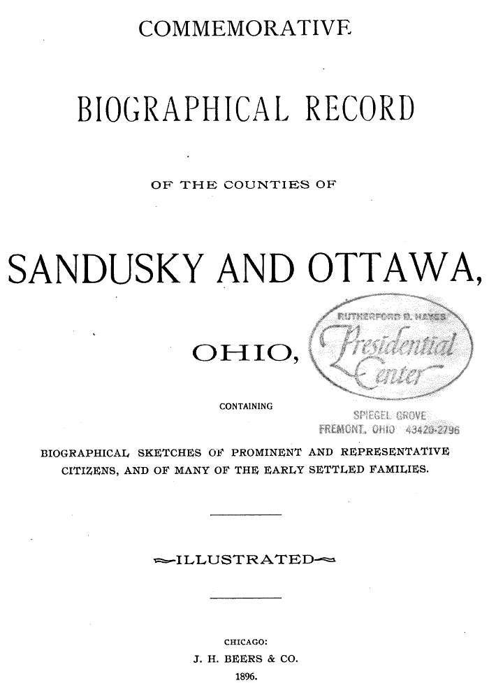

# Thorpe Family Research Vault

Welcome to the Thorpe family research vault — a growing collection of genealogical research on the Thorpe family and their connected lines (Lemmon, Blake, Spicer, Palmer, and others). This project is separate from the Copley family vault and focuses on building accurate, source-grounded family profiles spanning three centuries and two continents.

## Project Scope at a Glance

| Metric | Coverage |
|--------|----------|
| **Individuals documented** | 111 people across primary family lines |
| **Primary branches** | Lemmon-Blake-Thorpe cluster, Spicer line, Palmer and supporting families |
| **Time span** | 1760s–present (focus: 1796–1880 for genealogical records) |
| **Geographic focus** | Northamptonshire and Essex (England), Wisconsin and Ohio (USA) |
| **Source types** | UK Census (1841–1871), US Census (1850–1880), genealogical books, pedigree timelines, burial records |

## What You'll Find Here

**Census records:** Detailed household extracts from 1841–1871 UK census and 1850–1880 US census, with household composition, occupations, and locations pinpointed.

**Family branches:** Visual family diagrams showing relationships within the Lemmon, Blake, Thorpe, Spicer, and connected lines.

**Genealogical books:** References and extracts from 31 historical and genealogical books including *Descendants of Nathan Spicer*, *Descendants of Hugh Lemmon*, and regional Ohio histories.

**Reconciliation work:** Ongoing identity confirmation — verifying that individuals appearing in multiple records are the same person, consolidating duplicates, and documenting name variants and spelling changes.

## Initial Sources

- [[References/Butch Thorpe Email|Butch Thorpe Email]]
- [[Topics/Thorpe Pedigree Timelines|Thorpe Pedigree Timelines]]

## Quick Links

- **[[CHANGELOG|Session Changelog and Updates]]** — View all recent additions and reconciliations
- [[People Directory|People Directory]] — Alphabetical index of all individuals
- [[Search Index|Search Index]] — Topic and relationship search

## How to Explore

**Start with a family branch:** Explore the major family trees through visual diagrams:
- [[Topics/Lemmon Blake Thorpe Branch Summary|Lemmon-Blake-Thorpe cluster]] — The core research focus, spanning England and America
- [[People/Nathan Spicer|Spicer line]] — Connecticut and Ohio settlers
- [[Topics/Spelling and Identity Reconciliations|Variant names guide]] — Help identifying the same person across different spellings and transcriptions

**Search for a specific person:** Browse the [[People Directory|alphabetical list]] (111 documented individuals) or use the [[Search Index|full-text search]].

**Dive into primary sources:** 
- [[References/Shared Intake 2026-04-24 Census InDesign Summaries|Census household extracts]] — Detailed 1841–1871 UK census and 1850–1880 US census records
- [[References/Book Outprints Collection|Genealogical books]] — 31 historical books with extracted pages (Spicer, Lemmon, Thorpe, and regional histories)

**Follow the research:** The [[CHANGELOG|changelog]] documents ongoing identity reconciliation — watch individuals confirm their identity across multiple census records and duplicates get consolidated.

## Current Work

**Identity reconciliation** is the active research priority. We're confirming that individuals appearing across multiple census records (1841–1880) are the same person, consolidating duplicates, and documenting how names changed and varied across transcriptions. This ensures the vault reflects the actual historical record, not fragmented data.

**Recent confirmations:** Eleanor Emblow, Ann Sorrell, Sarah Kelly, Susan Lewis — each verified across 20–30 years of census records with household consistency checks and biographical evidence.

See the [[Topics/Identity Reconciliation Matrix|reconciliation queue]] and [[CHANGELOG|changelog]] for details on ongoing and completed work.
