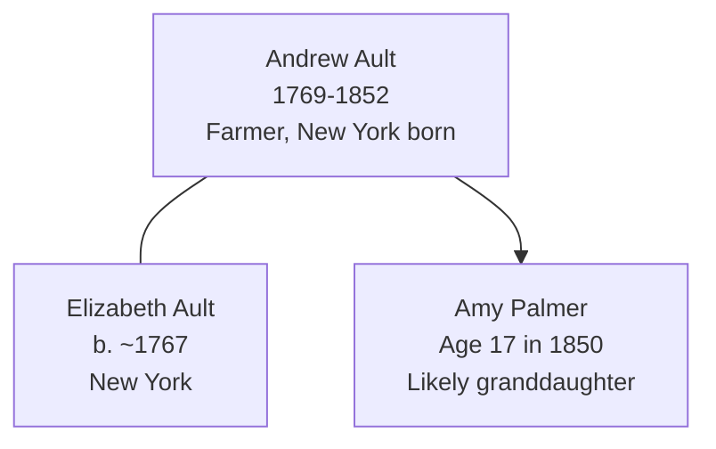

# Andrew Ault

## Biographical Profile

- **Name:** Andrew Ault
- **Role in this project:** Ault-line patriarch and farmer in Ohio; documented in 1850 census at advanced age.

## Source-Cited Facts

- **Birth/Death:** Born 2 Apr 1769; died 28 Mar 1852 (age 82 years, 11 months, 26 days).
- **Birthplace:** New York
- **Occupation:** Farmer

## Census Records and Household Context

### 1850 Ohio Census — Jefferson County, Island Creek Township
- **Head:** `Andrew AULT`, male, age 82, occupation farmer, born New York
- **Spouse:** `Elizabeth AULT`, female, age 83, born New York
- **Household also includes:**
  - `Amy PALMER`, female, age 17, born Ohio
- **Source:** Series M432, Roll 699, Page 523; GSU microfilm available

## Family Connections

- **Wife:** Elizabeth Ault (b. ~1767 New York, age 83 in 1850)
- **Household member:** Amy Palmer (age 17 in 1850), likely granddaughter or niece
- **Pedigree context:** Contemporary with [[People/Frederick Ault|Frederick Ault]] (1795-c.1857) in same county; relationship unclear but likely father or older brother
- **Occupational continuity:** Both Andrew and Frederick were farmers/tradesmen in Ohio, suggesting family network

## Family Diagram

Andrew Ault represents the earliest generation in the documented Ault line, with a 80+ year lifespan spanning New York to Ohio settlement.

## Research Gaps

1. Confirm relationship of Elizabeth Ault to Andrew (wife, sister, or other).
2. Clarify relationship of Amy Palmer (granddaughter, niece, other relative).
3. Locate Andrew Ault in earlier census records (1830, 1840) if available.
4. Determine relationship to [[People/Frederick Ault|Frederick Ault]] (father/brother/other).
5. Verify death date and burial location from cemetery records.

## Sources

1. [[References/Shared Intake 2026-04-22 Census Summary Individuals p1-p10|Shared Intake 2026-04-22 Census Summary Individuals p1-p10]]
2. [[References/Shared Intake 2026-04-22 Census Citation Notes|Shared Intake 2026-04-22 Census Citation Notes]]
3. `References/raw/inbox/2026-04-22-intake/BurialSites/BurialSites.txt`
4. `References/raw/inbox/2026-04-22-intake/Census/CensusSummaryIndividual.pdf`