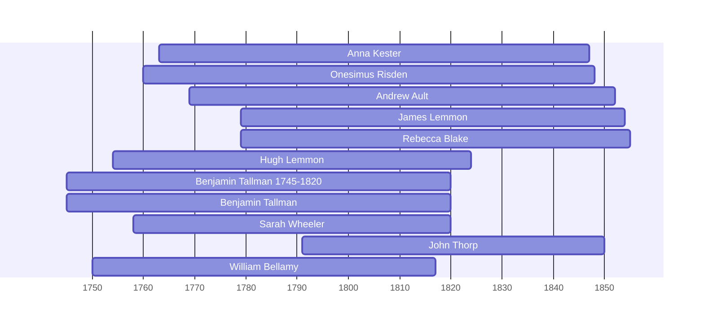

![[assets/snippets/Anna Kester.svg]]

# Anna Kester

## Biographical Profile

- **Name:** Anna Kester
- **Dates:** 1763-1847

## Source-Cited Facts

- Identified in pedigree timeline source.

## Research Notes

- Initial stub created from pedigree timeline extraction.

## Overlapping Lifespans

> [!info] Visualizing contemporaries in the vault during the life of Anna Kester (1763-1847).

## Source Indicators

> [!info] Indicators from Pedigree Timeline Diagrams
>
> - **Census Records**: Found in 1840, 1850
> - **Official Records**: Ref #010, 009, 235
> - **Burial**: Verified (RIP marker)
> - **Obituary**: Available (Obit marker)

## Sources

1. [[References/raw/extracted/PedigreeTimeline2025Prior.txt|PedigreeTimeline2025Prior.txt]]
