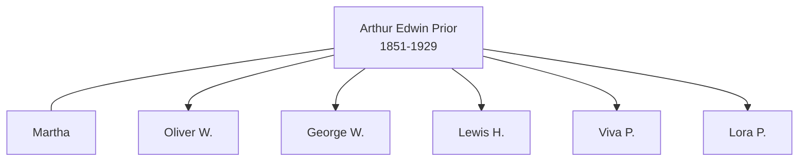

# Arthur Edwin Prior

## Biographical Profile

- **Name:** Arthur Edwin Prior
- **Role in this project:** Prior-line ancestor represented in repeated 1860-1920 census-summary chains.

## Source-Cited Facts

- A census-summary entry gives Arthur Edwin Prior as born 14 Jul 1851 and died 10 Jul 1929.
- The profile section includes 1860 Penfield, Ohio Pryor household context, 1870 Winfield Township, Michigan entries, and later 1900 Minnesota, 1910 South Dakota, and 1920 Minnesota households.
- The extracted chain associates Arthur with spouse Martha and children including Oliver W., George W., Lewis H., Viva P., and Lora P. in 1900.
- The Prior pedigree timeline places `Arthur Edwin Prior` (1853-1929) in the next generation after `Joseph Warren Washington Prior` and `Alzina Morgan`.
- The Burial Sites book places Arthur Edwin Prior at Brook Park Cemetery, south of Brook Park, Minnesota (page 25), with date of death 10 July 1929 and inscription `PRIOR / ARTHUR E. / JULY 14, 1853 / JUY 10, 1929`. Map: [Google Maps](https://www.google.com/maps/search/?api=1&query=Brook+Park+Cemetery+Brook+Park+Minnesota).

## Family Diagram

This is a household sketch from the census-summary chain on the page.

## Research Gaps

1. Resolve possible mixed-row contamination between Arthur Edwin and Joseph Warren Prior sections.
2. Verify all county/state transitions and household continuity from image-level records.
3. Confirm birth/death dates from independent vital records.

## Sources

1. [[References/Shared Intake 2026-04-22 Census Summary Individuals p51-p60|Shared Intake 2026-04-22 Census Summary Individuals p51-p60]]
2. [[References/Shared Intake 2026-04-22 Pedigree Timeline Prior|Shared Intake 2026-04-22 Pedigree Timeline Prior]]
3. [[References/Shared Intake 2026-04-22 Burial Sites Summary|Shared Intake 2026-04-22 Burial Sites Summary]]
4. `References/raw/extracted/PedigreeTimeline2025Prior.txt`
5. `References/raw/inbox/2026-04-22-intake/BurialSites/BurialSites.txt`
6. `References/raw/inbox/2026-04-22-intake/Census/CensusSummaryIndividual.pdf`
