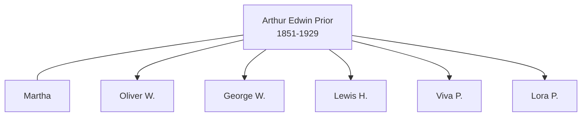

![[assets/snippets/Arthur Edwin Prior.svg]]

# Arthur Edwin Prior

## Biographical Profile

- **Name:** Arthur Edwin Prior
- **Role in this project:** Prior-line ancestor represented in repeated 1860-1920 census-summary chains.

## Source-Cited Facts

- A census-summary entry gives Arthur Edwin Prior as born 14 Jul 1851 and died 10 Jul 1929.
- The profile section includes 1860 Penfield, Ohio Pryor household context, 1870 Winfield Township, Michigan entries, and later 1900 Minnesota, 1910 South Dakota, and 1920 Minnesota households.
- The extracted chain associates Arthur with spouse Martha and children including Oliver W., George W., Lewis H., Viva P., and Lora P. in 1900.
- The Prior pedigree timeline places `Arthur Edwin Prior` (1853-1929) in the next generation after `Joseph Warren Washington Prior` and `Alzina Morgan`.
- The processed Prior timeline review keeps Arthur's branch placement clear but leaves the `1851` versus `1853` birth-year conflict unresolved.
- The Burial Sites book places Arthur Edwin Prior at Brook Park Cemetery, south of Brook Park, Minnesota (page 25), with date of death 10 July 1929 and inscription `PRIOR / ARTHUR E. / JULY 14, 1853 / JUY 10, 1929`. Map: [Google Maps](https://www.google.com/maps/search/?api=1&query=Brook+Park+Cemetery+Brook+Park+Minnesota).

## Family Diagram



This is a household sketch from the census-summary chain on the page.

## Research Gaps

1. Resolve possible mixed-row contamination between Arthur Edwin and Joseph Warren Prior sections.
2. Verify all county/state transitions and household continuity from image-level records.
3. Confirm birth/death dates from independent vital records.
4. Keep the birth year open rather than harmonizing the chart and census values prematurely.


## Census Records

> [!info] Extract from References/raw/extracted/CensusSummaryIndividual.txt

```text
PRIOR, Arthur Edwin (14 Jul 1851 - 10 Jul 1929)
1860 Ohio, Lorain, Penfield
D/F
106/108

Name
Warren PRYOR
Alzina PRYOR
Jessie PRYOR
Arthur PRYOR
Series: M653, Roll: 1008, Page: 34

Age Sex
33
M
28
F
3
F
7
M

Color

Occupation
Laborer

Property
50

Nativity
NY
O
O
O

Comments

Real Pers
1000 600

Nativity Comments
New York
Canada
Michigan
Michigan
Michigan
Canada
Rachael bro?

1870 Michigan, Montcalm County, Winfield Township, Greenville
D/F
10/10

Name
J. W. PRIOR
Rachael PRIOR
Arthur PRIOR
Willie PRIOR
Ernest PRIOR
Andrew WHITSELL
Series: M593, Roll: , Page:

Age Sex
43
M
38
F
17
M
3
M
1
M
18
M

Color
W
W
W
W
W
W

Occupation
FARMER
Keeping House

Farm Laborer

1900 Minnesota, Mower County, Grand Meadows Township
Add Name
43/45 Arthur PRIOR
Martha PRIOR
Oliver W PRIOR
George W
Lewis H
Viva P
Lora P
Series: T623, Roll: 777, Page 108A

Rel
Head
Wife
Son
Son
Son
Dau
Dau

Race
W
W
W
W
W
W
W

Sex
M
F
M
M
M
F
F

Birthdate
July 1853
Dec 1859
Mar 1880
Aug 1883
Aug 1888
Dec 1895
Aug 1897

Age
46
40
20
16
11
4
2

MS ? ? ?
M 23
M 23 9 7
S
S
S
S
S

BP
Mich
Wisc
Minn
Minn
Minn
Mo
Mo

FBP
Mich
Verm
Mich
Mich
Mich
Mich
Mich

MBP Occ.
Mich Farmer
NY
Wisc Farm Labr
Wisc Farm Labr
Wisc At School
Wisc
Wisc

1910 South Dakota, Brown County, Hanson Township
D/F Name
18/18 Arthur PRIOR
Martha PRIOR
Lora PRIOR
Arthur PRIOR
Lewis PRIOR
Agnes PRIOR
Series: T624, Roll: , Page 15B

Rel
Head
Wife
Dau
Son
Son
DIL

Sex Race Age
M
W
56
F
W
50
F
W
11
M
W
7
M
W
22
F
W
21

MS
M1
M1
S
S
M1
M1

?
35
35

?

?

11

9

1
1

1

1

BP
Mich
Wisc
MO
Minn
Minn
Iowa

FBP
Unk
Ver
Mich
Mich
Mich
Unk

MBP
Unk
NY
Wisc
Wisc
Wisc
Unk

Occupation
Laborer
None
None
None
Laborer
None

1920 Minnesota, Pine County, Pokegama Township
D/F
169

Name
Rel
Sex Race Age
Arthur E. PRIOR
Head
M
W
66
Martha E. PRIOR
Wife
F
W
60
Arthur E. PRIOR Jr
Son
M
W
16
Series: T625, Roll: 849, Page: 15A, ED 76

CENSUS SUMMARY - INDIVIDUALS

MS
M
M
S

?

?

?

BP
Mich
Wisc
Minn

Robert Archer John Thorpe

FBP
NY
Ver
Mich

MBP
Mich
NY
Wisc

Occupation
Farming
House Keeping
None

53
```


## Source Indicators

> [!info] Indicators from Pedigree Timeline Diagrams
>
> - **Census Records**: Found in 1870, 1880, 1890, 1900, 1910
> - **Official Records**: Ref #017, 052, 250, 123
> - **Burial**: Verified (RIP marker)
> - **Obituary**: Available (Obit marker)

## Sources

1. [[References/Shared Intake 2026-04-22 Census Summary Individuals p51-p60|Shared Intake 2026-04-22 Census Summary Individuals p51-p60]]
2. [[References/Shared Intake 2026-04-22 Pedigree Timeline Prior|Shared Intake 2026-04-22 Pedigree Timeline Prior]]
3. [[References/raw/processed/2026-04-22-intake/Pedigree Timeline/PRIOR_PEDIGREE_TIMELINE_INDEX|Prior Pedigree Timeline Extraction Index]]
4. [[References/Shared Intake 2026-04-22 Burial Sites Summary|Shared Intake 2026-04-22 Burial Sites Summary]]
5. `References/raw/extracted/PedigreeTimeline2025Prior.txt`
6. `References/raw/inbox/2026-04-22-intake/BurialSites/BurialSites.txt`
7. `References/raw/inbox/2026-04-22-intake/Census/CensusSummaryIndividual.pdf`
