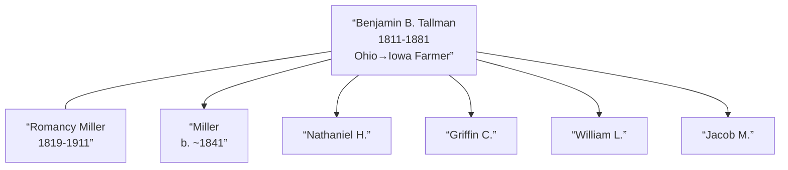

# Benjamin B Tallman

## Biographical Profile

- **Name:** Benjamin B Tallman
- **Role in this project:** Tallman-line patriarch spanning Iowa (1850-1880) with documented multi-generational household and farming operations across three decades.

## Source-Cited Facts

- **Birth/Death:** Born 25 May 1811; died 26 Oct 1881 (age 70 years, 5 months, 1 day).
- **Birthplace:** Ohio
- **Occupation:** Farmer
- **Burial:** Western Cemetery, Linn County, Iowa; Section 35-82-7; GPS 41°52’17.7”N 91°38’9.8”W; inscription `BENJAMIN / TALLMAN / DIED / OCT. 26, 1881 / AGED / 69 Ys. 5 Ms, 1 DAY.`

## Census Records and Household Context

### 1850 Iowa Census — Jones County, Rome Township
- **Head:** `Benjamin TOLLMAN`, male, age 39, occupation farmer, born Ohio
- **Wife:** `Romancy TOLLMAN` (née Miller), female, age 32, born Ohio
- **Children in household:**
  - `Miller TOLLMAN`, male, age 9, born Ohio
  - `Emma E TOLLMAN`, female, age 5, born Ohio
  - `Sarah J TOLLMAN`, female, age 14, born Ohio
  - `Eliza E TOLLMAN`, female, age 3, born Ohio
  - `Nathaniel H TOLLMAN`, male, age 2, born Iowa
- **Other household members:**
  - `John VANOISDELL?`, male, age 20, occupation farm hand
  - `Elizabeth McVETE?`, female, age 33, occupation domestic
  - `Matthew BOWER`, male, age 60
- **Source:** Series M432, Roll 185, Page 192; GSU microfilm available

### 1860 Iowa Census — Linn County, College Township, Western
- **Head:** `Benjamin TALMON`, male, age 47, occupation farmer, born Ohio, property $5,000
- **Wife:** `Romcy TALMON`, female, age 40, born Ohio
- **Children:**
  - `Miller TALMON`, male, age 19, born Ohio, occupation farmer
  - `Ama TALMON`, female, age 16, born Ohio
  - `Eliza E TALMON`, female, age 13, born Ohio
  - `Nathaniel TALMON`, male, age 11, born Iowa
  - `Ama E TALMON`, female, age 6, born Iowa
  - `Griffin C TALMON`, male, age 7, born Iowa
  - `William L TALMON`, male, age 2, born Iowa
- **Source:** Series 653, Roll 532, Page 387; GSU microfilm available

### 1870 Iowa Census — Linn County, College Township, Page 180
- **Head:** `Benj TALLMAN`, male, age 59, occupation farmer, born Ohio
- **Wife:** `Romancee TALLMAN`, female, age 56, born Ohio
- **Children:**
  - `Matt H TALLMAN`, male, age 28, born Ohio, occupation farmer
  - `Nathan H TALLMAN`, male, age 21, born Iowa, occupation farm laborer
  - `Griffin C TALLMAN`, male, age 18, born Iowa, occupation farm laborer
  - `Romancee TALLMAN`, female, age 14, born Iowa
  - `Wm L TALLMAN`, male, age 8, born Iowa
  - `Jacob M TALLMAN`, male, age 5, born Iowa
- **Source:** Series M593, Roll 405, Page 180; GSU microfilm available

### 1880 Iowa Census — Linn County, College Township, Western
- **Head:** `B. TALLMAN` (Benjamin), male, self, married, age 69, born Ohio, occupation farming
- **Wife:** `Romancy TALLMAN`, female, married, age 62, born Ohio, occupation keeping house
- **Child:**
  - `Romancy TALLMAN` (daughter), female, single, age 23, born Iowa
- **Note:** Household significantly reduced from earlier decades; grown children established elsewhere
- **Source:** Fam Hist Lib Film 1254351; GSU microfilm available

## Family Connections

- **Wife:** [[People/Romancy Miller|Romancy Miller]] (1819-1911), married c. 1840s
- **Children identified:** Miller (b. ~1841), Emma E., Sarah J., Eliza E., Nathaniel H., Ama E., Griffin C., William L., Jacob M., Romancy (10+ children across 1850-1880)
- **Occupational continuity:** Farmer throughout documented lifecycle, managing expanding household and farmland worth $5,000 by 1860
- **Pedigree significance:** Ohio-origin patriarch establishing Tallman farming presence in Iowa; father of extended Tallman family line

## Family Diagram

Benjamin Tallman represents the Ohio-origin patriarch who established the Iowa Tallman farming family, maintaining agricultural operation across 30 years (1850-1880) with expanding household and land value growth.

## Research Gaps

1. Confirm Benjamin Tallman’s Ohio parentage and family origin.
2. Validate all children names and relationships from original census images.
3. Clarify name spelling variants (Tallman, Talmon, Tollman) and their consistency.
4. Determine reason for household contraction by 1880 (adult children migration vs. death).
5. Trace all children’s adult lives, especially Miller and Matt H. Tallman.
6. Verify relationship to [[People/Miller Mathias Tallman|Miller Mathias Tallman]] (possible distant relative).

## Sources

1. [[References/Shared Intake 2026-04-22 Census Summary Individuals p41-p50|Shared Intake 2026-04-22 Census Summary Individuals p41-p50]]
2. [[References/Shared Intake 2026-04-22 Burial Sites Summary|Shared Intake 2026-04-22 Burial Sites Summary]]
3. `References/raw/inbox/2026-04-22-intake/BurialSites/BurialSites.txt`
4. `References/raw/inbox/2026-04-22-intake/Census/CensusSummaryIndividual.pdf`

1. `References/raw/inbox/2026-04-24-census-indesign/CensusSummary-TallmanBenjaminB.txt`
