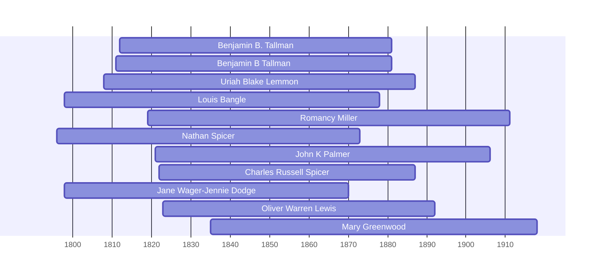

![[assets/snippets/Benjamin B. Tallman.svg]]

# Benjamin B. Tallman

## Biographical Profile

- **Name:** Benjamin B. Tallman
- **Dates:** 1812-1881

## Source-Cited Facts

- Identified in pedigree timeline source.

## Research Notes

- Initial stub created from pedigree timeline extraction.

## Overlapping Lifespans

> [!info] Visualizing contemporaries in the vault during the life of Benjamin B. Tallman (1812-1881).

## Source Indicators

> [!info] Indicators from Pedigree Timeline Diagrams
>
> - **Census Records**: Found in 1840, 1860, 1870, 1880
> - **Official Records**: Ref #027, 165, 109, 110, 111, 235
> - **Burial**: Verified (RIP marker)
> - **Obituary**: Available (Obit marker)

## Sources

1. [[References/raw/extracted/PedigreeTimelines2025Thorpe.txt|PedigreeTimelines2025Thorpe.txt]]
