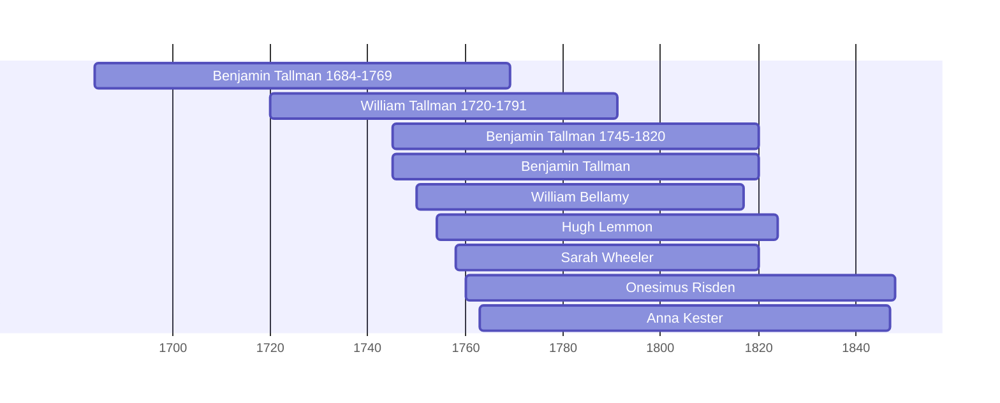

# Benjamin Tallman 1684-1769

## Biographical Profile

- **Name:** Benjamin Tallman
- **Role in this project:** Earlier Tallman-line ancestor named in the Durfee genealogy as father of [[People/William Tallman 1720-1791|William Tallman]].

## Source-Cited Facts

- *The Descendants of Thomas Durfee* volume I page 31 says Benjamin Tallman was a son of Peter Tallman and Joan Briggs Tallman.
- The same page says he was born in Portsmouth, Rhode Island, on 28 January 1684.
- The same page says he died in Warwick, Rhode Island, on 20 May 1769.
- The page says he married [[People/Patience Durfee Tallman|Patience Durfee]] at Portsmouth, Rhode Island, on 23 September 1708.

## Family Connections

- **Spouse:** [[People/Patience Durfee Tallman|Patience Durfee Tallman]]
- **Child in this project:** [[People/William Tallman 1720-1791|William Tallman]]

## Research Gaps

1. Verify Benjamin's birth, marriage, death, and probate from Rhode Island town and probate records.
2. Confirm the Peter Tallman and Joan Briggs parentage from primary records.

## Overlapping Lifespans

> [!info] Visualizing contemporaries in the vault during the life of Benjamin Tallman 1684-1769 (1684-1769).

## Sources

1. [[References/Book Outprints — Durfee|Book Outprints — Durfee]]
2. [[References/raw/processed/2026-04-24-book-outprints/Durfee/DURFEE_TALLMAN_INDEX|Durfee Tallman Extraction Index]]
