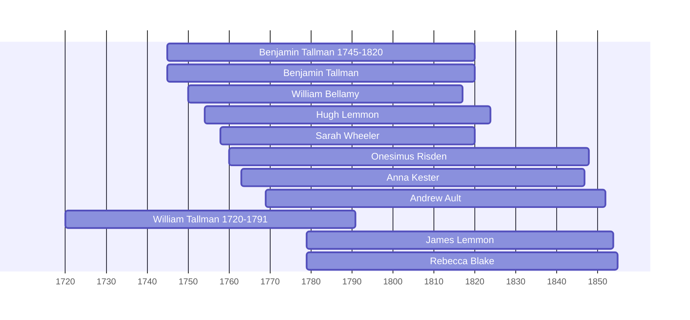

# Benjamin Tallman 1745-1820

## Biographical Profile

- **Name:** Benjamin Tallman
- **Role in this project:** Older Tallman-line ancestor connected to the Thorpe pedigree timeline, the Tallman Cemetery burial group, and Fairfield County pioneer narratives.

## Source-Cited Facts

- The Thorpe pedigree timeline gives Benjamin Tallman as `1745-1820` and places him before [[People/John Tallman|John Tallman]] in the Tallman chain.
- The Burial Sites book indexes Benjamin Tallman at Tallman Cemetery in the same older Tallman burial group as [[People/Dinah Boone|Dinah Boone]].
- The raw extracted burial text for pages 10 and 35 places Benjamin Tallman at Tallman Cemetery, Peters Farm, Ohio SR 674 north of Ohio SR 188, with the inscription `BENJ. TALLMAN / 1745 – 1820 / REVOLUTIONARY SERVICE / ARMAND’S CORPS / WIFE / DINAH BOONE / 1749 – 1824`.
- *Pioneer People of Fairfield County, Ohio* states that Benjamin Tallman and his wife [[People/Dinah Boone|Dinah Boone]] settled at Canal Winchester, Ohio.
- *The Descendants of Thomas Durfee* volume II page 572 identifies Benjamin as a child of [[People/William Tallman 1720-1791|William Tallman]] and [[People/Ann Lincoln Tallman|Ann Lincoln Tallman]], born in Berks County, Pennsylvania, on 9 January 1745, and died near Canal Winchester, Ohio, on 4 June 1820.
- The same page says Benjamin married [[People/Dinah Boone|Dinah Boone]] in Berks County on 9 November 1764, removed to Virginia in 1779, served in Pennsylvania militia and later in Virginia, and removed to Ohio around 1810.

## Family Connections

- **Spouse:** [[People/Dinah Boone|Dinah Boone]]
- **Parents:** [[People/William Tallman 1720-1791|William Tallman]] and [[People/Ann Lincoln Tallman|Ann Lincoln Tallman]], based on compiled Durfee/Tallman genealogy.
- **Pedigree-line descendant:** [[People/John Tallman|John Tallman]], according to the Thorpe pedigree timeline
- **Related older Fairfield County context:** [[People/Samuel Tallman|Samuel Tallman]] and [[People/Sarah Wells Tallman|Sarah Wells Tallman]]

## Research Gaps

1. Confirm the parent-child chain between Benjamin Tallman, [[People/John Tallman|John Tallman]], and [[People/Benjamin B Tallman|Benjamin B Tallman]] with probate, land, church, or cemetery records.
2. Verify the Canal Winchester settlement detail against local histories or land records.
3. Confirm whether the Tallman Cemetery entries preserve exact death dates or only year ranges.
4. Verify the Durfee genealogy's Bible-record and military-service references from original records.
5. Locate the original Revolutionary War or land records behind the burial-book inscription.

## Overlapping Lifespans

> [!info] Visualizing contemporaries in the vault during the life of Benjamin Tallman 1745-1820 (1745-1820).

## Sources

1. [[References/Shared Intake 2026-04-22 Pedigree Timeline Thorpe|Shared Intake 2026-04-22 Pedigree Timeline Thorpe]]
2. [[References/Shared Intake 2026-04-22 Burial Sites Summary|Shared Intake 2026-04-22 Burial Sites Summary]]
3. [[References/raw/processed/2026-04-22-intake/BurialSites/TALLMAN_TARGETED_SEARCH|Burial Sites Tallman Targeted Search]]
4. [[References/Book Outprints — Pioneer People of Fairfield County Ohio|Book Outprints — Pioneer People of Fairfield County Ohio]]
5. [[References/Book Outprints — Durfee|Book Outprints — Durfee]]
