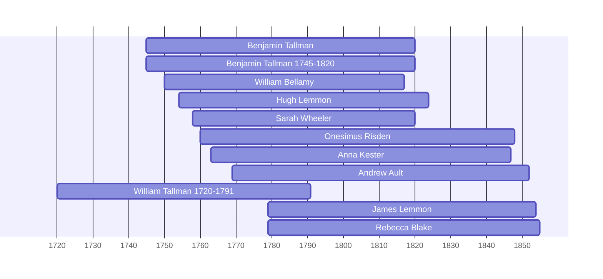

![[assets/snippets/Benjamin Tallman.svg]]

# Benjamin Tallman

## Biographical Profile

- **Name:** Benjamin Tallman
- **Dates:** 1745-1820

## Source-Cited Facts

- Identified in pedigree timeline source.

## Research Notes

- Initial stub created from pedigree timeline extraction.

## Overlapping Lifespans

> [!info] Visualizing contemporaries in the vault during the life of Benjamin Tallman (1745-1820).

## Source Indicators

> [!info] Indicators from Pedigree Timeline Diagrams
>
> - **Official Records**: Ref #224

## Sources

1. [[References/raw/extracted/PedigreeTimelines2025Thorpe.txt|PedigreeTimelines2025Thorpe.txt]]
