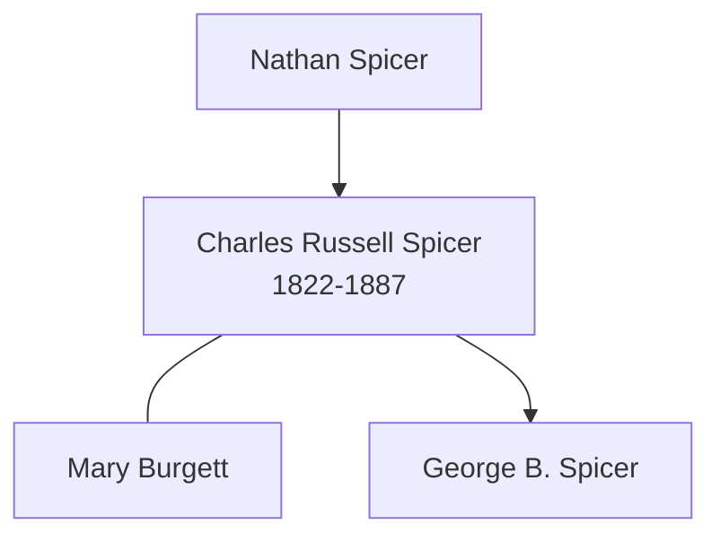

# Charles Russell Spicer

## Biographical Profile

- **Name:** Charles Russell Spicer
- **Role in this project:** Spicer-line ancestor listed in the census-summary index and lineage notes.

## Source-Cited Facts

- A census-summary entry gives Charles Russell Spicer as born 22 Oct 1822 and died 3 Jun 1887.
- The Spicer lineage note positions Charles Russell Spicer between Nathan Spicer and George B. Spicer.
- The lineage chain pairs Charles Russell Spicer with Mary Burgett.

## Family Diagram

This is a lineage sketch from the Spicer note and census-summary index, not a complete household chart.

## Research Gaps

1. Verify dates and places against US census records.
2. Confirm marital details and descendancy to George B. Spicer.

## Sources

1. [[References/Shared Intake 2026-04-22 Spicer Lineage Note|Shared Intake 2026-04-22 Spicer Lineage Note]]
2. `References/raw/inbox/2026-04-22-intake/Census/Ancestors in the Census.txt`
3. `References/raw/inbox/2026-04-22-intake/Pedigree Timeline/SPICLINE.txt`
