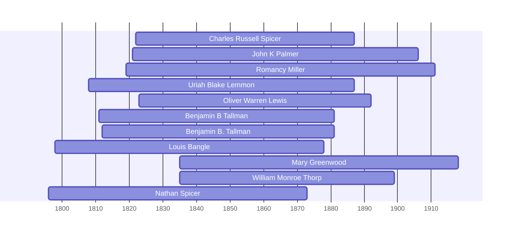

![[assets/snippets/Charles Russell Spicer.svg]]

# Charles Russell Spicer

## Biographical Profile

- **Name:** Charles Russell Spicer
- **Birth/Death:** Born 22 Oct 1822; died 3 Jun 1887 (age 64 years, 7 months, 12 days)
- **Role in this project:** Spicer line patriarch connecting Nathan Spicer (father) to George B. Spicer (son); bridge generation in Iowa Spicer agricultural line (1850s-1880s).
- The processed Spicer timeline review confirms Charles Russell Spicer as the start of the clearest later direct chain and pairs him with Mary Burgett, while leaving the Claramon Tiffany placement unresolved.

## Census Records and Household Context

### 1850 Iowa Census — Iowa County, Brush Run Township
- **Head:** `Russell Spicer`, male, farmer, born New York
- **Wife:** `Angeline Spicer`, female, born Ohio
- **Children:**
  - Levina Spicer, female, Ohio
  - John Spicer, male, Iowa
  - Charles Spicer, male, Iowa
  - Elizabeth Burget, female, Indiana
- **Source:** Series M432, Roll 184, Page 278

### 1860 Iowa Census — Iowa County, Iowa Township
- **Head:** `C. Spicer`, male, chair maker, born New York
- **Wife:** `Mary Spicer`, female, born Ohio
- **Children:**
  - Charles Spicer, male, Iowa
  - Sylvester Spicer, male, Iowa
  - Amanda Spicer, female, Iowa
  - Mariah Spicer, female, Iowa
  - Rebeka Spicer, female, Ohio
- **Other:** Peter Burget, male, distiller, Pennsylvania
- **Source:** Series M653, Roll 325, Page 629

### 1870 Iowa Census — Linn County, Clinton Township
- **Head:** `Chas S. Spicer`, male, farm laborer, age ~35+
- **Wife:** `Mary Spicer`, female, keeping house
- **Children:**
  - Sylvester S. Spicer, male, farm laborer
  - Amanda Spicer, female
  - Mary Spicer, female
  - Wm Spicer, female
  - Perry Spicer, male
  - George Spicer, male (future patriarch)
  - Ella Spicer, female
  - Zerna Spicer, female
- **Note:** Large household of 8 children indicates prolific family; George B. Spicer appears here as child
- **Source:** Series M593, Roll 405, Page 67

### 1880 Iowa Census — Linn County, Clinton Township
- **Head:** `Russel Spicer`, male, farmer, age ~50, born New York
- **Wife:** `Mary Spicer`, female, keeping house, born Ohio (English parentage noted)
- **Children in household:**
  - George Spicer, male, single, Iowa
  - William Spicer, male, single, Iowa
  - Ellen Spicer, female, single, at school, Iowa
  - Dellie M. Spicer, female, single, Iowa
  - Elizabeth Spicer, female, single, Iowa
- **Source:** Series T9, Roll 351, Page 153C, ED 260; Fam Hist Lib Film 1254351

## Family Connections

- **Father:** Nathan Spicer (1796-1873) — patriarch; lineage note positions Charles Russell between Nathan and George B.
- **Wife:** Mary Spicer (multiple wives noted: Angeline 1850, Mary 1860-1880; or wife name change)
- **Children identified:** Levina, John, Charles Jr., Sylvester, Amanda, Mariah, Rebecca, Perry, George (future patriarch), Ellen, Dellie, Elizabeth, Zerna
- **Son:** George B. Spicer (1864-1938) — appears in 1870 and 1880 households; becomes major patriarch
- **Occupation transition:** Farmer (1850) → chair maker (1860) → farm laborer (1870) → farmer again (1880) — suggests economic fluctuation
- **Sibling:** Appears in context of larger Spicer agricultural expansion in Iowa

## Household Narrative

Charles Russell Spicer's households show:
- **1850:** Young family (Angeline wife) establishing in Iowa County, farming
- **1860:** Occupational shift to chair maker; wife now Mary; 5 children
- **1870:** Return to agricultural work; expanded household of 8-10 family members
- **1880:** 30-year-long marriage to Mary; younger children still at home; George B. (age ~16) still in household before establishing independence

## Research Gaps

1. Reconcile wife names (Angeline vs Mary) — possible remarriage or name variant
2. Verify occupational shifts (farmer → chair maker → laborer → farmer) — economic pressures?
3. Confirm death date (3 Jun 1887) from independent records
4. Clarify relationship of George B. Spicer to Charles Russell (son or nephew?)
5. Do not attach Claramon Tiffany to Charles Russell as a settled spouse without stronger evidence.


## Census Records

> [!info] Extract from References/raw/extracted/CensusSummaryIndividual.txt

```text
SPICER, Charles Russell (22 Oct 1822 - 3 Jun 1887)
1850 Iowa, Iowa County, Brush Run Township
R/F
2/2

Name
Russell SPICER
Angeline SPICER
Levina SPICER
John SPICER
Charles SPICER
Elizabeth BURGET
Series: M432, Roll: 184 , Page: 278

Sex
M
F
F
M
M
F

Age
29
24
5
3
1
10

Occupation
Farmer

Born
New York
Ohio
Ohio
Iowa
Iowa
Indiana

Comments

1860 Iowa, Iowa County, Iowa Township, Page 629
D/F
968/1009

Name
C R SPICER
Mary SPICER
Charles SPICER
Silvester SPICER
Amana SPICER
Mariah SPICER
Rebeka SPICER
Peter BURGETT
Series: M653, Roll: 325, Page: 629

Age Sex
39
M
24
F
12
M
6
M
5
F
2
F
26
F
56
M

Color

Occupation
Chair Maker

Property
100

Nativity
New York
Ohio
Iowa
Iowa
Iowa
Iowa
Ohio
Penn

Real
800

Nativity Comments
New York
Iowa

Distiller

Comments

1870 Iowa, Linn County, Clinton Township
D/F
43/43

Name
Chas R SPICER
Mary SPICER
Sylvester N SPICER
Amanda SPICER
Mary SPICER
Wm SPICER
Perry SPICER
George SPICER
Ella SPICER
Zerna SPICER
Series: M593, Roll: 405, Page: 67

Age Sex
59? M
35
F
15
M
13
F
11
F
9
F
8
M
5
M
3
F
1
F

Color
W
W
W
W
W
W
W
W
W
W

Occupation
Farm Labr
Keeps House
Farm Labr

Pers
300

1880 Iowa, Linn County, Clinton Township, Page 153 C & 153 D
D/F
65/66

Name
Russel SPICER
Mary SPICER
George SPICER
William SPICER
Ellen SPICER
Dellie M. SPICER
Elizabeth SPICER
Fam Hist Lib Film
1254351

Rel
Self
Wife
Son
Son
Dau
Dau
Dau

CENSUS SUMMARY - INDIVIDUALS

Married Gender Race Age
BP
Married
Male
White 59
NY
Married
Female White 45
OH
Single
Male
White 15
IA
Single
Male
White 19
IA
Single
Female White 12
IA
Single
Female White 8
IA
Single
Female White 7
IA
NA Film No. T9-0351
Page 153C

Robert Archer John Thorpe

Occupation
Farmer
Keeping House

At School

FBP
NY
ENG
NY
NY
NY
NY
NY

MBP
NY
PA
OH
OH
OH
OH
OH

65
```


## Name Variations

> [!info] Known aliases or census misspellings from Butch Thorpe's cross-reference table.
>
> - **SPICER, C R**
> - **SPICER, Chas R**
> - **SPICER, Russell**

## Overlapping Lifespans

> [!info] Visualizing contemporaries in the vault during the life of Charles Russell Spicer (1822-1887).



## Source Indicators

> [!info] Indicators from Pedigree Timeline Diagrams
>
> - **Burial**: Verified (RIP marker)
> - **Obituary**: Available (Obit marker)

## Sources

1. [[References/Shared Intake 2026-04-24 Census InDesign Summaries|Census InDesign Summaries]]
2. `References/raw/inbox/2026-04-24-census-indesign/CensusSummary-SpicerCharlesRussell.txt`
3. [[References/Shared Intake 2026-04-22 Spicer Lineage Note|Spicer Lineage Note]]

2. [[References/Shared Intake 2026-04-22 Pedigree Timeline Spicer|Shared Intake 2026-04-22 Pedigree Timeline Spicer]]
3. [[References/raw/processed/2026-04-22-intake/Pedigree Timeline/SPICER_PEDIGREE_TIMELINE_INDEX|Spicer Pedigree Timeline Extraction Index]]
