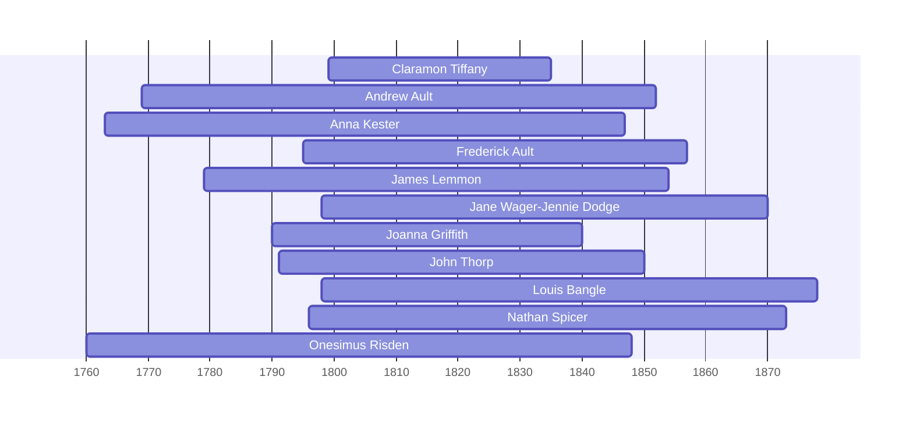

![[assets/snippets/Claramon Tiffany.svg]]

# Claramon Tiffany

## Biographical Profile

- **Name:** Claramon Tiffany
- **Dates:** 1799-1835

## Source-Cited Facts

- Identified in pedigree timeline source.

## Research Notes

- Initial stub created from pedigree timeline extraction.

## Overlapping Lifespans

> [!info] Visualizing contemporaries in the vault during the life of Claramon Tiffany (1799-1835).

## Source Indicators

> [!info] Indicators from Pedigree Timeline Diagrams
>
> - **Burial**: Verified (RIP marker)

## Sources

1. [[References/raw/extracted/PedigreeTimelines2025Spicer.txt|PedigreeTimelines2025Spicer.txt]]
