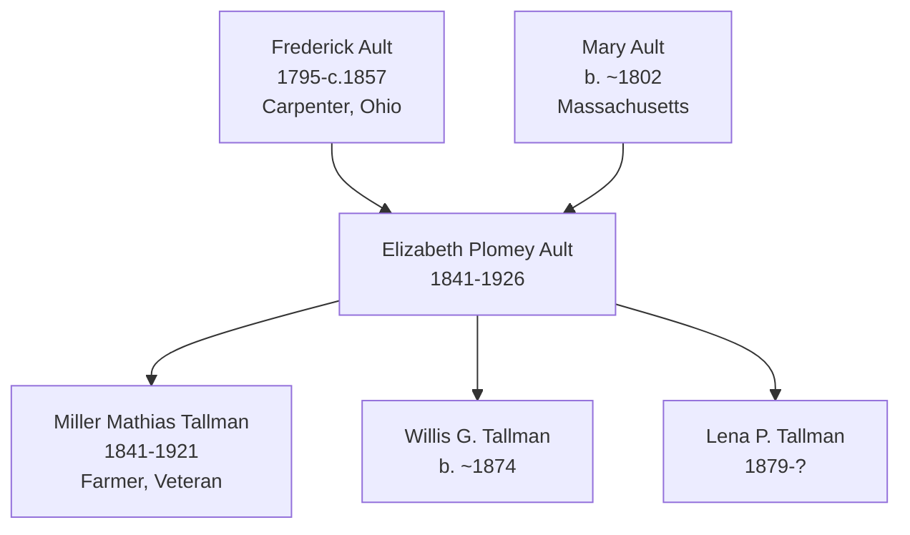

# Elizabeth Plomey Ault

## Biographical Profile

- **Name:** Elizabeth Plomey Ault (later Elizabeth Tallman)
- **Role in this project:** Ault-Tallman line ancestor spanning Ohio to Iowa (1850-1920) with six documented census entries across 70 years.

## Source-Cited Facts

- **Birth/Death:** Born 31 Oct 1841; died 5 Mar 1926 (age 84 years, 4 months, 3 days).
- **Maiden surname:** Ault; married name: Tallman (married [[People/Miller Mathias Tallman|Miller Mathias Tallman]] c. 1880)

## Census Records and Life Progression

### 1850 Ohio Census — Meigs County, Salisbury Township, District No. 98 (as daughter)
- **Head:** `Frederick AULT`, male, carpenter
- **Elizabeth Ault** (daughter), female, age 8, born Ohio
- **Mother:** Mary Ault, age ~48
- **Siblings:** Charles B. Ault (age 24), Mehitable Ault (age 14)
- **Source:** Series M432, Roll 710, Page 175; GSU microfilm available

### 1860 Ohio Census — Meigs County, Salisbury Township (as young woman)
- **Head:** `Mary AULT`, female, age 55, born New Jersey
- **Eliza AULT** (daughter), female, age 18, born Ohio
- **Household also includes:**
  - `Alex GILMORE`, male, age 26, born Ohio
  - `Hettie GILMORE`, female, age 22, born Ohio
  - `Charles GILMORE`, male, age 4, born Ohio
- **Source:** Series M653, Roll 1008, Page 34; GSU microfilm available

### 1880 Iowa Census — Cherokee County, Afton Township (as wife)
- **Head:** `Miller M. TALLMAN`, male, married, age 39, occupation farmer, born Ohio
- **Elizabeth TALLMAN** (wife), female, married, age 30, born Ohio, occupation keeping house
- **Children:**
  - `Willis G. TALLMAN`, male, single, age 6, born Iowa
  - `Lena TALLMAN`, female, single, age 1, born Iowa
- **Household also includes:**
  - `Elbert WINN`, male, single, age 17, born Iowa
  - `Mary AULT` (mother), female, widow, age 73, born Maine, occupation aged
  - `Andrew RICHEY`, male, single, age 24, born Illinois, occupation farm laborer
- **Source:** Fam Hist Lib Film 1254332, Page 52D; GSU microfilm available

### 1900 Iowa Census — Woodbury County, Sioux City, p. 231R, Filmore Avenue
- **Head:** `Miller M. TALLMAN`, male, race White, birthdate Apr 1841, age 58, occupation teamster
- **Elizabeth P. TALLMAN** (wife), female, race White, birthdate Oct 1841, age 58
- **Child:**
  - `Lena P. TALLMAN`, female, race White, birthdate Feb 1879, age 21
- **Source:** Series T623, Roll 467, Page 231B; GSU microfilm available

### 1910 Iowa Census — Marshall County, Linn Township, Iowa Soldiers' Home
- **Head:** `Miller M. TALLMAN`, male, race White, age 69, occupation none
- **Elizabeth P. TALLMAN** (wife), female, race White, age 68
- **Note:** Residing at Iowa Soldiers' Home; no children listed
- **Source:** Series T624, Roll 441, Page 72; GSU microfilm available

### 1920 Iowa Census — Marshall County, Iowa Soldiers' Home
- **Head:** `Miller M. TALLMAN`, male, race White, age 78, occupation none, member of Soldiers' Home
- **Elizabeth TALLMAN** (wife), female, race White, age 78, member of Soldiers' Home
- **Note:** Continued residence at Iowa Soldiers' Home; household status: married couple
- **Source:** Series T625, Roll 502, Pages 5B, ED 155; GSU microfilm available

## Family Connections

- **Father:** [[People/Frederick Ault|Frederick Ault]] (1795-c.1857), carpenter in Ohio
- **Mother:** Mary Ault (b. ~1802 Massachusetts)
- **Siblings:** Charles B. Ault, Mehitable Ault
- **Husband:** [[People/Miller Mathias Tallman|Miller Mathias Tallman]] (1841-1921), farmer and military veteran
- **Children identified:** Willis G. Tallman (b. ~1874), Lena/Lena P. Tallman (b. 1879)
- **Pedigree significance:** Bridges Ault family of Ohio with Tallman family expansion into Iowa; extended family included Mary Ault (mother) in 1880 household

## Family Diagram

Elizabeth Plomey's life arc spans Ohio childhood (1850-1860), migration to Iowa (1880), farming partnership (1880-1900), and veteran care facility residence (1910-1920).

## Research Gaps

1. Locate Willis G. Tallman in later census records to trace his life.
2. Trace Lena P. Tallman's life after 1900 and identify her spouse/descendants.
3. Validate exact marriage date (c. 1880) from marriage records.
4. Clarify relationship of Andrew Richey and Elbert Winn in the 1880 household.
5. Confirm Iowa Soldiers' Home admission reason and military service timeline for Miller M. Tallman.

## Sources

1. [[References/Shared Intake 2026-04-22 Census Summary Individuals p1-p10|Shared Intake 2026-04-22 Census Summary Individuals p1-p10]]
2. [[References/Shared Intake 2026-04-22 Burial Sites Summary|Shared Intake 2026-04-22 Burial Sites Summary]]
3. `References/raw/inbox/2026-04-22-intake/BurialSites/BurialSites.txt`
4. `References/raw/inbox/2026-04-22-intake/Census/CensusSummaryIndividual.pdf`