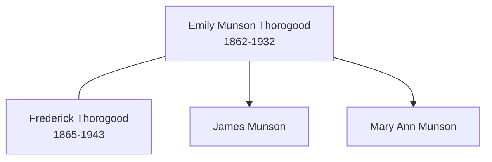

# Emily Munson

## Biographical Profile

- **Name:** Emily Munson
- **Role in this project:** Essex Munson-to-Thorogood branch individual represented in 1871-1911 census-summary extracts.

## Source-Cited Facts

- A census-summary entry gives Emily Munson as born 10 Feb 1862 and died 5 Mar 1932.
- The 1871 Felstead entry lists Emily Munson as daughter in James and Mary Ann Munson's household.
- The 1881 Barnston entry lists Emily Munsen as domestic servant.
- The 1891, 1901, and 1911 Chelmsford entries list Emily Thorogood as wife in Frederick Thorogood households.
- The Bellamy pedigree timeline places Emily Munson in the Bellamy collateral branch and connects her to the Frederick Thorogood marriage line.
- The Burial Sites book places Emily Munson Thorogood at Chelmsford Borough Cemetery in Chelmsford, Essex, England (page 21), Grave 4827, with date of death 5 March 1932 and inscription noting her as the beloved wife of Frederick Thorogood. Map: [Google Maps](https://www.google.com/maps/search/?api=1&query=Chelmsford+Borough+Cemetery+Essex+England).

## Family Diagram

This is a household- and marriage-level sketch; the 1881 servant record remains separate context.

## Research Gaps

1. Confirm Munson-to-Thorogood marriage linkage from civil records.
2. Resolve Felstead/Felsted spelling and MUNSON/MUNSEN variants.
3. Validate incomplete RG14 fields in the 1911 segment from primary images.

## Sources

1. [[References/Shared Intake 2026-04-22 Census Summary Individuals p41-p50|Shared Intake 2026-04-22 Census Summary Individuals p41-p50]]
2. [[References/Shared Intake 2026-04-22 Census Citation Notes|Shared Intake 2026-04-22 Census Citation Notes]]
3. [[References/Shared Intake 2026-04-22 Pedigree Timeline Bellamy|Shared Intake 2026-04-22 Pedigree Timeline Bellamy]]
4. [[References/Shared Intake 2026-04-22 Burial Sites Summary|Shared Intake 2026-04-22 Burial Sites Summary]]
5. `References/raw/extracted/PedigreeTimelines2025Bellamy.txt`
6. `References/raw/inbox/2026-04-22-intake/BurialSites/BurialSites.txt`
7. `References/raw/inbox/2026-04-22-intake/Census/CensusSummaryIndividual.pdf`
