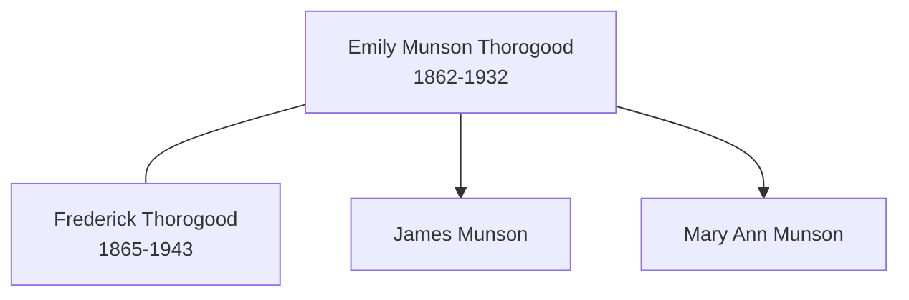

![[assets/snippets/Emily Munson.svg]]

# Emily Munson

## Biographical Profile

- **Dates:** 10 Feb 1862 - 5 Mar 1932

- **Name:** Emily Munson
- **Role in this project:** Essex Munson-to-Thorogood branch individual represented in 1871-1911 census-summary extracts.

## Source-Cited Facts

- A census-summary entry gives Emily Munson as born 10 Feb 1862 and died 5 Mar 1932.
- The 1871 Felstead entry lists Emily Munson as daughter in James and Mary Ann Munson's household.
- The 1881 Barnston entry lists Emily Munsen as domestic servant.
- The 1891, 1901, and 1911 Chelmsford entries list Emily Thorogood as wife in Frederick Thorogood households.
- The Bellamy pedigree timeline places Emily Munson in the Bellamy collateral branch and connects her to the Frederick Thorogood marriage line.
- The processed Bellamy timeline review confirms Emily's placement under the James Munson branch, while keeping the exact spouse/parent geometry tied to chart layout.
- The Burial Sites book places Emily Munson Thorogood at Chelmsford Borough Cemetery in Chelmsford, Essex, England (page 21), Grave 4827, with date of death 5 March 1932 and inscription noting her as the beloved wife of Frederick Thorogood. Map: [Google Maps](https://www.google.com/maps/search/?api=1&query=Chelmsford+Borough+Cemetery+Essex+England).

## Family Diagram



This is a household- and marriage-level sketch; the 1881 servant record remains separate context.


## Research Gaps

> [!warning] Priority Research Leads
> The following census records are indicated in the pedigree diagrams but matching transcripts are missing from the vault:
> - **1860 Census**: Transcript needed to verify household context.

## Census Records

> [!info] Extract from References/raw/extracted/CensusSummaryIndividual.txt

```text
MUNSON, Emily (10 Feb 1862 - 5 Mar 1932)
1871 Essex, Felstead, Village
No. Name
Rel
Cond. AM AF Occupation
120 James MUNSON
Head
Mar
55
Police Constable
Mary Ann MUNSON
Wife
Mar
38
Alfred MUNSON
Son
Unm
18
Miller Journeyman
Henry MUNSON
Son
Unm
12
Errand Boy
John MUNSON
Son
Unm
10
Scholar
Emily MUNSON
Daur Unm
8 Scholar
Albert MUNSON
Son
Unm
7
Scholar
Ellen MUNSON
Daur Unm
4 Scholar
Public Records Office, Reference - Source: RG10, Piece: 1703, Folio: 50, Page: 20, No: 120

Where Born
Essex, Langham
Essex, Felsted
Essex, Felsted
Essex, Felsted
Essex, Felsted
Essex, Felsted
Essex, Felsted
Essex, Felsted

1881 Essex, Barnston, Bickners
Name
Joseph Fleetwood WELLS
Jessie Matilda WELLS
Matilda CAMPBELL
Emma DIGBY
Emily MUNSEN
Fam Hist Lib Film

Mar Age
M
30

Sex
M

Birthplace
Little Waltham, Essex, England

Relationship
Head

M
28
F
Canada
W
69
F
Bristol, Somerset, England
U
22
F
Great Leighs, Essex, England
U
20
F
Felstead, Essex, England
1341437 PRO Ref RG11 Piece 1813 Folio 5 Page 3

Wife
Mother In Law
Serv
Serv

Occupation
Farmer (388 Acres)
Emp. 16 Men & 4 Boys
Farmers Wife
Cook (Domestic)
Housmaid (Domestic)

1891 Essex, Chelmsford, White House Farm, Baddow Road
Name
Relationship
Mar
Age M Age F Occupation
Frederick THOROGOOD
Head
M
26
Railway Clerk
Emily THOROGOOD
Wife
M
29
Mary THOROGOOD
Mother
W
67
Retired Publican
Public Records Office, Reference - Source: RG12, Piece: 1386, Folio: 88, Page: 17, No: 112

Birthplace
Herts, Wormley
Essex, Felstead
Essex, Boreham

1901 Essex, Chelmsford, 37 Baddow Road
Name
Relationship Marr Age-M Age-F
Occupation
Frederick THOROGOOD
Head
M
36
Railway Clerk
Emily THOROGOOD
Wife
M
39
Annie G THOROGOOD
Dau
S
9
Grace C THOROGOOD
Dau
S
6
Public Records Office, Reference - Source: RG13, Piece: 1672, Folio: 94, Page: 7, No: 43

Worker?

Where born
Herts, Wormley
Essex, Felstead
Essex, Chelmsford
Essex, Chelmsford

1911 Essex, Chelmsford, 37 Baddow Road
Name
Relationship Marr
Years Sex
Age
THOROGOOD, Frederick
Head
Married
M
46
THOROGOOD, Emily
Wife
Wife
20
F
48
THOROGOOD, Annie Gertrude Daughter
Single
F
19
THOROGOOD, Grace Caroline Daughter
Single
F
16
THOROGOOD, Frederick James Son
M
8
Public Records Office, Reference - Source: RG14, Piece: , Folio: , Page: , No:
(RG14PN10056 RG78PN529 RD194 SD2 ED11 SN41)

CENSUS SUMMARY - INDIVIDUALS

Robert Archer John Thorpe

Occupation
Railway Clerk
Dressmaker
Dressmaker
School

Where born:
Herts, Wormley
Essex, Felstead
Essex, Chelmsford
Essex, Chelmsford
Essex, Chelmsford

47
```


## Name Variations

> [!info] Known aliases or census misspellings from Butch Thorpe's cross-reference table.
>
> - **MUNSEN, Emily**
> - **THOROGOOD, Emily**
## Source Indicators

> [!info] Indicators from Pedigree Timeline Diagrams
>
> - **Census Records**: Found in 1860, 1870
> - **Burial**: Verified (RIP marker)

## Sources

1. [[References/Shared Intake 2026-04-22 Census Summary Individuals p41-p50|Shared Intake 2026-04-22 Census Summary Individuals p41-p50]]
2. [[References/Shared Intake 2026-04-22 Census Citation Notes|Shared Intake 2026-04-22 Census Citation Notes]]
3. [[References/Shared Intake 2026-04-22 Pedigree Timeline Bellamy|Shared Intake 2026-04-22 Pedigree Timeline Bellamy]]
4. [[bellamy-pedigree-timeline-index|Bellamy Pedigree Timeline Extraction Index]]
5. [[References/Shared Intake 2026-04-22 Burial Sites Summary|Shared Intake 2026-04-22 Burial Sites Summary]]
6. `References/raw/extracted/PedigreeTimelines2025Bellamy.txt`
7. `References/raw/inbox/2026-04-22-intake/BurialSites/BurialSites.txt`
8. `References/raw/inbox/2026-04-22-intake/Census/CensusSummaryIndividual.pdf`

1. `References/raw/inbox/2026-04-24-census-indesign/CensusSummary-MunsonEmily.txt`
