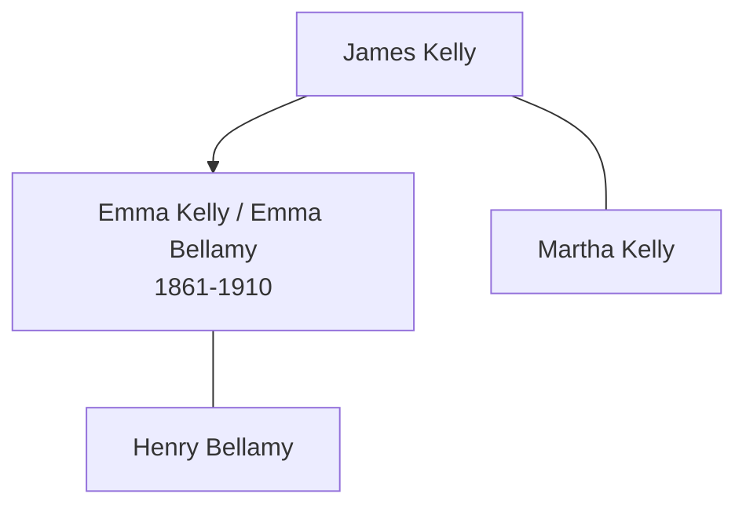

# Emma Kelly

## Biographical Profile

- **Name:** Emma Kelly
- **Role in this project:** Kelly-to-Bellamy branch individual represented in UK census-summary entries.

## Source-Cited Facts

- A census-summary entry gives Emma Kelly as born 25 May 1861 and died 24 Dec 1910.
- The 1871 Peterborough Wood Street household includes Emma Kelly as daughter in James and Martha Kelly's household.
- The 1881 Peterborough North Street entry lists Emma Kelly as an unmarried domestic servant.
- The 1891 and 1901 Peterborough entries list Emma Bellamy as wife in Henry/Harry Bellamy households.
- The Burial Sites book places Emma Kelly at Broadway Cemetery in Peterborough, Cambridgeshire, England (page 13), 3rd Div, 2nd Plan, Grave no. 3976, with date of death 24 December 1910 and no visible stone. Map: [Google Maps](https://www.google.com/maps/search/?api=1&query=Broadway+Cemetery+Peterborough+Cambridgeshire+England).

## Family Diagram

This sketch shows the household sequence and the later marriage link without collapsing Emma Kelly and Emma Bellamy into separate people.

## Research Gaps

1. Confirm continuity from Emma Kelly to Emma Bellamy across 1881-1891 records.
2. Validate all RG10/RG11/RG12/RG13 details from image-level records where fields are incomplete.
3. Confirm death details from civil records to support 1910 date.

## Sources

1. [[References/Shared Intake 2026-04-22 Census Summary Individuals p31-p40|Shared Intake 2026-04-22 Census Summary Individuals p31-p40]]
2. [[References/Shared Intake 2026-04-22 Census Citation Notes|Shared Intake 2026-04-22 Census Citation Notes]]
3. [[References/Shared Intake 2026-04-22 Burial Sites Summary|Shared Intake 2026-04-22 Burial Sites Summary]]
4. `References/raw/inbox/2026-04-22-intake/BurialSites/BurialSites.txt`
5. `References/raw/inbox/2026-04-22-intake/Census/CensusSummaryIndividual.pdf`
