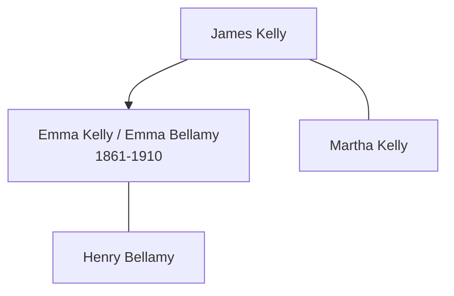

![[assets/snippets/Emma Kelly.svg]]

# Emma Kelly

## Biographical Profile

- **Dates:** 25 May 1861 - 24 Dec 1910

- **Name:** Emma Kelly
- **Role in this project:** Kelly-to-Bellamy branch individual represented in UK census-summary entries.

## Source-Cited Facts

- A census-summary entry gives Emma Kelly as born 25 May 1861 and died 24 Dec 1910.
- The 1871 Peterborough Wood Street household includes Emma Kelly as daughter in James and Martha Kelly's household.
- The 1881 Peterborough North Street entry lists Emma Kelly as an unmarried domestic servant.
- The 1891 and 1901 Peterborough entries list Emma Bellamy as wife in Henry/Harry Bellamy households.
- The Bellamy pedigree timeline places Emma Kelly in the Kelly-to-Bellamy branch and suggests the marriage link to Henry James Bellamy.
- The processed Bellamy timeline review keeps that Henry-James link as a chart-layout reading supported by the later census sequence, rather than as a stand-alone chart proof.
- The Burial Sites book places Emma Kelly at Broadway Cemetery in Peterborough, Cambridgeshire, England (page 13), 3rd Div, 2nd Plan, Grave no. 3976, with date of death 24 December 1910 and no visible stone. Map: [Google Maps](https://www.google.com/maps/search/?api=1&query=Broadway+Cemetery+Peterborough+Cambridgeshire+England).

## Family Diagram



This sketch shows the household sequence and the later marriage link without collapsing Emma Kelly and Emma Bellamy into separate people.

## Research Gaps

1. Confirm continuity from Emma Kelly to Emma Bellamy across 1881-1891 records.
2. Validate all RG10/RG11/RG12/RG13 details from image-level records where fields are incomplete.
3. Confirm death details from civil records to support 1910 date.
4. Keep the chart-based marriage placement tied to the broader census sequence.


## Census Records

> [!info] Extract from References/raw/extracted/CensusSummaryIndividual.txt

```text
KELLY, Emma (25 May 1861 - 24 Dec 1910)
1871 Northamptonshire, Peterborough, 73 Wood Street
No.
25

Name
Rel
Cond. AM AF Occupation
James KELLY
Head
Mar
43
Tailor
Martha KELLY
Wife
Mar
40
John James KELLY
Son
Unm
16
Fitter & Turner
Emma KELLY
Daur
9 Scholar
Hannah KELLY
Daur
6 Scholar
Georgiana KELLY
Daur
4 Scholar
Harriet KELLY
Daur
3 Scholar
George KELLY
Son
1
Public Records Office, Reference - Source: RG10, Piece: , Folio: , Page: , No:

Where Born
Northamptonshire, Peterborough
Northamptonshire, Peterborough
Northamptonshire, Peterborough
Northamptonshire, Peterborough
Northamptonshire, Peterborough
Northamptonshire, Peterborough
Northamptonshire, Peterborough
Northamptonshire, Peterborough

1881 Northampton, Peterborough, North Street
Name
Mar Age Sex Birthplace
George KIRKWOOD
U
28
M
Scotland
Mireian B. KIRKWOOD
W
64
F
Scotland
Katherine H. KIRKWOOD
U
27
F
Scotland
Alice S. LOWE
U
56
F
Scotland
Emma KELLY
U
19
F
Peterboro, Northampton, England
Fam Hist Lib Film
1341382 PRO Ref RG11 Piece 1593 Folio 127 Page 24

Relationship
Head
Mother
Sister
Serv
Serv

Occupation
M.D. Edinr Gen Pract

Cook Dom Serv
Housemaid Dom Serv

1891 Northamptonshire, Peterborough, 7 Gladstone Street
Name
Relationship
Mar
Age M Age F Occupation
Henry BELLAMY
Head
M
28
Chemist’s & Draper’s Trav
Emma BELLAMY
Wife
M
29
Annie BELLAMY
Daur
6
George BELLAMY
Son
3
Archibald BELLAMY
Son
2
Public Records Office, Reference - Source: RG12, Piece: 1228, Folio: 28, Page: 10, No: 60

Birthplace
Lincs, Bourne
Norths, Peterborough
Norths, Peterborough
Norths, Peterborough
Norths, Peterborough

1901 Northampton, Peterborough, 70 Russell Street
Name
Relationship Marr Age-M Age-F
Occupation
Harry BELLAMY
Head
M
38
Commercial Traveller
Emma BELLAMY
Wife
M
39
Annie BELLAMY
Daur
S
16
George William BELLAMY
Son
S
13
James A BELLAMY
Son
12
Albert Victor BELLAMY
Son
7
Olive Winifred BELLAMY
Daur
4
Milicent May BELLAMY
Daur
2
Public Records Office, Reference - Source: RG13, Piece: 1463, Folio: 143, Page: 34, No: 228

CENSUS SUMMARY - INDIVIDUALS

Robert Archer John Thorpe

Worker?
Worker

Where born
Peterborough
Peterborough
Peterborough
Peterborough
Peterborough
Peterborough
Peterborough
Peterborough

34
```


## Name Variations

> [!info] Known aliases or census misspellings from Butch Thorpe's cross-reference table.
>
> - **BELLAMY, Emma**
## Source Indicators

> [!info] Indicators from Pedigree Timeline Diagrams
>
> - **Official Records**: Ref #151, 199
> - **Burial**: Verified (RIP marker)

## Sources

1. [[References/Shared Intake 2026-04-22 Census Summary Individuals p31-p40|Shared Intake 2026-04-22 Census Summary Individuals p31-p40]]
2. [[References/Shared Intake 2026-04-22 Census Citation Notes|Shared Intake 2026-04-22 Census Citation Notes]]
3. [[References/Shared Intake 2026-04-22 Pedigree Timeline Bellamy|Shared Intake 2026-04-22 Pedigree Timeline Bellamy]]
4. [[bellamy-pedigree-timeline-index|Bellamy Pedigree Timeline Extraction Index]]
5. [[References/Shared Intake 2026-04-22 Burial Sites Summary|Shared Intake 2026-04-22 Burial Sites Summary]]
6. `References/raw/extracted/PedigreeTimelines2025Bellamy.txt`
7. `References/raw/inbox/2026-04-22-intake/BurialSites/BurialSites.txt`
8. `References/raw/inbox/2026-04-22-intake/Census/CensusSummaryIndividual.pdf`

1. `References/raw/inbox/2026-04-24-census-indesign/CensusSummary-KellyEmma.txt`
