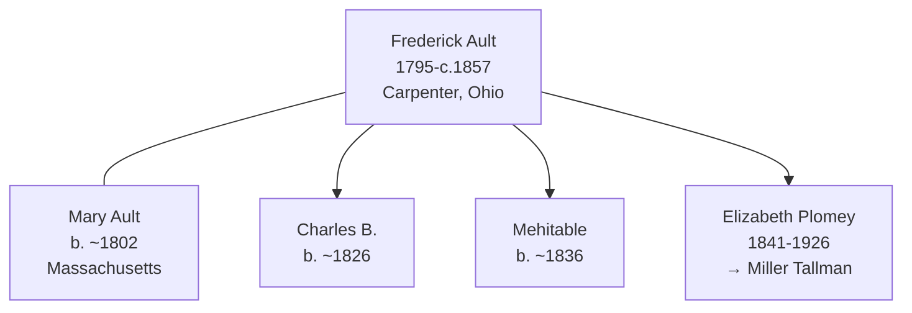

# Frederick Ault

## Biographical Profile

- **Name:** Frederick Ault
- **Role in this project:** Ault-line ancestor indexed in the census summary and listed as household head in 1850 Meigs County, Ohio.

## Source-Cited Facts

- **Birth/Death:** Born 8 Mar 1795; died about 1857 (age ~62).
- **Occupation:** Carpenter
- **Birthplace:** Pennsylvania

## Census Records and Household Context

### 1850 Ohio Census — Meigs County, Salisbury Township, District No. 98
- **Head:** `Frederick AULT`, male, age 55, occupation carpenter, born Pennsylvania
- **Spouse:** `Mary AULT`, female, age 48, born Massachusetts
- **Children:**
  - `Charles B. AULT`, male, age 24, born Ohio
  - `Mehitable AULT`, female, age 14, born Ohio
  - `Elizabeth AULT`, female, age 8, born Ohio (later [[People/Elizabeth Plomey Ault|Elizabeth Plomey Ault]])
- **Source:** Series M432, Roll 710, Page 175; GSU microfilm available

## Family Connections

- **Wife:** Mary Ault (b. ~1802 Massachusetts)
- **Children identified:** Charles B. (b. ~1826), Mehitable (b. ~1836), Elizabeth Plomey (b. 1841, later [[People/Elizabeth Plomey Ault|Elizabeth Plomey Ault]])
- **Occupation:** Carpenter (skilled tradesman in Ohio)
- **Pedigree significance:** Father of [[People/Elizabeth Plomey Ault|Elizabeth Plomey Ault]], who married [[People/Miller Mathias Tallman|Miller Mathias Tallman]] and migrated to Iowa

## Family Diagram

Frederick Ault bridges the Ohio Ault family line from patriarch Andrew Ault to the Iowa Tallman connection through his daughter Elizabeth Plomey's marriage to Miller Mathias Tallman.

## Research Gaps

1. Confirm death date and location from independent cemetery records.
2. Validate household relationships from original census images.
3. Determine relationship to [[People/Andrew Ault|Andrew Ault]] (same township, 1850).
4. Extend profile with pre-1850 and post-1850 record coverage.

## Sources

1. [[References/Shared Intake 2026-04-22 Census Summary Individuals p1-p10|Shared Intake 2026-04-22 Census Summary Individuals p1-p10]]
2. `References/raw/inbox/2026-04-22-intake/BurialSites/BurialSites.txt`
3. `References/raw/inbox/2026-04-22-intake/Census/CensusSummaryIndividual.pdf`

1. `References/raw/inbox/2026-04-24-census-indesign/CensusSummary-AultFrederick.txt`

2. [[References/Shared Intake 2026-04-22 Pedigree Timeline Thorpe|Shared Intake 2026-04-22 Pedigree Timeline Thorpe]]