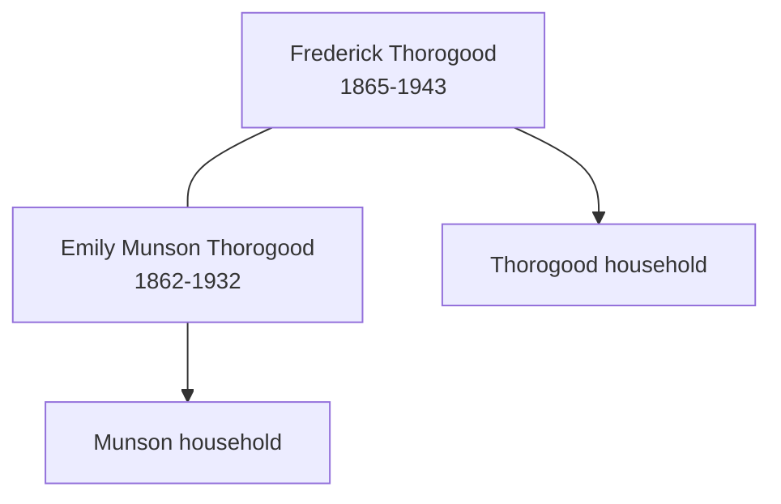

# Frederick Thorogood

## Biographical Profile

- **Name:** Frederick Thorogood
- **Role in this project:** Thorogood-line individual indexed in the census summary extraction.

## Source-Cited Facts

- A census-summary entry gives Frederick Thorogood as born 25 Mar 1865 and died 18 Sep 1943.
- The extraction notes a UK census sequence spanning 1871 through 1911.
- The Bellamy pedigree timeline places Frederick Thorogood in the Bellamy collateral branch through Emily Munson / Thorogood.
- The processed Bellamy timeline review keeps Frederick in the James Thorogood branch and ties his Emily Munson link to chart layout rather than stand-alone proof.
- The Burial Sites book places Frederick Thorogood at Chelmsford Borough Cemetery in Chelmsford, Essex, England (page 39), Grave 4827, and the inscription says `FREDERICK THOROGOOD / AGED 78 YEARS / Death divides but memory clings`. Map: [Google Maps](https://www.google.com/maps/search/?api=1&query=Chelmsford+Borough+Cemetery+Chelmsford+Essex+England).

## Family Diagram

This sketch keeps the marriage link visible while leaving the earlier household sequence as separate source-backed context.

## Research Gaps

1. Confirm parish/civil locations and household members in each census year.
2. Validate death registration details for September 1943.
3. Keep the Thorogood-to-Munson placement tied to the broader census and burial context.

## Sources

1. [[References/Shared Intake 2026-04-22 Census Summary Individuals p61-p96|Shared Intake 2026-04-22 Census Summary Individuals p61-p96]]
2. [[References/Shared Intake 2026-04-22 Pedigree Timeline Bellamy|Shared Intake 2026-04-22 Pedigree Timeline Bellamy]]
3. [[References/raw/processed/2026-04-22-intake/Pedigree Timeline/BELLAMY_PEDIGREE_TIMELINE_INDEX|Bellamy Pedigree Timeline Extraction Index]]
4. [[References/Shared Intake 2026-04-22 Burial Sites Summary|Shared Intake 2026-04-22 Burial Sites Summary]]
5. `References/raw/extracted/PedigreeTimelines2025Bellamy.txt`
6. `References/raw/processed/2026-04-22-intake/Census/Ancestors in the Census.txt`
7. `References/raw/inbox/2026-04-22-intake/BurialSites/BurialSites.txt`

1. `References/raw/inbox/2026-04-24-census-indesign/CensusSummary-ThorogoodFrederick.txt`
