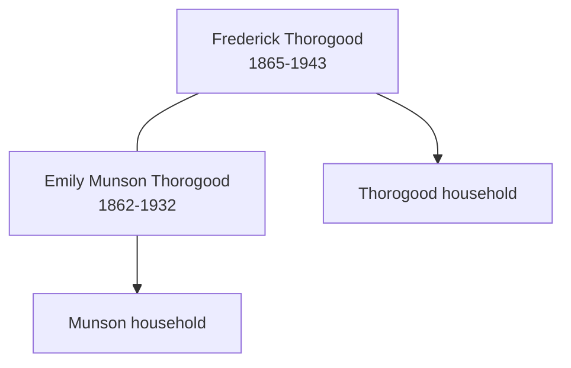

![[assets/snippets/Frederick Thorogood.svg]]

# Frederick Thorogood

## Biographical Profile

- **Name:** Frederick Thorogood
- **Role in this project:** Thorogood-line individual indexed in the census summary extraction.

## Source-Cited Facts

- A census-summary entry gives Frederick Thorogood as born 25 Mar 1865 and died 18 Sep 1943.
- The extraction notes a UK census sequence spanning 1871 through 1911.
- The Bellamy pedigree timeline places Frederick Thorogood in the Bellamy collateral branch through Emily Munson / Thorogood.
- The processed Bellamy timeline review keeps Frederick in the James Thorogood branch and ties his Emily Munson link to chart layout rather than stand-alone proof.
- The Burial Sites book places Frederick Thorogood at Chelmsford Borough Cemetery in Chelmsford, Essex, England (page 39), Grave 4827, and the inscription says `FREDERICK THOROGOOD / AGED 78 YEARS / Death divides but memory clings`. Map: [Google Maps](https://www.google.com/maps/search/?api=1&query=Chelmsford+Borough+Cemetery+Chelmsford+Essex+England).

## Family Diagram



This sketch keeps the marriage link visible while leaving the earlier household sequence as separate source-backed context.


## Research Gaps

> [!warning] Priority Research Leads
> The following census records are indicated in the pedigree diagrams but matching transcripts are missing from the vault:
> - **1860 Census**: Transcript needed to verify household context.
> - **1920 Census**: Transcript needed to verify household context.
> - **1930 Census**: Transcript needed to verify household context.
> - **1940 Census**: Transcript needed to verify household context.

## Census Records

> [!info] Extract from References/raw/extracted/CensusSummaryIndividual.txt

```text
THOROGOOD, Frederick (25 Mar 1865 - 18 Sep 1943)
1871 Hertfordshire, Wormley, High Street
No.
30

Name
Rel
Cond. AM AF Occupation
James THOROGOOD
Head
Mar
43
Licensed Vitualler
Mary THOROGOOD
Wife
Mar
45
Frederick THOROGOOD Son
6
Frederick THOROGOOD
Visitor Unm
39
Gent? Servant
John WARNER
Lodger Unm
24
Laborer
James EVENS
Lodger Unm
26
Laborer
George LARILE?
Lodger Unm
28
Ostler?
Public Records Office, Reference - Source: RG10, Piece: 1349, Folio: 7, Page: 5, No: 30

Where Born
Essex, Felsted
Essex, Boreham
Herts, Wormley
Essex, Felsted
Herts, Stantton?
Herts, Westford?
Herts, Albury

1881 Essex, Great Baddow, Baddow Rd, page 1 and 2
Name
Mar Age Sex Birthplace
Relationship
Hannah HAWKES
W
45
F
Boreham, Essex, England
Head
Emily HAWKES
U
17
F
Gt Baddow, Essex, England
Daur
Arthur W. HAWKES
U
16
M
Gt Baddow, Essex, England
Son
Laura HAWKES
14
F
Gt Baddow, Essex, England
Daur
Charles HAWKES
10
M
Gt Baddow, Essex, England
Son
George HAWKES
7
M
Gt Baddow, Essex, England
Son
Frederick HAWKES
5
M
Gt Baddow, Essex, England
Son
Frederick THOROGOOD
16
M
Wormley, Hertford, England
Visitor
Fam Hist Lib Film
1341425 PRO Ref RG11 Piece 1766 Folio 76 Page 24 & 25

Occupation
Charwoman
Housekeeper To Mother
Journeyman Baker
Scholar
Scholar
Scholar
Scholar
Scholar

1891 Essex, Chelmsford, White House Farm, Baddow Road
Name
Relationship
Mar
Age M Age F Occupation
Frederick THOROGOOD
Head
M
26
Railway Clerk
Emily THOROGOOD
Wife
M
29
Mary THOROGOOD
Mother
W
67
Retired Publican
Public Records Office, Reference - Source: RG12, Piece: 1386, Folio: 88, Page: 17, No: 112

Birthplace
Herts, Wormley
Essex, Felstead
Essex, Boreham

1901 Essex, Chelmsford, 37 Baddow Road
Name
Relationship Marr Age-M Age-F
Occupation
Frederick THOROGOOD
Head
M
36
Railway Clerk
Emily THOROGOOD
Wife
M
39
Annie G THOROGOOD
Dau
S
9
Grace C THOROGOOD
Dau
S
6
Public Records Office, Reference - Source: RG13, Piece: 1672, Folio: 94, Page: 7, No: 43

Worker?

Where born
Herts, Wormley
Essex, Felstead
Essex, Chelmsford
Essex, Chelmsford

1911 Essex, Chelmsford, 37 Baddow Road
Name
Relationship Marr
Years Sex
Age
THOROGOOD, Frederick
Head
Married
M
46
THOROGOOD, Emily
Wife
Wife
20
F
48
THOROGOOD, Annie Gertrude Daughter
Single
F
19
THOROGOOD, Grace Caroline Daughter
Single
F
16
THOROGOOD, Frederick James Son
M
8
Public Records Office, Reference - Source: RG14, Piece: , Folio: , Page: , No:
(RG14PN10056 RG78PN529 RD194 SD2 ED11 SN41)

CENSUS SUMMARY - INDIVIDUALS

Robert Archer John Thorpe

Occupation
Railway Clerk
Dressmaker
Dressmaker
School

Where born:
Herts, Wormley
Essex, Felstead
Essex, Chelmsford
Essex, Chelmsford
Essex, Chelmsford

75
```


## Source Indicators

> [!info] Indicators from Pedigree Timeline Diagrams
>
> - **Census Records**: Found in 1860, 1870, 1880, 1900, 1910, 1920, 1930, 1940
> - **Official Records**: Ref #012, 253, 030, 032, 065, 226, 230, 251
> - **Burial**: Verified (RIP marker)
> - **Obituary**: Available (Obit marker)

## Sources

1. [[References/Shared Intake 2026-04-22 Census Summary Individuals p61-p96|Shared Intake 2026-04-22 Census Summary Individuals p61-p96]]
2. [[References/Shared Intake 2026-04-22 Pedigree Timeline Bellamy|Shared Intake 2026-04-22 Pedigree Timeline Bellamy]]
3. [[bellamy-pedigree-timeline-index|Bellamy Pedigree Timeline Extraction Index]]
4. [[References/Shared Intake 2026-04-22 Burial Sites Summary|Shared Intake 2026-04-22 Burial Sites Summary]]
5. `References/raw/extracted/PedigreeTimelines2025Bellamy.txt`
6. `References/raw/processed/2026-04-22-intake/Census/Ancestors in the Census.txt`
7. `References/raw/inbox/2026-04-22-intake/BurialSites/BurialSites.txt`

1. `References/raw/inbox/2026-04-24-census-indesign/CensusSummary-ThorogoodFrederick.txt`
