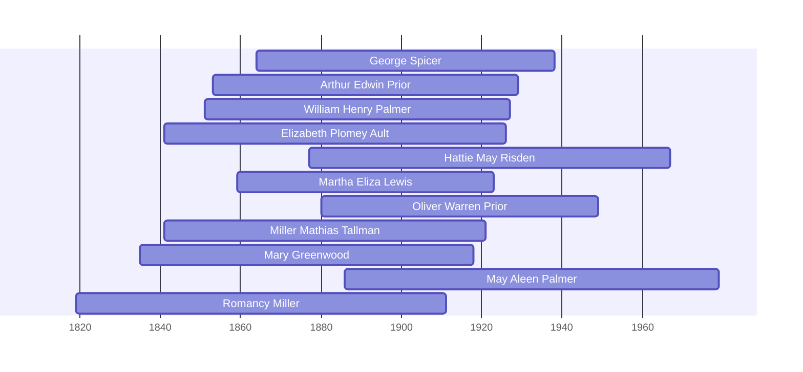

![[assets/snippets/George B Spicer.svg]]

# George Spicer

## Biographical Profile

- **Name:** George B. Spicer
- **Birth/Death:** 3 Sep 1864 – 15 May 1938 (age 73 years, 8 months)
- **Role in this project:** Direct-line Spicer patriarch; Iowa agricultural farmer and household head (1900-1938); husband of [[People/Hattie May Risden|Hattie May Risden]] (Thorpe line connection).
- The processed Spicer timeline review confirms George B. Spicer as the next direct generation after Charles Russell Spicer and before Lester Harold Spicer.

## Census Records and Household Context

### 1870 Iowa Census — Linn County, Clinton Township (as child)
- **Head:** Charles Spicer, male, farm laborer
- **George B. Spicer** appears in household, age ~6
- **Household:** Mary Spicer (wife), Sylvester, Amanda, Mary, William, Perry, George, Ella, Zerna
- **Source:** Series M593, Roll 405, Page 67

### 1880 Iowa Census — Linn County, Clinton Township (as young adult)
- **Head:** Russel Spicer, male, farmer, age ~50, born New York
- **Wife:** Mary Spicer, female, keeping house, born Ohio
- **George B. Spicer** appears as son, male, single, age ~16, Iowa-born
- **Siblings:** William, Ellen, Dellie M., Elizabeth
- **Source:** Series T9, Roll 351, Page 153C, ED 260; Fam Hist Lib Film 1254351

### 1900 Iowa Census — Linn County, Clinton Township (as household head)
- **Head:** `George B. Spicer`, male, farmer, born September
- **Wife:** `Hattie Spicer`, female, age ~23
- **Mother:** Mary Spicer (living with household)
- **Sister:** Clara Spicer
- **Boarder:** Roy Forney, farm laborer
- **Source:** Series T623, Roll 443, Page 62B

### 1910 Iowa Census — Benton County, Canton Township (mid-career)
- **Head:** `George Spicer`, male, farmer
- **Wife:** `Hattie Spicer`, female
- **Children:** Edith, Charles S., George G., Lester H., Chester J.
- **Brother:** William Spicer (farm worker)
- **Source:** Series T624, Roll 391, Pages 56-57

### 1920 Iowa Census — Benton County, Benton Township (later career)
- **Head:** `George Spicer`, male, farmer
- **Wife:** `Hattie Spicer`, female
- **Children at home:** Charles S., George J., Lester H., Chester J., Edna, Myron L. (6 children, aged 6-20+)
- **Note:** Large household, mid-career farming prosperity
- **Source:** Series T625, Roll 477, Pages 4B & 5A, ED 4

## Family Connections

- **Parents:** Charles Spicer (patriarch, 1870), Mary Spicer (mother, appears through 1900)
- **Wife:** [[People/Hattie May Risden|Hattie May Risden]] (1877-1967) — married ~1900; 40-year partnership; buried in adjacent lots (Lot 88, Space 5 vs. 4)
- **Children identified:** Edith, Charles S., George G., Lester H., Chester J., Edna, Myron L. (7 children across household chains)
- **Siblings:** William (appears in 1880 and 1910 as farm worker); Charles, Sylvester, Amanda, Perry, Ella, Zerna (from 1870 household)
- **Pedigree connection:** Marries into [[Topics/Lemmon Blake Thorpe Branch Summary|Lemmon-Thorpe line]] through Hattie May Risden (daughter of Sarah Annett Lemmon/Monroe Thorpe)

## Burial and Legacy

- **Burial:** Spring Grove Cemetery, Covington, Iowa; Lot 88, Space 5
- **Inscription:** `FATHER / GEORGE SPICER / 1864 — 1938`
- **Wife's burial:** Adjacent plot (Space 4) in same lot; both died and buried at Spring Grove
- **Legacy:** Patriarch of Iowa Spicer agricultural line spanning 1900-1938; 7+ children; large multi-generational household representing successful farm household model of early 20th century Iowa

## Research Gaps

1. Confirm whether Charles Spicer (1870 head) is biological father or step-father
2. Validate exact marriage date (~1900 estimated from census proximity)
3. Extend profile with any post-1920 records (1930 census, death records)
4. Keep the earlier Nathan-to-Charles linkage separate from the better-supported Charles-to-George-to-Lester chain.


## Census Records

> [!info] Extract from References/raw/extracted/CensusSummaryIndividual.txt

```text
SPICER, George B (3 Sep 1864 - 15 May 1938)
1870 Iowa, Linn County, Clinton Township
D/F
43/43

Name
Chas R SPICER
Mary SPICER
Sylvester N SPICER
Amanda SPICER
Mary SPICER
Wm SPICER
Perry SPICER
George SPICER
Ella SPICER
Zerna SPICER
Series: M593, Roll: 405, Page: 67

Age Sex
59? M
35
F
15
M
13
F
11
F
9
F
8
M
5
M
3
F
1
F

Color
W
W
W
W
W
W
W
W
W
W

Occupation
Farm Labr
Keeps House
Farm Labr

Real
800

Pers
300

Nativity Comments
New York
Iowa

1880 Iowa, Linn County, Clinton Township, Page 153 C & 153 D
D/F
65/66

Name
Russel SPICER
Mary SPICER
George SPICER
William SPICER
Ellen SPICER
Dellie M. SPICER
Elizabeth SPICER
Fam Hist Lib Film
1254351

Rel
Self
Wife
Son
Son
Dau
Dau
Dau

Married Gender Race Age
BP
Married
Male
White 59
NY
Married
Female White 45
OH
Single
Male
White 15
IA
Single
Male
White 19
IA
Single
Female White 12
IA
Single
Female White 8
IA
Single
Female White 7
IA
NA Film No. T9-0351
Page 153C

Occupation
Farmer
Keeping House

FBP
NY
ENG
NY
NY
NY
NY
NY

At School

MBP
NY
PA
OH
OH
OH
OH
OH

1900 Iowa, Linn County, Clinton Township
Add
242

Name
George SPICER
Hattie SPICER
Mary SPICER
Clara SPICER
Roy Forney
Series: T623, Roll: 443, Page 62B

Rel
Head
Wife
Mother
Sister
Boarder

Race
W
W
W
W
W

Sex
M
F
F
F
M

Birthdate
Sept 1865
Mar 1877
? 1835
Sept 1881
Nov 1878

Age
35
23
65
18
21

MS ?
M 3
M 3

? ?
2 0
12 10

S
S

BP
Iowa
Iowa
Ohio
Iowa
Iowa

FBP
Ohio
Ohio
Penn
Ohio
NY

MBP
Ohio
Ind
Eng
Ohio
NY

Occ
Farmer

Farm Labr

1910 Iowa, Benton County, Canton Township, Page 56 and Page 57
D/F
166

Name
Rel
George SPICER
Head
Hattie SPICER
Wife
Edith SPICER
Dau
Charles R SPICER
Son
George G SPICER
Son
Lester H SPICER
Son
Chester J SPICER
Son
William SPICER
Bro
Series: T624, Roll:391 , Pages 56, 57

Sex Race Age
M
W
45
F
W
32
F
W
9
M
W
8
M
W
6
M
W
3
M
W 2.3
M
W
49

MS
M1
M1
S
S
S
S
S
M2

?
13
13

?

?

5

5

BP
Iowa
Iowa
Iowa
Iowa
Iowa
Iowa
Iowa
Iowa

FBP

MBP

NY
Iowa
Iowa
Iowa
Iowa
Iowa

Ind
Iowa
Iowa
Iowa
Iowa
Iowa

Occupation
Farmer
None
None
None
None
None
None
Farmer Laborer

1920 Iowa, Benton County, Benton Township, Sheet 4B & 5A
D/F
99

Name
Rel
Sex Race Age
George SPICER
Head
M
W
55
Hattie SPICER
Wife
F
W
42
Charles R. SPICER
Son
M
W
17
George J. SPICER
Son
M
W
15
Lester H SPICER
Son
M
W
13
Chester J SPICER
Son
M
W
11
Edna SPICER
Dau
F
W
7
Myron SPICER
Son
M
W 4+
Series: T625, Roll: 477, Page: 4B & 5A, ED 4

CENSUS SUMMARY - INDIVIDUALS

MS
M
M
S
S
S
S
S
S

?

?

?

BP
Iowa
Iowa
Iowa
Iowa
Iowa
Iowa
Iowa
Iowa

Robert Archer John Thorpe

FBP
US
NY
Iowa
Iowa
Iowa
Iowa
Iowa
Iowa

MBP
US
Ind
Iowa
Iowa
Iowa
Iowa
Iowa
Iowa

Occupation
Farmer
None
Farm Laborer
Farm Laborer
None
None
None
None

66
```


## Overlapping Lifespans

> [!info] Visualizing contemporaries in the vault during the life of George Spicer (1864-1938).



## Source Indicators

> [!info] Indicators from Pedigree Timeline Diagrams
>
> - **Official Records**: Ref #156, 186
> - **Burial**: Verified (RIP marker)
> - **Obituary**: Available (Obit marker)

## Sources

1. [[References/Shared Intake 2026-04-24 Census InDesign Summaries|Census InDesign Summaries]]
2. `References/raw/inbox/2026-04-24-census-indesign/CensusSummary-SpicerGeorge p1.txt`
3. [[References/Shared Intake 2026-04-22 Burial Sites Summary|Burial Sites Summary]]
4. [[People/Hattie May Risden|Hattie May Risden]] (spouse page for household context)

2. [[References/Shared Intake 2026-04-22 Pedigree Timeline Spicer|Shared Intake 2026-04-22 Pedigree Timeline Spicer]]
3. [[References/raw/processed/2026-04-22-intake/pedigree-timeline/spicer-pedigree-timeline-index|Spicer Pedigree Timeline Extraction Index]]
