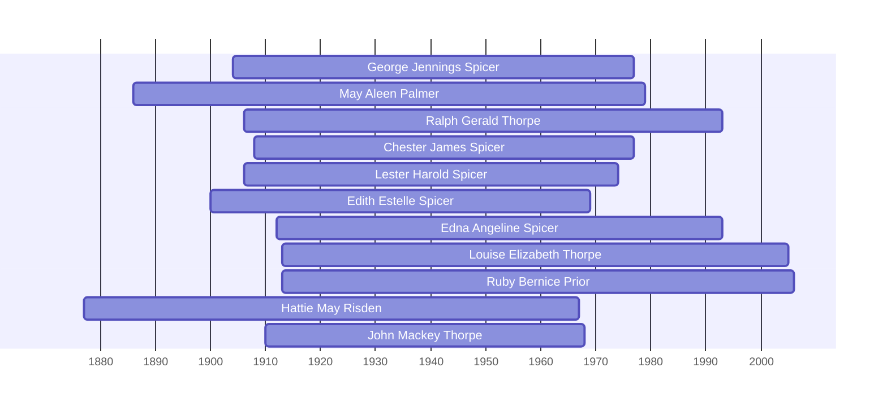

# George Jennings Spicer

## Biographical Profile

- **Name:** George Jennings Spicer
- **Dates:** 1904 - 1977

## Source-Cited Facts

- Identified in pedigree timeline source.

## Research Notes

- Initial stub created from pedigree timeline extraction.

## Overlapping Lifespans

> [!info] Visualizing contemporaries in the vault during the life of George Jennings Spicer (1904-1977).

## Sources

1. [[References/raw/extracted/PedigreeTimelines2025Spicer.txt|PedigreeTimelines2025Spicer.txt]]
