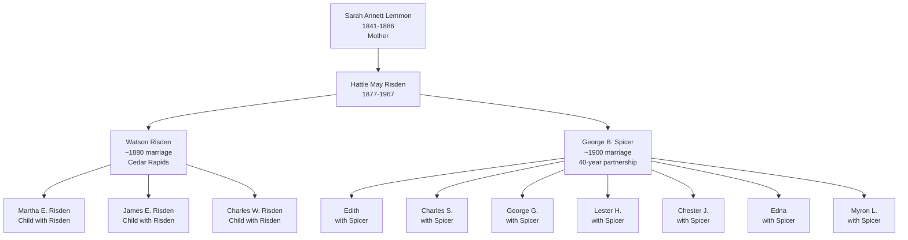
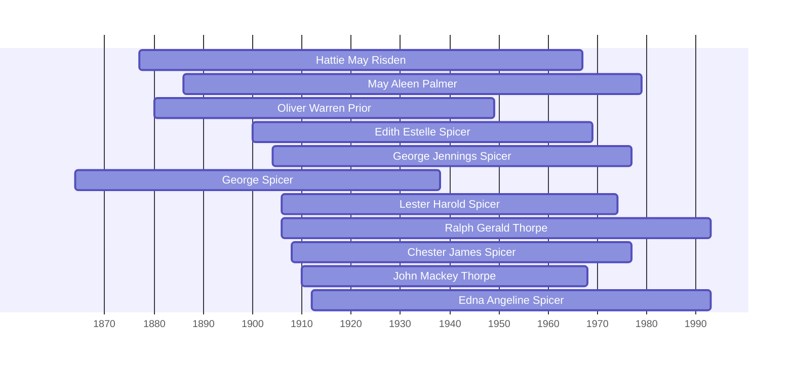

![[assets/snippets/Hattie May Risden.svg]]

# Hattie May Risden

## Biographical Profile

- **Name:** Hattie May Risden
- **Role in this project:** Spicer-line ancestor represented in repeated 1880-1930 Iowa census-summary chains.

## Source-Cited Facts

- **Birth/Death:** Born 29 Mar 1877; died 11 Mar 1967 (age 89 years, 11 months, 11 days).
- **Burial:** Spring Grove Cemetery, Covington, Iowa; Lot 88, Space 4; GPS 42°1’47.6”N 91°46’6.2”W; Burial Sites book, page 28.
- **Known spouses:** Watson Risden (1880), George B. Spicer (1900-1930)
- **Family lineage:** Daughter of [[People/Sarah Annett Lemmon|Sarah Annett Lemmon]] (1841-1886) and Monroe Thorpe; granddaughter of [[People/Uriah Blake Lemmon|Uriah Blake Lemmon]]; married into Spicer family line.
- The processed Spicer timeline review confirms the Risden-side chain `Onesimus Risden` -> `Moses Risden` -> `John Wheeler Risden` -> `Watson Moses Risden` -> `Hattie May Risden`, while keeping John Wheeler's chart dates as a conflict note.

## Census Records and Life Progression

### 1880 Iowa Census — Linn County, Cedar Rapids, Ward 5
- **Head:** `Watson Risden`, male, married, laborer
- **Hattie E. Risden** (spouse), female, keeping house
- **Children:**
  - Martha E. Risden, female, at school
  - James E. Risden, male, at school
  - Charles W. Risden, male
  - Hattie E. Risden, female (possibly granddaughter or daughter with same name)
- **Boarder:** Annie Havice, housekeeper, Pennsylvania
- **Source:** Series T9, Roll 351, Page 133B, ED 258; Fam Hist Lib Film 1254351

### 1900 Iowa Census — Linn County, Clinton Township
- **Head:** `George B. Spicer`, male, farmer
- **Hattie Spicer** (wife), female, age ~23
- **Children:**
  - Mary Spicer, mother (visiting/living with)
  - Clara Spicer, sister, age ~6
  - Roy Forney, boarder, farm laborer
- **Source:** Series T623, Roll 443, Page 62B

### 1910 Iowa Census — Benton County, Canton Township
- **Head:** `George Spicer`, male, farmer
- **Hattie Spicer** (wife), female
- **Children:** Edith, Charles S., George G., Lester H., Chester J., William (brother of George)
- **Source:** Series T624, Roll 391, Pages 56-57

### 1920 Iowa Census — Benton County, Benton Township
- **Head:** `George Spicer`, male, farmer
- **Hattie Spicer** (wife), female
- **Children:** Charles S., George J., Lester H., Chester J., Edna, Myron L.
- **Note:** Shows expansion of household through late childbearing years
- **Source:** Series T625, Roll 477, Pages 4B & 5A, ED 4

### 1930 Iowa Census — Linn County, Clinton Township
- **Head:** `George Spicer`, male, farmer
- **Hattie Spicer** (wife), female, age ~53
- **Children:** Lester H. (car repairer/railroad shop), Chester J. (farmer)
- **Note:** Hattie now in her 50s; household has contracted to adult children only
- **Source:** Series T626, Roll 664, Page 11A, ED 8

### 1940 Iowa Census — Linn County, Clinton Township
- **Head:** `Hattie Spicer` (now head of household), female
- **Son:** Myron L. Spicer, male, farmer
- **Note:** George Spicer no longer listed (likely deceased); Hattie as widow/head of household
- **Source:** Series T627?, Roll 664?, Page 13A, ED 57-8

## Family Connections

- **Father:** Monroe Thorpe (farmer, Ohio/Iowa); **Mother:** [[People/Sarah Annett Lemmon|Sarah Annett Lemmon]] (1841-1886)
- **Grandparents:** [[People/Uriah Blake Lemmon|Uriah Blake Lemmon]] (1808-1887) and Emily A. Lemmon
- **First husband:** Watson Risden (marriage ~1880 or earlier; household in Cedar Rapids 1880)
- **Second husband:** George B. Spicer (married ~1900; 40-year marriage 1900-1930+)
- **Children with Spicer:** Edith, Charles S., George G., Lester H., Chester J., Edna, Myron L. (7+ children across decades)
- **Siblings:** Nettie, Clyde, Gertrude, U.B. (from Sarah Annett’s 1880 household)
- **Buriedcemetery:** Spring Grove Cemetery, Covington; George B. Spicer also buried there

## Family Diagram



Hattie May bridges two marriages across Iowa household evolution: Watson Risden (Cedar Rapids 1880) and George B. Spicer (Clinton Township 1900-1940), with 7+ documented children and 50+ years of census household records.

## Research Gaps

1. Reconcile existing project profile naming (`Hattie Risden`) with this indexed full-name form.
2. Verify OCR-ambiguous row fields in 1900 and 1910 extracts.
3. Confirm death date from independent records.
4. Keep the John Wheeler Risden date conflict visible on linked branch pages and profiles.


## Census Records

> [!info] Extract from References/raw/extracted/CensusSummaryIndividual.txt

```text
RISDEN, Hattie May (29 Mar 1877 - 11 Mar 1967)
1880 Iowa, Linn County, Cedar Rapids, 4th Ward
D/F
177/198

Name
Watson RISDEN
Nancy RISDEN
Martha E. RISDEN
James E. RISDEN
Charles W. RISDEN
Hattie E. RISDEN
Fam Hist Lib Film
1254351

Rel
Self
Wife
Dau
Son
Son
Dau

Married Gender Race Age
BP
Married
Male
White 35
NY
Married
Female White 32
IN
Single
Female White 10
MI
Single
Male
White 5
IA
Single
Male
White 4
IA
Single
Female White 2
IA
NA Film No. T9-0351
Page 133B

Occupation
Laborer
Keeping House
At School
At School

FBP
NY
IN
NY
NY
NY
NY

MBP
NY
KY
IN
IN
IN
IN

1900 Iowa, Linn County, Clinton Township
Add
242

Name
George SPICER
Hattie SPICER
Mary SPICER
Clara SPICER
Roy Forney
Laborer
Series: T623, Roll: 443, Page 62B

Rel
Head
Wife
Mother
Sister
Boarder

Race
W
W
W
W
W

Sex
M
F
F
F
M

Birthdate
Sept 1865
Mar 1877
? 1835
Sept 1881
Nov 1878

Age
35
23
65
18
21

MS ?
M 3
M 3

? ?
2 0
12 10

S
S

BP
Iowa
Iowa
Ohio
Iowa
Iowa

FBP
Ohio
Ohio
Penn
Ohio
NY

MBP
Ohio
Ind
Eng
Ohio
NY

Occupation
Farmer

Farm

1910 Iowa, Benton County, Canton Township, Page 56 and Page 57
D/F
166

Name
Rel
George SPICER
Head
Hattie SPICER
Wife
Edith SPICER
Dau
Charles R SPICER
Son
George G SPICER
Son
Lester H SPICER
Son
Chester J SPICER
Son
William SPICER
Bro
Series: T624, Roll:391 , Pages 56, 57

Sex Race Age
M
W
45
F
W
32
F
W
9
M
W
8
M
W
6
M
W
3
M
W 2.3
M
W
49

MS
M1
M1
S
S
S
S
S
M2

?
13
13

?

?

5

5

BP
Iowa
Iowa
Iowa
Iowa
Iowa
Iowa
Iowa
Iowa

FBP

MBP

NY
Iowa
Iowa
Iowa
Iowa
Iowa

Ind
Iowa
Iowa
Iowa
Iowa
Iowa

Occupation
Farmer
None
None
None
None
None
None
Farmer Laborer

1920 Iowa, Benton County, Benton Township, Sheet 4B & 5A
D/F
99

Name
Rel
Sex Race Age
George SPICER
Head
M
W
55
Hattie SPICER
Wife
F
W
42
Charles R. SPICER
Son
M
W
17
George J. SPICER
Son
M
W
15
Lester H SPICER
Son
M
W
13
Chester J SPICER
Son
M
W
11
Edna SPICER
Dau
F
W
7
Myron SPICER
Son
M
W 4+
Series: T625, Roll: 477, Page: 4B & 5A, ED 4

MS
M
M
S
S
S
S
S
S

?

?

?

BP
Iowa
Iowa
Iowa
Iowa
Iowa
Iowa
Iowa
Iowa

FBP
US
NY
Iowa
Iowa
Iowa
Iowa
Iowa
Iowa

MBP
US
Ind
Iowa
Iowa
Iowa
Iowa
Iowa
Iowa

Occupation
Farmer
None
Farm Laborer
Farm Laborer
None
None
None
None

1930 Iowa, Linn County, Clinton Township
D/F
230

Name
Rel
Sex Race Age
George SPICER
Head
M
W
65
Hattie SPICER
Wife-H F
W
53
Lester H. SPICER
Son
M
W
23
Chester ? SPICER
Son
M
W
21
Edna SPICER
Dau
F
W
17
Myron L. SPICER
Son
M
W
14
Series: T626, Roll: 664, Page: 11A, ED 8

CENSUS SUMMARY - INDIVIDUALS

MS
M
M
S
S
S
S

BP
Iowa
Iowa
Iowa
Iowa
Iowa
Iowa

FBP
Iowa
NY
Iowa
Iowa
Iowa
Iowa

Robert Archer John Thorpe

MBP
Penn
Ind
Iowa
Iowa
Iowa
Iowa

Occupation
Farmer
None
Car Repairer (Railroad Shop)
Farmer
None
None

58
```


## Name Variations

> [!info] Known aliases or census misspellings from Butch Thorpe's cross-reference table.
>
> - **SPICER, Hattie**
## Overlapping Lifespans

> [!info] Visualizing contemporaries in the vault during the life of Hattie May Risden (1877-1967).



## Source Indicators

> [!info] Indicators from Pedigree Timeline Diagrams
>
> - **Burial**: Verified (RIP marker)
> - **Obituary**: Available (Obit marker)

## Sources

1. [[References/Shared Intake 2026-04-22 Census Summary Individuals p51-p60|Shared Intake 2026-04-22 Census Summary Individuals p51-p60]]
2. [[References/Shared Intake 2026-04-22 Census Summary Individuals p1-p10|Shared Intake 2026-04-22 Census Summary Individuals p1-p10]]
3. [[References/Shared Intake 2026-04-22 Burial Sites Summary|Shared Intake 2026-04-22 Burial Sites Summary]]
4. `References/raw/inbox/2026-04-22-intake/BurialSites/BurialSites.txt`
5. `References/raw/inbox/2026-04-22-intake/Census/CensusSummaryIndividual.pdf`

2. [[References/Shared Intake 2026-04-22 Pedigree Timeline Spicer|Shared Intake 2026-04-22 Pedigree Timeline Spicer]]
3. [[References/raw/processed/2026-04-22-intake/pedigree-timeline/spicer-pedigree-timeline-index|Spicer Pedigree Timeline Extraction Index]]
