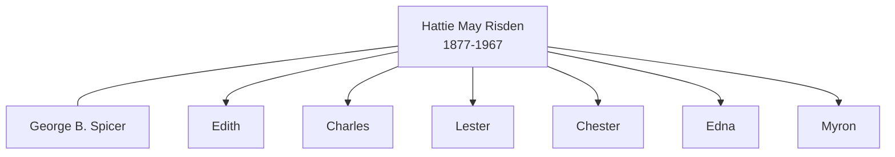

# Hattie May Risden

## Biographical Profile

- **Name:** Hattie May Risden
- **Role in this project:** Spicer-line ancestor represented in repeated 1880-1930 Iowa census-summary chains.

## Source-Cited Facts

- A census-summary entry gives Hattie May Risden as born 29 Mar 1877 and died 11 Mar 1967.
- The profile section includes 1880 Cedar Rapids Risden household and 1900/1910/1920/1930 Spicer household entries in Linn and Benton counties, Iowa.
- The extracted rows place Hattie as wife of George Spicer with children including Edith, Charles, George, Lester, Chester, Edna, and Myron across successive decades.
- The Burial Sites book places Hattie May Risden at Spring Grove Cemetery near Covington, Iowa (page 28), Lot 88, Space 4, with GPS coordinates `42°1’47.6”N 91°46’6.2”W` and date of death 11 March 1967. Map: [Google Maps](https://www.google.com/maps/search/?api=1&query=Spring+Grove+Cemetery+Covington+IA).

## Family Diagram

This is a simple family sketch based on the repeated census-summary household groupings.

## Research Gaps

1. Reconcile existing project profile naming (`Hattie Risden`) with this indexed full-name form.
2. Verify OCR-ambiguous row fields in 1900 and 1910 extracts.
3. Confirm death date from independent records.

## Sources

1. [[References/Shared Intake 2026-04-22 Census Summary Individuals p51-p60|Shared Intake 2026-04-22 Census Summary Individuals p51-p60]]
2. [[References/Shared Intake 2026-04-22 Census Summary Individuals p1-p10|Shared Intake 2026-04-22 Census Summary Individuals p1-p10]]
3. [[References/Shared Intake 2026-04-22 Burial Sites Summary|Shared Intake 2026-04-22 Burial Sites Summary]]
4. `References/raw/inbox/2026-04-22-intake/BurialSites/BurialSites.txt`
5. `References/raw/inbox/2026-04-22-intake/Census/CensusSummaryIndividual.pdf`
