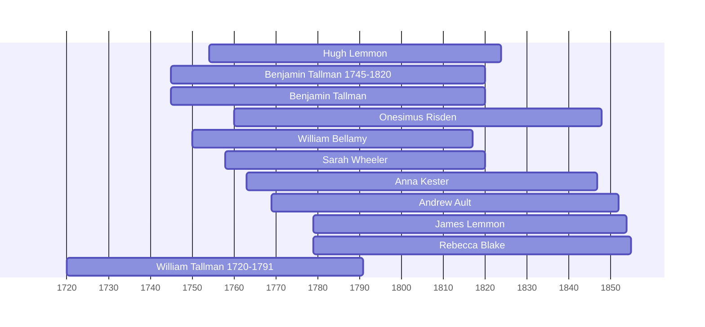

![[assets/snippets/Hugh Lemmon.svg]]

# Hugh Lemmon

## Biographical Profile

- **Name:** Hugh Lemmon
- **Dates:** 1754-1824

## Source-Cited Facts

- Identified in pedigree timeline source.

## Research Notes

- Initial stub created from pedigree timeline extraction.

## Overlapping Lifespans

> [!info] Visualizing contemporaries in the vault during the life of Hugh Lemmon (1754-1824).

## Source Indicators

> [!info] Indicators from Pedigree Timeline Diagrams
>
> - **Burial**: Verified (RIP marker)
> - **Obituary**: Available (Obit marker)

## Sources

1. [[References/raw/extracted/PedigreeTimelines2025Thorpe.txt|PedigreeTimelines2025Thorpe.txt]]
