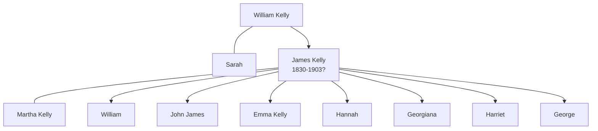

# James Kelly

## Biographical Profile

- **Name:** James Kelly
- **Role in this project:** Ancestor represented in Peterborough parish/christening extracts and census citation notes.

## Source-Cited Facts

- A christening extract gives James Kelly christening date as 15 Aug 1830 at Peterborough, Northampton, England.
- The same extract names his parents as William Kelly and Sarah.
- Census-summary pages include James Kelly in Peterborough entries for 1841, 1851, 1861, and 1871 with wife Martha and children including William, John James, Emma, Hannah, Georgiana, Harriet, and George.
- The 1871 entry is cited in the summary as RG10 Piece 1517, Folio 85, Page 6.
- The Burial Sites book index also lists James Kelly as `c1825-1903`, but the extracted text did not yield a separate cemetery page.
- The Bellamy pedigree timeline also includes a James Kelly branch with a different spouse interpretation (`Sarah Barton?`), so the Bellamy export should be treated as a separate research lead rather than a resolution.
- The processed Bellamy timeline review keeps that conflict open: the chart uses `James Kelly c1828-before 1881?` with `Sarah Barton?`, which should not override the stronger parish and census evidence on this page.

## Family Diagram



This is a household sketch based on the parish extract and the census-summary family groupings.

## Research Gaps

1. Validate whether the 1871 census citation in notes is a confirmed match to this James Kelly.
2. Confirm birth date versus christening date from original parish image.
3. Add spouse/children only after image-level confirmation.
4. Reconcile the Bellamy timeline's James Kelly interpretation against the Peterborough parish and census evidence already on this page.
5. Keep the chart's `Sarah Barton?` placement as a lead only unless additional local records support it.


## Census Records

> [!info] Extract from References/raw/extracted/CensusSummaryIndividual.txt

```text
KELLY, James (15 Aug 1830 - ?)
1841 Northamptonshire, Peterborough
Place
Cumbergate

Name
Age Male
Age Female Occupation
Born in County?
Sarah KELLY
50
Tailor
No
James KELLY
14
Yes
George KELLY
6
Yes
Henry SMITH
30
Tailor ?
No
Source Citation: Class: HO107; Piece 817; Book: 1; Enumeration District: 1; Folio: 10; Page: 12; Line: 1; GSU roll: 438883.

1851 Northamptonshire, Peterborough, Yard 5 St. John’s St.
No.
93

Name
Rel
Cond AM AF Occupation
James KELLEY
Head
Mar
22
Journeyman Tailor
Martha KELLEY
Wife
Mar
21
Public Records Office, Reference - Source: HO107, Piece: 1747, Folio: 330, Page: 29, No: 93

Where Born?
Northamptonshire, Peterborough
Northamptonshire, Peterborough

1861 Northamptonshire, Peterborough, 44 Albert Place
No. Name
Rel
Cond. AM AF Occupation
163 James KELLY
Head
Mar
34
Tailor Journeyman
Martha KELLY
Wife
Mar
30 Dressmaker
William KELLY
Son
8
Scholar
John ? KELLY
Son
6
Scholar
George KELLY
Son
2
Scholar
Public Records Office, Reference - Source: RG9, Piece: 967, Folio: 34, Page: 30, No: 163

Where Born
Norths, Peterboro
Norths, Peterboro
Norths, Peterboro
Norths, Peterboro
Norths, Peterboro

1871 Northamptonshire, Peterborough, 73 Wood Street
No.
25

Name
Rel
Cond. AM AF Occupation
James KELLY
Head
Mar
43
Tailor
Martha KELLY
Wife
Mar
40
John James KELLY
Son
Unm
16
Fitter & Turner
Emma KELLY
Daur
9 Scholar
Hannah KELLY
Daur
6 Scholar
Georgiana KELLY
Daur
4 Scholar
Harriet KELLY
Daur
3 Scholar
George KELLY
Son
1
Source Citation: Class: RG10; Piece: 1517; Folio: 85; Page: 6; GSU roll: 829776.

CENSUS SUMMARY - INDIVIDUALS

Robert Archer John Thorpe

Where Born
Northamptonshire, Peterborough
Northamptonshire, Peterborough
Northamptonshire, Peterborough
Northamptonshire, Peterborough
Northamptonshire, Peterborough
Northamptonshire, Peterborough
Northamptonshire, Peterborough
Northamptonshire, Peterborough

35
```

## Sources

1. [[References/Shared Intake 2026-04-22 Certificates and Parish Extracts|Shared Intake 2026-04-22 Certificates and Parish Extracts]]
2. [[References/Shared Intake 2026-04-22 Census Citation Notes|Shared Intake 2026-04-22 Census Citation Notes]]
3. [[References/Shared Intake 2026-04-22 Census Summary Individuals p31-p40|Shared Intake 2026-04-22 Census Summary Individuals p31-p40]]
4. [[References/Shared Intake 2026-04-22 Pedigree Timeline Bellamy|Shared Intake 2026-04-22 Pedigree Timeline Bellamy]]
5. [[bellamy-pedigree-timeline-index|Bellamy Pedigree Timeline Extraction Index]]
6. `References/raw/extracted/PedigreeTimelines2025Bellamy.txt`
7. `References/raw/inbox/2026-04-22-intake/BurialSites/BurialSites.txt`
8. `References/raw/inbox/2026-04-22-intake/Certificates/JamesKellyBaptism1830.txt`
9. `References/raw/inbox/2026-04-22-intake/Census/EnglishCensusCitations.txt`
10. `References/raw/inbox/2026-04-22-intake/Census/CensusSummaryIndividual.pdf`

1. `References/raw/inbox/2026-04-24-census-indesign/CensusSummary-KellyJames.txt`
