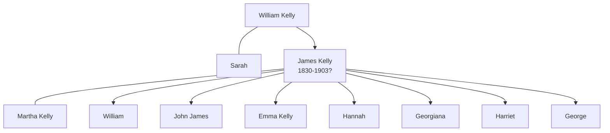

# James Kelly

## Biographical Profile

- **Name:** James Kelly
- **Role in this project:** Ancestor represented in Peterborough parish/christening extracts and census citation notes.

## Source-Cited Facts

- A christening extract gives James Kelly christening date as 15 Aug 1830 at Peterborough, Northampton, England.
- The same extract names his parents as William Kelly and Sarah.
- Census-summary pages include James Kelly in Peterborough entries for 1841, 1851, 1861, and 1871 with wife Martha and children including William, John James, Emma, Hannah, Georgiana, Harriet, and George.
- The 1871 entry is cited in the summary as RG10 Piece 1517, Folio 85, Page 6.
- The Burial Sites book index also lists James Kelly as `c1825-1903`, but the extracted text did not yield a separate cemetery page.
- The Bellamy pedigree timeline also includes a James Kelly branch with a different spouse interpretation (`Sarah Barton?`), so the Bellamy export should be treated as a separate research lead rather than a resolution.

## Family Diagram

This is a household sketch based on the parish extract and the census-summary family groupings.

## Research Gaps

1. Validate whether the 1871 census citation in notes is a confirmed match to this James Kelly.
2. Confirm birth date versus christening date from original parish image.
3. Add spouse/children only after image-level confirmation.
4. Reconcile the Bellamy timeline's James Kelly interpretation against the Peterborough parish and census evidence already on this page.

## Sources

1. [[References/Shared Intake 2026-04-22 Certificates and Parish Extracts|Shared Intake 2026-04-22 Certificates and Parish Extracts]]
2. [[References/Shared Intake 2026-04-22 Census Citation Notes|Shared Intake 2026-04-22 Census Citation Notes]]
3. [[References/Shared Intake 2026-04-22 Census Summary Individuals p31-p40|Shared Intake 2026-04-22 Census Summary Individuals p31-p40]]
4. [[References/Shared Intake 2026-04-22 Pedigree Timeline Bellamy|Shared Intake 2026-04-22 Pedigree Timeline Bellamy]]
5. `References/raw/extracted/PedigreeTimelines2025Bellamy.txt`
6. `References/raw/inbox/2026-04-22-intake/BurialSites/BurialSites.txt`
7. `References/raw/inbox/2026-04-22-intake/Certificates/JamesKellyBaptism1830.txt`
8. `References/raw/inbox/2026-04-22-intake/Census/EnglishCensusCitations.txt`
9. `References/raw/inbox/2026-04-22-intake/Census/CensusSummaryIndividual.pdf`
