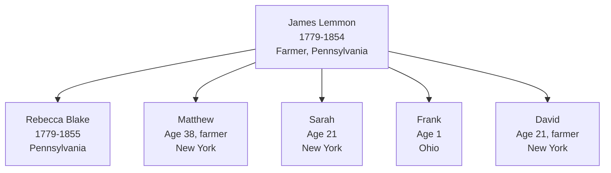

# James Lemmon

## Biographical Profile

- **Name:** James Lemmon
- **Role in this project:** Lemmon-line ancestor represented in 1850 Ohio census-summary extraction.

## Source-Cited Facts

- **Birth/Death:** Born 27 Jun 1779; died 7 May 1854 (age 74 years, 10 months, 10 days per burial record).
- **Burial:** Tew Cemetery, Townsend Township, Sandusky County, Ohio; Section 25-17-5, Coordinates 412203N 0825125W; Burial Sites book, page 14.

## Census Records and Household Context

### 1850 Ohio Census — Sandusky County, Townsend Township
- **Head:** `James Lemmon`, male, age 71, farmer, born Pennsylvania
- **Spouse:** `Rebecca Lemmon`, female, age 71, born Pennsylvania
- **Children in household:**
  - `Mathew? Lemmon`, male, age 38, farmer, born New York
  - `Sarah Lemmon`, female, age 21, born New York
  - `Frank Lemmon`, male, age 1, born Ohio
- **Boarder:** `Nathan Harkins`, male, age 12, born New York
- **Related person:** `David Lemmon`, male, age 21, farmer, born New York
- **Source:** Series M432, Roll 726, Page 476, R/F 1173/1198; GSU microfilm available

## Family Connections

- **Wife:** [[People/Rebecca Blake|Rebecca Blake]] (b. Pennsylvania, age 71 in 1850)
- **Children identified:** Mathew/Matthew, Sarah, Frank, David (possibly son; exact relationship unclear from census)
- **Related to:** [[People/Uriah Blake Lemmon|Uriah Blake Lemmon]] (likely brother or father, appears in same township 1850-1860)
- **Pedigree connection:** Linked to [[Topics/Lemmon Blake Thorpe Branch Summary|Blake family line]] via Rebecca; timeline shows him contemporaneous with [[People/Rebecca Blake|Rebecca Blake]] (1779-1855)

## Family Diagram

1850 Sandusky County household: patriarch James Lemmon age 71 with wife Rebecca, spanning three generations of birth locations (Pennsylvania, New York, Ohio).

## Research Gaps

1. Validate household relationships from image-level census page.
2. Confirm death date from independent cemetery/probate or death records.
3. Reconcile whether `James Lemmon Sr` compiler note maps cleanly to this profile.

## Sources

1. [[References/Shared Intake 2026-04-22 Census Summary Individuals p31-p40|Shared Intake 2026-04-22 Census Summary Individuals p31-p40]]
2. [[References/Shared Intake 2026-04-22 Burial Sites Summary|Shared Intake 2026-04-22 Burial Sites Summary]]
3. `References/raw/inbox/2026-04-22-intake/BurialSites/BurialSites.txt`
4. `References/raw/inbox/2026-04-22-intake/Census/CensusSummaryIndividual.pdf`

1. `References/raw/inbox/2026-04-24-census-indesign/CensusSummary-LemmonJames.txt`
