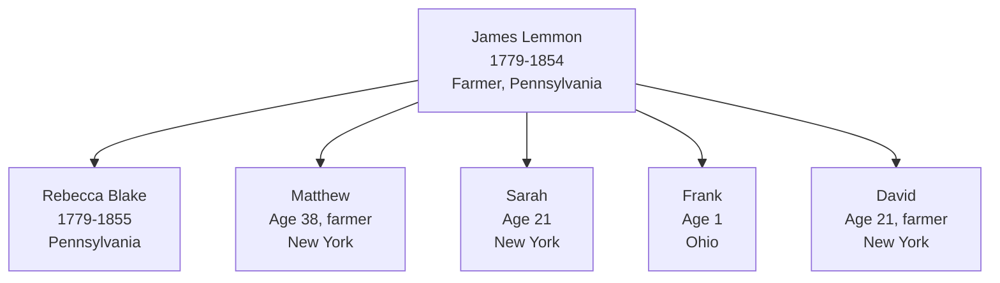
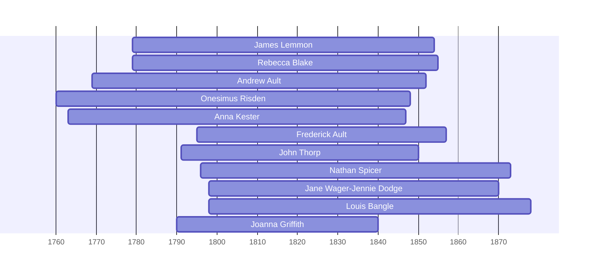

![[assets/snippets/James Lemmon.svg]]

# James Lemmon

## Biographical Profile

- **Name:** James Lemmon
- **Role in this project:** Lemmon-line ancestor represented in 1850 Ohio census-summary extraction.

## Source-Cited Facts

- **Birth/Death:** Born 27 Jun 1779; died 7 May 1854 (age 74 years, 10 months, 10 days per burial record).
- **Burial:** Tew Cemetery, Townsend Township, Sandusky County, Ohio; Section 25-17-5, Coordinates 412203N 0825125W; Burial Sites book, page 14.
- The Sandusky-Beers sketch for [[People/John McIntyre Lemmon|John McIntyre Lemmon]] gives a different birth date for James Lemmon Sr., 17 July 1779, and states that he was born in Northumberland County, Pennsylvania; married [[People/Rebecca Blake|Rebecca Blake]] in 1805; volunteered in the War of 1812; moved to Ohio in 1827; and died at North Ridge, Townsend, Sandusky County, Ohio, on 7 May 1854.

## Census Records and Household Context

### 1850 Ohio Census — Sandusky County, Townsend Township
- **Head:** `James Lemmon`, male, age 71, farmer, born Pennsylvania
- **Spouse:** `Rebecca Lemmon`, female, age 71, born Pennsylvania
- **Children in household:**
  - `Mathew? Lemmon`, male, age 38, farmer, born New York
  - `Sarah Lemmon`, female, age 21, born New York
  - `Frank Lemmon`, male, age 1, born Ohio
- **Boarder:** `Nathan Harkins`, male, age 12, born New York
- **Related person:** `David Lemmon`, male, age 21, farmer, born New York
- **Source:** Series M432, Roll 726, Page 476, R/F 1173/1198; GSU microfilm available

## Family Connections

- **Wife:** [[People/Rebecca Blake|Rebecca Blake]] (b. Pennsylvania, age 71 in 1850)
- **Children identified:** [[People/Uriah Blake Lemmon|Uriah Blake Lemmon]] from the Sandusky-Beers sketch, plus Mathew/Matthew, Sarah, Frank, and David from census extraction where exact relationships still need image-level confirmation.
- **Grandson:** [[People/John McIntyre Lemmon|John McIntyre Lemmon]]
- **Pedigree connection:** Linked to [[Topics/Lemmon Blake Thorpe Branch Summary|Blake family line]] via Rebecca; timeline shows him contemporaneous with [[People/Rebecca Blake|Rebecca Blake]] (1779-1855)

## Family Diagram



1850 Sandusky County household: patriarch James Lemmon age 71 with wife Rebecca, spanning three generations of birth locations (Pennsylvania, New York, Ohio).

## Research Gaps

1. Validate household relationships from image-level census page.
2. Resolve the 27 June 1779 vs 17 July 1779 birth-date conflict between burial/census-derived notes and the Sandusky-Beers sketch.
3. Confirm death date from independent cemetery/probate or death records.


## Census Records

> [!info] Extract from References/raw/extracted/CensusSummaryIndividual.txt

```text
LEMMON, James (27 Jun 1779 - 7 May 1854)
1850 Ohio, Sandusky County, Townsend Township, Page 476 A
R/F
1173/1198

Name
Mathew? LEMMON
Sarah LEMMON
Frank LEMMON
Nathan HARKINS
James LEMMON
Rebecca LEMMON
David LEMMON
Series: M432, Roll: 726, Page: 476

CENSUS SUMMARY - INDIVIDUALS

Sex
M
F
M
M
M
F
M

Age
38
21
1
12
71
71
21

Occupation
Farmer

Farmer
Farmer

Born
New York
New York
Ohio
New York
Penn
Penn
New York

Robert Archer John Thorpe

Comments

James Lemmon Sr

36
```


## Overlapping Lifespans

> [!info] Visualizing contemporaries in the vault during the life of James Lemmon (1779-1854).



## Source Indicators

> [!info] Indicators from Pedigree Timeline Diagrams
>
> - **Census Records**: Found in 1850
> - **Official Records**: Ref #203, 204, 205, 210
> - **Burial**: Verified (RIP marker)
> - **Obituary**: Available (Obit marker)

## Sources

1. [[References/Shared Intake 2026-04-22 Census Summary Individuals p31-p40|Shared Intake 2026-04-22 Census Summary Individuals p31-p40]]
2. [[References/Shared Intake 2026-04-22 Burial Sites Summary|Shared Intake 2026-04-22 Burial Sites Summary]]
3. `References/raw/inbox/2026-04-22-intake/BurialSites/BurialSites.txt`
4. `References/raw/inbox/2026-04-22-intake/Census/CensusSummaryIndividual.pdf`
5. `References/raw/processed/2026-04-24-census-indesign/CensusSummary-LemmonJames.txt`
6. [[References/Shared Intake 2026-04-22 Pedigree Timeline Thorpe|Shared Intake 2026-04-22 Pedigree Timeline Thorpe]]
7. [[References/Book Outprints — Sandusky-Beers Lemmon John M|Book Outprints — Sandusky-Beers Lemmon John M]]
