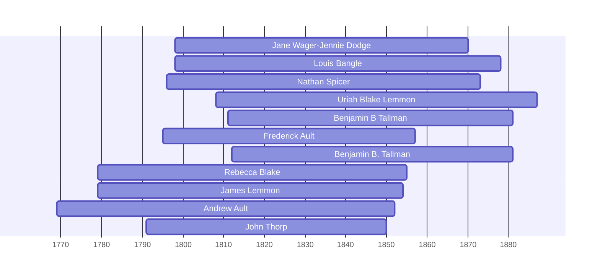

![[assets/snippets/Jane Wager-Jennie Dodge.svg]]

# Jane Wager-Jennie Dodge

## Biographical Profile

- **Name:** Jane Wager-Jennie Dodge
- **Dates:** c Nov 1798 - 22 Jan 1870

## Source-Cited Facts

- Identified in pedigree timeline source.

## Research Notes

- Initial stub created from pedigree timeline extraction.

## Overlapping Lifespans

> [!info] Visualizing contemporaries in the vault during the life of Jane Wager-Jennie Dodge (1798-1870).

## Source Indicators

> [!info] Indicators from Pedigree Timeline Diagrams
>
> - **Burial**: Verified (RIP marker)

## Sources

1. [[References/raw/extracted/PedigreeTimelines2025Thorpe.txt|PedigreeTimelines2025Thorpe.txt]]
