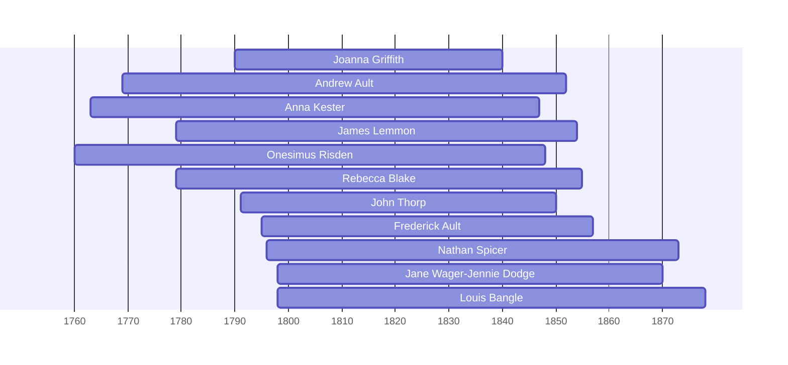

![[assets/snippets/Joanna Griffith.svg]]

# Joanna Griffith

## Biographical Profile

- **Name:** Joanna Griffith
- **Dates:** 1790 - 1840

## Source-Cited Facts

- Identified in pedigree timeline source.

## Research Notes

- Initial stub created from pedigree timeline extraction.

## Overlapping Lifespans

> [!info] Visualizing contemporaries in the vault during the life of Joanna Griffith (1790-1840).

## Source Indicators

> [!info] Indicators from Pedigree Timeline Diagrams
>
> - **Burial**: Verified (RIP marker)

## Sources

1. [[References/raw/extracted/PedigreeTimeline2025Prior.txt|PedigreeTimeline2025Prior.txt]]
