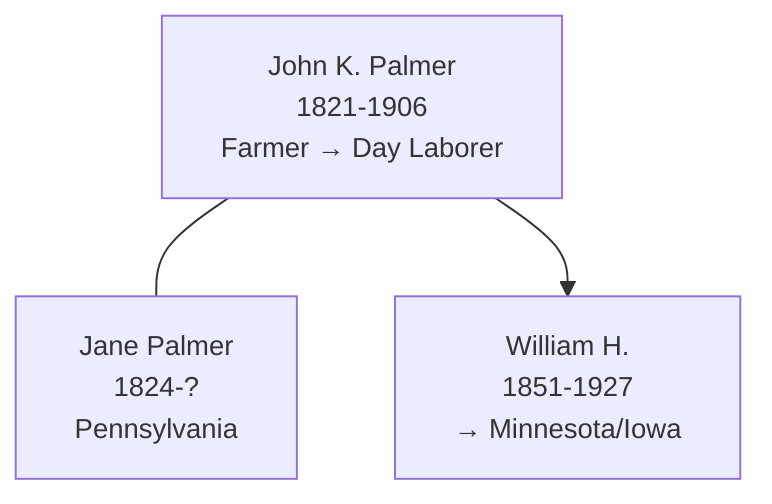

# John K Palmer

## Biographical Profile

- **Name:** John K Palmer
- **Role in this project:** Palmer-line patriarch spanning Wisconsin (Sauk and Eau Claire counties) with documented household progression from 1860-1900.

## Source-Cited Facts

- **Birth/Death:** Born 9 Oct 1821; died 2 Jun 1906 (age 84 years, 7 months, 24 days).
- **Birthplace:** Pennsylvania
- **Occupation:** Farmer

## Census Records and Household Context

### 1860 Wisconsin Census — Sauk County, Baraboo
- **Head:** `J PALMER`, male, age 38, occupation farmer, property $400, born Pennsylvania
- **Wife:** `Jane PALMER`, female, age 36, born Pennsylvania
- **Children:**
  - `Mary PALMER`, female, age 15, born Pennsylvania
  - `Elizabeth PALMER`, female, age 14, born Pennsylvania
  - `W H PALMER`, male, age 9, born Pennsylvania (later [[People/William Henry Palmer|William Henry Palmer]])
  - `Emily PALMER`, female, age 7, born Pennsylvania
- **Source:** Series M653, Roll 1429, Page 450; GSU microfilm available

### 1880 Wisconsin Census — Eau Claire County, Otter Creek Township, Page 532A
- **Head:** `John K. PALMER`, male, self, married, age 48, born Pennsylvania, occupation farmer
- **Wife:** `Jane PALMER`, female, married, age 55, born Pennsylvania, occupation keeping house
- **Children:**
  - `Rosella PALMER`, female, single, age 16, born Wisconsin
  - `Peter PALMER`, male, single, age 14, born Wisconsin
- **Source:** Fam Hist Lib Film 1255425; GSU microfilm available

### 1900 Wisconsin Census — Eau Claire County, Augusta, Perkins Street, Sheet 4B
- **Head:** `John K. PALMER`, male, race White, birthdate Oct 1821, age 78, born Pennsylvania, occupation day laborer
- **Wife:** `Jane PALMER`, female, race White, birthdate Aug 1824, age 75, born Pennsylvania
- **Note:** Occupation changed to day laborer by 1900; both in advanced age
- **Source:** Series T623, Roll 1787, Page 4B; GSU microfilm available

## Family Connections

- **Wife:** Jane Palmer (b. Aug 1824 Pennsylvania, age 75 in 1900)
- **Children identified:** Mary (b. ~1845), Elizabeth (b. ~1846), William H. (b. ~1851), Emily (b. ~1853), Rosella (b. ~1864), Peter (b. ~1866)
- **Son:** [[People/William Henry Palmer|William Henry Palmer]] (1851-1927), who continued farming in Minnesota
- **Pedigree significance:** Patriarch of Wisconsin Palmer branch; father of William Henry who migrated to Minnesota and whose daughter May Aleen married into the Prior line

## Family Diagram

John K. Palmer was the patriarch of the Wisconsin Palmer line (1821-1906), father of William Henry Palmer whose line extended into Minnesota and Iowa.

## Research Gaps

1. Locate John K. Palmer in earlier census records (1850 or earlier) to establish pre-Wisconsin origin.
2. Clarify relationship to [[People/Peter Palmer|Peter Palmer]] (c. 1800) in Pennsylvania, if any.
3. Validate all children names and ages from original 1860 and 1880 census images.
4. Confirm death date and burial location.
5. Trace Rosella and Peter Palmer's later lives.

## Sources

1. [[References/Shared Intake 2026-04-22 Census Summary Individuals p41-p50|Shared Intake 2026-04-22 Census Summary Individuals p41-p50]]
2. [[References/Shared Intake 2026-04-22 Burial Sites Summary|Shared Intake 2026-04-22 Burial Sites Summary]]
3. `References/raw/inbox/2026-04-22-intake/BurialSites/BurialSites.txt`
4. `References/raw/inbox/2026-04-22-intake/Census/CensusSummaryIndividual.pdf`

1. `References/raw/inbox/2026-04-24-census-indesign/CensusSummary-PalmerJohnK.txt`
