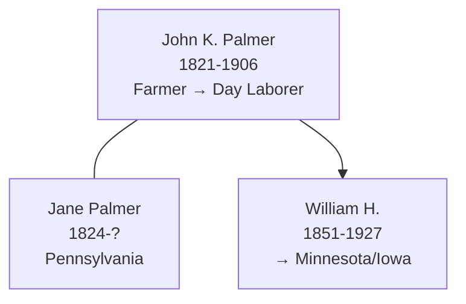
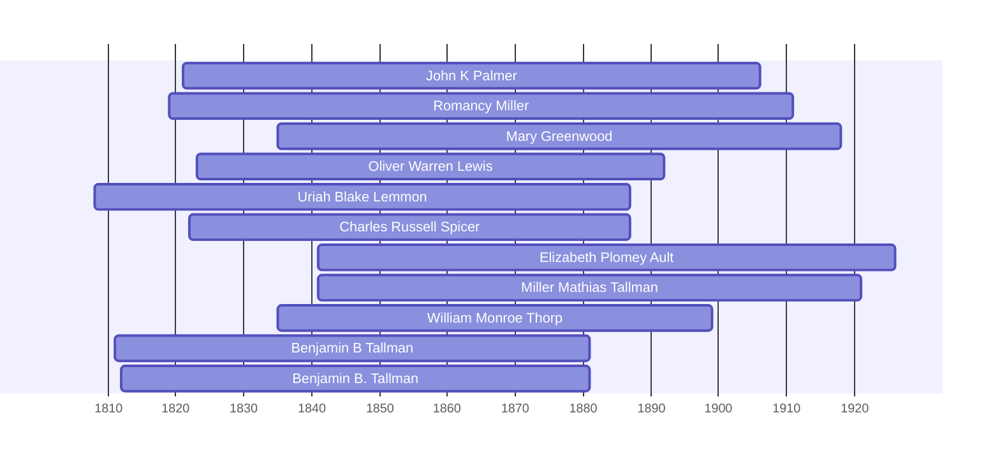

![[assets/snippets/John K Palmer.svg]]

# John K Palmer

## Biographical Profile

- **Name:** John K Palmer
- **Role in this project:** Palmer-line patriarch spanning Wisconsin (Sauk and Eau Claire counties) with documented household progression from 1860-1900.

## Source-Cited Facts

- **Dates:** 9 Oct 1821 - 2 Jun 1906
- **Birthplace:** Pennsylvania
- **Occupation:** Farmer

## Census Records and Household Context

### 1860 Wisconsin Census — Sauk County, Baraboo
- **Head:** `J PALMER`, male, age 38, occupation farmer, property $400, born Pennsylvania
- **Wife:** `Jane PALMER`, female, age 36, born Pennsylvania
- **Children:**
  - `Mary PALMER`, female, age 15, born Pennsylvania
  - `Elizabeth PALMER`, female, age 14, born Pennsylvania
  - `W H PALMER`, male, age 9, born Pennsylvania (later [[People/William Henry Palmer|William Henry Palmer]])
  - `Emily PALMER`, female, age 7, born Pennsylvania
- **Source:** Series M653, Roll 1429, Page 450; GSU microfilm available

### 1880 Wisconsin Census — Eau Claire County, Otter Creek Township, Page 532A
- **Head:** `John K. PALMER`, male, self, married, age 48, born Pennsylvania, occupation farmer
- **Wife:** `Jane PALMER`, female, married, age 55, born Pennsylvania, occupation keeping house
- **Children:**
  - `Rosella PALMER`, female, single, age 16, born Wisconsin
  - `Peter PALMER`, male, single, age 14, born Wisconsin
- **Source:** Fam Hist Lib Film 1255425; GSU microfilm available

### 1900 Wisconsin Census — Eau Claire County, Augusta, Perkins Street, Sheet 4B
- **Head:** `John K. PALMER`, male, race White, birthdate Oct 1821, age 78, born Pennsylvania, occupation day laborer
- **Wife:** `Jane PALMER`, female, race White, birthdate Aug 1824, age 75, born Pennsylvania
- **Note:** Occupation changed to day laborer by 1900; both in advanced age
- **Source:** Series T623, Roll 1787, Page 4B; GSU microfilm available

## Family Connections

- **Wife:** Jane Palmer (b. Aug 1824 Pennsylvania, age 75 in 1900)
- **Children identified:** Mary (b. ~1845), Elizabeth (b. ~1846), William H. (b. ~1851), Emily (b. ~1853), Rosella (b. ~1864), Peter (b. ~1866)
- **Son:** [[People/William Henry Palmer|William Henry Palmer]] (1851-1927), who continued farming in Minnesota
- **Pedigree significance:** Patriarch of Wisconsin Palmer branch; father of William Henry who migrated to Minnesota and whose daughter May Aleen married into the Prior line

## Family Diagram



John K. Palmer was the patriarch of the Wisconsin Palmer line (1821-1906), father of William Henry Palmer whose line extended into Minnesota and Iowa.


## Research Gaps

> [!warning] Priority Research Leads
> The following census records are indicated in the pedigree diagrams but matching transcripts are missing from the vault:
> - **1890 Census**: Transcript needed to verify household context. (Note: The 1890 US Federal Census was largely destroyed by fire)

## Census Records

> [!info] Extract from References/raw/extracted/CensusSummaryIndividual.txt

```text
PALMER, John K (9 Oct 1821 - 2 Jun 1906)........................................................................................... 49
PALMER, May Aleen (1 May 1886 - 21 May 1979) ............................................................................... 50
PALMER, Peter (c. 1800 - ?).................................................................................................................... 51
PALMER, William Henry (12 Jun 1851 - 8 May 1927)........................................................................... 52
PRIOR, Arthur Edwin (14 Jul 1851 - 10 Jul 1929) .................................................................................. 53
PRIOR, Joseph Warren (1 Jun 1828 - 14 May 1909) ............................................................................... 54
PRIOR, Oliver Warren (15 Mar 1880 - 29 May 1949)............................................................................. 55
PRIOR, Ruby Bernice (24 Apr 1913 - 1 Aug 2006) ................................................................................. 56
QUACKENBUSH, Elizabeth A (c. 1836 - 15 Dec 1909) ........................................................................ 57
RISDEN, Hattie May (29 Mar 1877 - 11 Mar 1967) ............................................................................... 58
RISDEN, John Wheeler (15 Apr 1812 - 26 Dec 1892) ............................................................................ 59
RISDEN, Watson Moses (1 Dec 1843 - 30 Jun 1932) ............................................................................. 60
ROWLAND, Jesse (c. 1816 - ?) ............................................................................................................... 61
ROWLAND, Nancy West (10 Jan 1851 - 9 May 1923) ........................................................................... 62
SORRELL, James (c. 1799 - c. 1877) ...................................................................................................... 63
SORRELL, Mary (c. 1823 - 20 Jun 1897) ............................................................................................... 64
SPICER, Charles Russell (22 Oct 1822 - 3 Jun 1887) ............................................................................. 65
SPICER, George B (3 Sep 1864 - 15 May 1938) ..................................................................................... 66
SPICER, Lester Harold (14 Jul 1906 - 28 Jun 1974) ............................................................................... 68
SPICER, Nathan (3 Apr 1796 - 16 May 1873) ......................................................................................... 69
TALLMAN, Benjamin B (25 May 1811 - 26 Oc 1881) ........................................................................... 70
TALLMAN, John (? - ?) ........................................................................................................................... 71
TALLMAN, Lenore Hetty (1 Feb 1879 - 28 Jun 1953) ........................................................................... 72
TALLMAN, Miller Mathias (14 Apr 1841 - 8 Apr 1921) ........................................................................ 73
THOROGOOD, Frederick (25 Mar 1865 - 18 Sep 1943) ........................................................................ 75
THOROGOOD, Grace Caroline (24 Sep 1894 - 27 Dec 1987) ............................................................... 76
THOROGOOD, James (c. 1828 - 1 Aug 1880) ........................................................................................ 77
THOROGOOD, Joseph (2 Aug 1799 - 9 Nov 1878) ............................................................................... 78
THOROGOOD, Mary Ann (21 Mar 1832 - 17 Jul 1916) ........................................................................ 79
THORP, John (28 Dec 1791 - 28 Mar 1860) ............................................................................................ 80
THORP, William Monroe (18 Jan 1835 - 8 Nov 1899) ............................................................................ 81
THORPE, Raymond Miller (2 Aug 1917 - 3 Jan 1974) ........................................................................... 82
THORPE, Uriah Blake (14 Jul 1878 - 19 May 1959) .............................................................................. 83
UNKNOWN, Ann (c. 1798 - c. 1877) ...................................................................................................... 84
UNKNOWN, Eleanor (c. 1795 - c. 1874) ................................................................................................ 85
UNKNOWN, Sarah (Barton?) (c. 1786 - c. 1867) ................................................................................... 86
UNKNOWN, Susan (c.1796 - ?) .............................................................................................................. 87
VAN HORN, Mary (? - ?) ........................................................................................................................ 88
WAGER, Jane (c. Nov 1798 - 22 Jan 1870) ............................................................................................. 89
WALLER, Hannah (c. 1767 - 14 Aug 1843) ............................................................................................ 90
WHEELER, Mary (22 Jul 1801 - c. 1883) ............................................................................................... 91
WHITFIELD, John (? - c. 1843) .............................................................................................................. 92
WHITFIELD, Mary (c. 1819 - 22 Mar 1918) .......................................................................................... 93
WILLSON, Jane (9 Aug 1824 - 15 May 1910) ........................................................................................ 95
CROSS REFERENCES ........................................................................................................................... 96

CENSUS SUMMARY - INDIVIDUALS

Robert Archer John Thorpe

3
```


## Name Variations

> [!info] Known aliases or census misspellings from Butch Thorpe's cross-reference table.
>
> - **PALMER, J**


## Overlapping Lifespans

> [!info] Visualizing contemporaries in the vault during the life of John K Palmer (1821-1906).



## Source Indicators

> [!info] Indicators from Pedigree Timeline Diagrams
>
> - **Census Records**: Found in 1840, 1860, 1870, 1880, 1890, 1900
> - **Official Records**: Ref #027, 165, 109, 110, 111, 235
> - **Burial**: Verified (RIP marker)
> - **Obituary**: Available (Obit marker)

## Sources

1. [[References/Shared Intake 2026-04-22 Census Summary Individuals p41-p50|Shared Intake 2026-04-22 Census Summary Individuals p41-p50]]
2. [[References/Shared Intake 2026-04-22 Burial Sites Summary|Shared Intake 2026-04-22 Burial Sites Summary]]
3. `References/raw/inbox/2026-04-22-intake/BurialSites/BurialSites.txt`
4. `References/raw/inbox/2026-04-22-intake/Census/CensusSummaryIndividual.pdf`

1. `References/raw/inbox/2026-04-24-census-indesign/CensusSummary-PalmerJohnK.txt`
