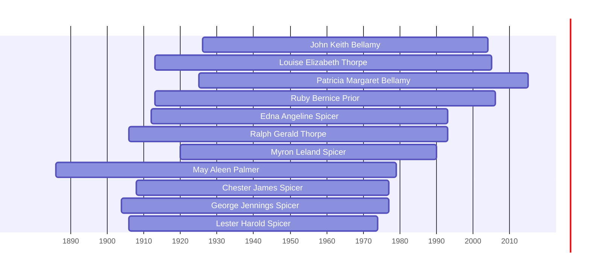

![[assets/snippets/John Keith Bellamy.svg]]

# John Keith Bellamy

## Biographical Profile

- **Name:** John Keith Bellamy
- **Dates:** 1926 - 2004

## Source-Cited Facts

- Identified in pedigree timeline source.

## Research Notes

- Initial stub created from pedigree timeline extraction.

## Overlapping Lifespans

> [!info] Visualizing contemporaries in the vault during the life of John Keith Bellamy (1926-2004).

## Source Indicators

> [!info] Indicators from Pedigree Timeline Diagrams
>
> - **Burial**: Verified (RIP marker)
> - **Obituary**: Available (Obit marker)

## Sources

1. [[References/raw/extracted/PedigreeTimelines2025Bellamy.txt|PedigreeTimelines2025Bellamy.txt]]
