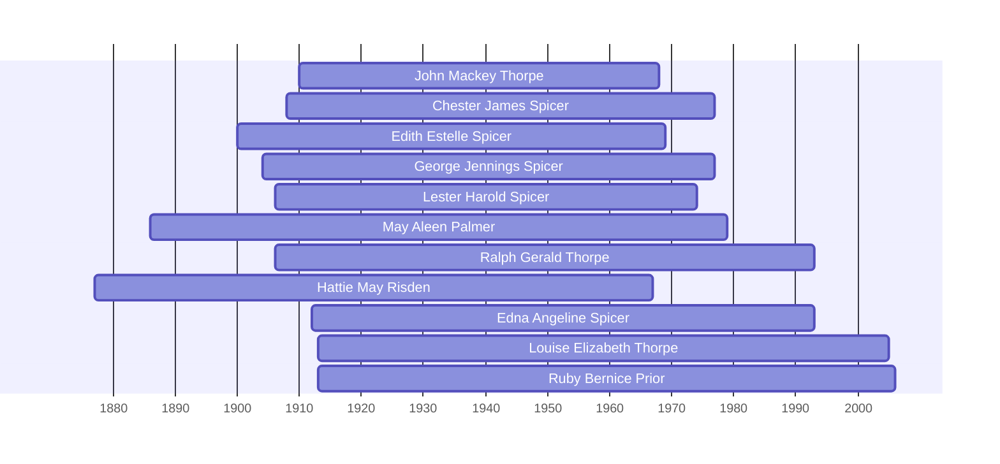

![[assets/snippets/John Mackey Thorpe.svg]]

# John Mackey Thorpe

## Biographical Profile

- **Name:** John Mackey Thorpe
- **Dates:** 1910 - 1968

## Source-Cited Facts

- Identified in pedigree timeline source.

## Research Notes

- Initial stub created from pedigree timeline extraction.

## Overlapping Lifespans

> [!info] Visualizing contemporaries in the vault during the life of John Mackey Thorpe (1910-1968).

## Source Indicators

> [!info] Indicators from Pedigree Timeline Diagrams
>
> - **Official Records**: Ref #089, 209
> - **Burial**: Verified (RIP marker)

## Sources

1. [[References/raw/extracted/PedigreeTimelines2025Thorpe.txt|PedigreeTimelines2025Thorpe.txt]]
