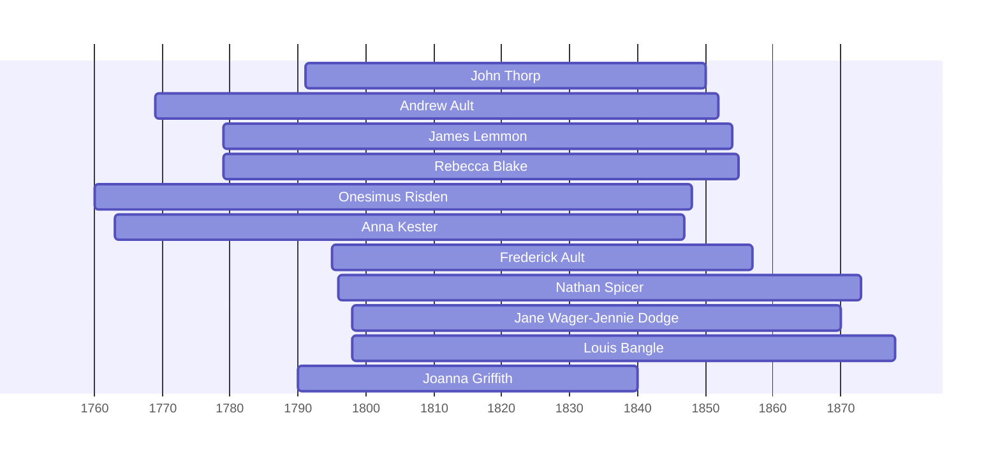

![[assets/snippets/John Thorp.svg]]

# John Thorp

## Biographical Profile

- **Name:** John Thorp
- **Dates:** 1791-1850
## Life and Times

As the earliest documented patriarch of the Thorpe line, John Thorp represents the family's origins in the era of early statehood and frontier expansion. His life spanned the transition of the family from its mysterious early roots toward the clearly documented generations that would eventually settle in the heart of Iowa.

## Pedigree Timeline Context

This person is documented in the Thorpe pedigree timeline as part of the direct Thorpe ancestral chain. The chart also places Jane Wager/Jennie Dodge in the same upper branch context and carries the line down to William Monroe Thorp.

## Research Notes

- Specific census records, occupations, and household details require further extraction from available sources.
- Birth/death dates and locations are from pedigree timeline documentation and require verification against primary records.


## Census Records

> [!info] Extract from References/raw/extracted/CensusSummaryIndividual.txt

```text
THORP, John (28 Dec 1791 - 28 Mar 1860)
1850 Ohio, Sandusky County, District No. 132, Mortality Schedule
R/F

Name
Sex
Age
Occupation
John THORP
M
58
Wagonmaker
Series: T1159, Roll: 15, Page: ?, Line #13, District no. 132

CENSUS SUMMARY - INDIVIDUALS

Born
NY

Robert Archer John Thorpe

Comments
died March, In. Lungs - Ill 7 days

80
```


## Overlapping Lifespans

> [!info] Visualizing contemporaries in the vault during the life of John Thorp (1791-1850).



## Source Indicators

> [!info] Indicators from Pedigree Timeline Diagrams
>
> - **Census Records**: Found in 1840, 1850
> - **Official Records**: Ref #144, 233, 146, 154
> - **Burial**: Verified (RIP marker)
> - **Obituary**: Available (Obit marker)


## Research Gaps

> [!warning] Priority Research Leads
> The following census records are indicated in the pedigree diagrams but matching transcripts are missing from the vault:
> - **1840 Census**: Transcript needed to verify household context.

## Sources

1. [[References/Shared Intake 2026-04-22 Pedigree Timeline Thorpe|Shared Intake 2026-04-22 Pedigree Timeline Thorpe]]
2. [[thorpe-pedigree-timeline-index|Thorpe Pedigree Timeline Extraction Index]]
