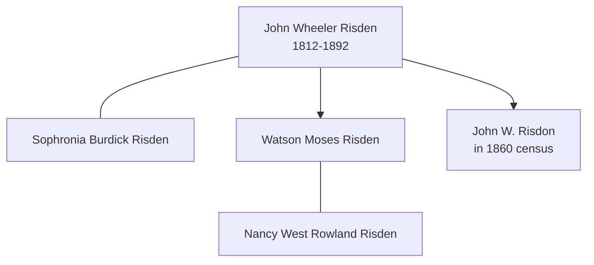

# John Wheeler Risden

## Biographical Profile

- **Name:** John Wheeler Risden
- **Role in this project:** Earlier-generation Risden ancestor represented in 1860 Iowa census-summary extraction.

## Source-Cited Facts

- A census-summary entry gives John Wheeler Risden as born 15 Apr 1812 and died 26 Dec 1892.
- The 1860 Lyons Township, Clinton County, Iowa table lists John W. Risdon with sons Watson and John.
- The extract cites M653 Roll 316 Page 366.
- The Burial Sites book lists John Wheeler Risden in the Linwood Cemetery cemetery entry (page 50), alongside Sophronia Burdick Risden, Watson Moses Risden, and Nancy West Rowland Risden. The same section gives the Linwood Cemetery plot for Watson and Nancy on Block 3, 3rd Addition, S½ Lot 135. Map: [Google Maps](https://www.google.com/maps/search/?api=1&query=Linwood+Cemetery+Cedar+Rapids+IA).

## Family Diagram

This is a small household-structure sketch based on the census summary and burial-book context. It is not a full proof of parentage for every person shown.

## Research Gaps

1. Resolve RISDON/RISDEN spelling differences.
2. Validate age, occupation, and nativity fields from image-level census page.
3. Confirm death date with independent records.

## Sources

1. [[References/Shared Intake 2026-04-22 Census Summary Individuals p51-p60|Shared Intake 2026-04-22 Census Summary Individuals p51-p60]]
2. [[References/Shared Intake 2026-04-22 Burial Sites Summary|Shared Intake 2026-04-22 Burial Sites Summary]]
3. `References/raw/inbox/2026-04-22-intake/BurialSites/BurialSites.txt`
4. `References/raw/inbox/2026-04-22-intake/Census/CensusSummaryIndividual.pdf`
