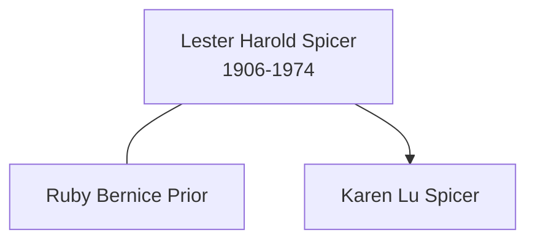

# Lester Harold Spicer

## Biographical Profile

- **Name:** Lester Harold Spicer
- **Role in this project:** Direct-line ancestor in staged Spicer lineage text.

## Source-Cited Facts

- The staged lineage chain records Lester Harold Spicer paired with Ruby Bernice Prior.
- The same chain places Lester Harold Spicer as parent generation above Karen Lu Spicer.
- The census-summary contents index lists `SPICER, Lester Harold` with dates 14 Jul 1906 to 28 Jun 1974.
- The Burial Sites book places Lester Harold Spicer at Cedar Memorial Cemetery in Cedar Rapids, Iowa (page 33), `64K Last Supper, Space 4`, with GPS coordinates `42°1’24.2”N 91°38’17.4”W`, date of death 28 June 1974, and inscription `LESTER H. / 1906 † 1974`. Map: [Google Maps](https://www.google.com/maps/search/?api=1&query=Cedar+Memorial+Cemetery+Cedar+Rapids+IA).

## Family Diagram

This is a minimal family sketch derived from the staged lineage chain.

## Research Gaps

1. Confirm timeline dates from `PedigreeTimelines2025Spicer.pdf` before adding to this profile.
2. Add census and certificate evidence to support relationship assertions.
3. Resolve whether spelling and middle-name forms are consistent across all source sets.

## Sources

1. [[References/Shared Intake 2026-04-22 Spicer Lineage Note|Shared Intake 2026-04-22 Spicer Lineage Note]]
2. [[References/Shared Intake 2026-04-22 Census Summary Individuals p1-p10|Shared Intake 2026-04-22 Census Summary Individuals p1-p10]]
3. [[References/Shared Intake 2026-04-22 Burial Sites Summary|Shared Intake 2026-04-22 Burial Sites Summary]]
4. `References/raw/inbox/2026-04-22-intake/BurialSites/BurialSites.txt`
5. `References/raw/inbox/2026-04-22-intake/Pedigree Timeline/SPICLINE.txt`
6. `References/raw/inbox/2026-04-22-intake/Census/CensusSummaryIndividual.pdf`
