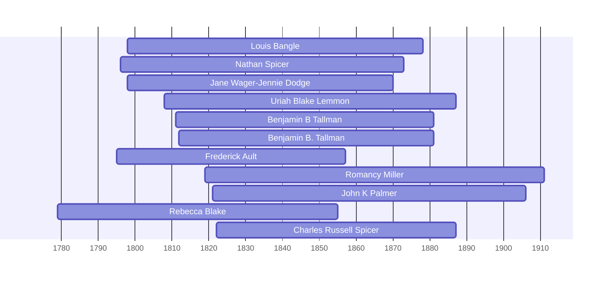

![[assets/snippets/Louis Bangle.svg]]

# Louis Bangle

## Biographical Profile

- **Name:** Louis Bangle
- **Dates:** 1798-?

## Source-Cited Facts

- Identified in pedigree timeline source.

## Research Notes

- Initial stub created from pedigree timeline extraction.

## Overlapping Lifespans

> [!info] Visualizing contemporaries in the vault during the life of Louis Bangle (1798-1878).

## Source Indicators

> [!info] Indicators from Pedigree Timeline Diagrams
>
> - **Burial**: Verified (RIP marker)
> - **Obituary**: Available (Obit marker)

## Sources

1. [[References/raw/extracted/PedigreeTimeline2025Prior.txt|PedigreeTimeline2025Prior.txt]]
