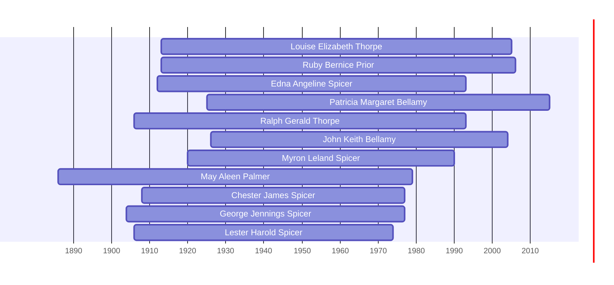

![[assets/snippets/Louise Elizabeth Thorpe.svg]]

# Louise Elizabeth Thorpe

## Biographical Profile

- **Name:** Louise Elizabeth Thorpe
- **Dates:** 1913 - 2005

## Source-Cited Facts

- Identified in pedigree timeline source.

## Research Notes

- Initial stub created from pedigree timeline extraction.

## Overlapping Lifespans

> [!info] Visualizing contemporaries in the vault during the life of Louise Elizabeth Thorpe (1913-2005).

## Source Indicators

> [!info] Indicators from Pedigree Timeline Diagrams
>
> - **Official Records**: Ref #121, 122
> - **Burial**: Verified (RIP marker)

## Sources

1. [[References/raw/extracted/PedigreeTimelines2025Thorpe.txt|PedigreeTimelines2025Thorpe.txt]]
