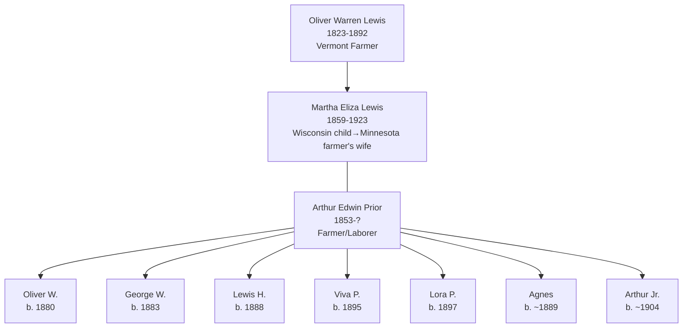
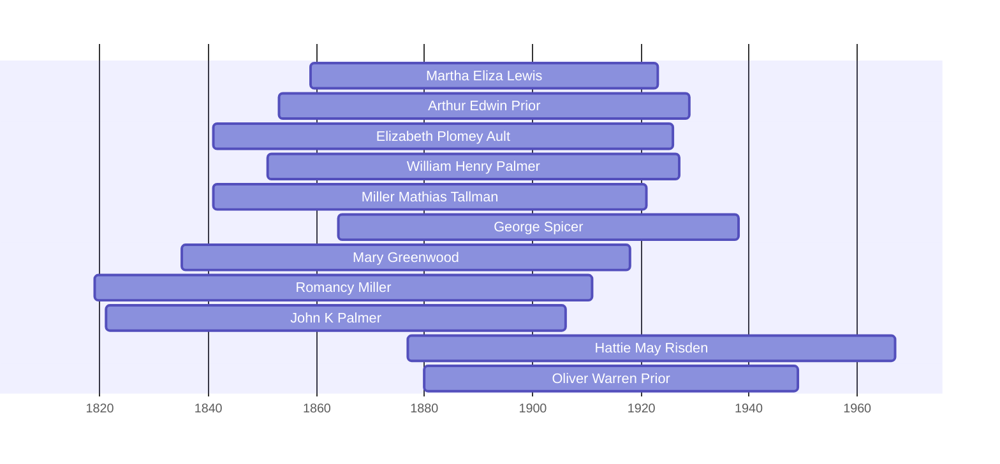

![[assets/snippets/Martha Eliza Lewis.svg]]

# Martha Eliza Lewis

## Biographical Profile

- **Name:** Martha Eliza Lewis (later Martha Eliza Prior)
- **Role in this project:** Lewis-to-Prior branch matriarch spanning Wisconsin (1860 childhood) to Minnesota/South Dakota (1900-1920) with documented multi-child household progression.

## Source-Cited Facts

- **Dates:** 15 Dec 1859 - 8 Dec 1923
- **Maiden surname:** Lewis; married name: Prior (married [[People/Arthur Edwin Prior|Arthur Edwin Prior]] c. 1900)
- **Burial:** Brook Park Cemetery, Brook Park, Minnesota; inscription `PRIOR / MARTHA E. / DEC. 15, 1859 / DEC. 8. 1923`
- The processed Prior timeline review places Martha in the direct line `Wynant Williamson Lewis` -> `Oliver Elhanon Lewis` -> `Martha Eliza Lewis`, which is useful branch placement but still a compiled-chart reading.

## Census Records and Life Progression

### 1860 Wisconsin Census — Fond du Lac County, Ripon 1st Ward (as child)
- **Head:** `W.W. LEWIS`, male, age 79, occupation farmer, born Massachusetts, property $50
- **Susan LEWIS** (wife), female, age 58, born New York
- **Oliver LEWIS** (son), male, age 35, born Vermont
- **Elizabeth LEWIS**, female, age 25, born New York
- **Martha E. LEWIS** (daughter), female, age 7/12 (infant), born Wisconsin
- **Source:** Series M653, Roll 1408, Page 829; GSU microfilm available

### 1900 Minnesota Census — Mower County, Grand Meadows Township (as wife)
- **Head:** `Arthur PRIOR`, male, race White, birthdate July 1853, age 46, born Michigan, occupation farmer
- **Martha PRIOR** (wife), female, race White, birthdate Dec 1859, age 40, born Wisconsin
- **Children:**
  - `Oliver W PRIOR`, male, race White, birthdate Mar 1880, age 20, born Minnesota, occupation farm laborer
  - `George W PRIOR`, male, race White, birthdate Aug 1883, age 16, born Minnesota, occupation farm laborer
  - `Lewis H PRIOR`, male, race White, birthdate Aug 1888, age 11, born Minnesota, occupation at school
  - `Viva P PRIOR`, female, race White, birthdate Nov 1895, age 4, born Minnesota
  - `Lora P PRIOR`, female, race White, birthdate Aug 1897, age 2, born Missouri
- **Source:** Series T623, Roll 777, Page 180A; GSU microfilm available

### 1910 South Dakota Census — Brown County, Hanson Township
- **Head:** `Arthur PRIOR`, male, race White, age 56, occupation laborer, birthplace Michigan
- **Martha PRIOR** (wife), female, race White, age 50, occupation none
- **Children:**
  - `Lora PRIOR`, female, race White, age 11
  - `Arthur PRIOR` (son), male, race White, age 7
  - `Lewis PRIOR` (son), male, race White, age 22, occupation laborer
  - `Agnes PRIOR`, female, race White, age 21, occupation none
- **Source:** Series T624, Roll 392, Page 15B; GSU microfilm available

### 1920 Minnesota Census — Pine County, Pokegama Township
- **Head:** `Arthur E. PRIOR`, male, race White, age 66, occupation farming
- **Martha E. PRIOR** (wife), female, race White, age 60, occupation house keeping
- **Child:**
  - `Arthur E. PRIOR Jr`, male, race White, age 16, occupation none
- **Source:** Series T625, Roll 849, Pages 15A, ED 76; GSU microfilm available

## Family Connections

- **Father:** [[People/Oliver Warren Lewis|Oliver Warren Lewis]] (1823-1892), Vermont farmer
- **Mother:** Martha Lewis (b. ~1801)
- **Husband:** [[People/Arthur Edwin Prior|Arthur Edwin Prior]] (b. 1853 Michigan), farmer/laborer
- **Children identified:** Oliver W., George W., Lewis H., Viva P., Lora P., Agnes, Arthur Jr. (7+ children across 40+ years)
- **Pedigree significance:** Represents Lewis family extension into Minnesota/South Dakota through Prior marriage; agricultural worker family

## Family Diagram



Martha Eliza Lewis's life arc spans Wisconsin farm childhood (1860) through Minnesota agricultural partnership (1900) to South Dakota labor settlement (1910) and back to Minnesota in later years (1920).

## Research Gaps

1. Locate Oliver Warren Lewis (father) in additional census records to establish full Lewis family lineage.
2. Verify Arthur Prior's parentage and occupational transitions (farmer → laborer).
3. Trace all children's adult lives in later records, especially sons Oliver W. and George W.
4. Clarify South Dakota relocation in 1910 (economic or family reasons).
5. Confirm return to Minnesota by 1920 and later life settlement.
6. Reconcile the chart's `Oliver Elhanon Lewis` name form against existing Lewis-page naming.


## Census Records

> [!info] Extract from References/raw/extracted/CensusSummaryIndividual.txt

```text
LEWIS, Martha Eliza (15 Dec 1859 - 8 Dec 1923)
1860 Wisconsin, Fond du Lac, Ripon 1st Ward
D/F
1078/1072

Name
W.W. LEWIS
Susan LEWIS
Oliver LEWIS
Marshal LEWIS
Elizabeth LEWIS
Martha E LEWIS
Series: M653, Roll: 1408, Page: 829

Age Sex
79
M
58
F
35
M
25
M
24
F
7/12
F

Color

Occupation
Farmer

Property
50
300

Nativity
Ma??
NY
Vermont
Vermont
NY
Wis

Comments

1900 Minnesota, Mower County, Grand Meadows Township
Add Name
43/45 Arthur PRIOR
Martha PRIOR
Oliver W PRIOR
George W PRIOR
Lewis H PRIOR
Viva P PRIOR
Lora P PRIOR
Series: T623, Roll: 777, Page 108A

Rel
Head
Wife
Son
Son
Son
Dau
Dau

Race
W
W
W
W
W
W
W

Sex
M
F
M
M
M
F
F

Birthdate
July 1853
Dec 1859
Mar 1880
Aug 1883
Aug 1888
Dec 1895
Aug 1897

Age
46
40
20
16
11
4
2

MS ? ? ?
M 23
M 23 9 7
S
S
S
S
S

BP
Mich
Wisc
Minn
Minn
Minn
Mo
Mo

FBP
Mich
Verm
Mich
Mich
Mich
Mich
Mich

MBP Occ.
Mich Farmer
NY
Wisc Farm Labr
Wisc Farm Labr
Wisc At School
Wisc
Wisc

1910 South Dakota, Brown County, Hanson Township
D/F Name
18/18 Arthur PRIOR
Martha PRIOR
Lora PRIOR
Arthur PRIOR
Lewis PRIOR
Agnes PRIOR
Series: T624, Roll: , Page 15B

Rel
Head
Wife
Dau
Son
Son
DIL

Sex Race Age
M
W
56
F
W
50
F
W
11
M
W
7
M
W
22
F
W
21

MS
M1
M1
S
S
M1
M1

?
35
35

?

?

11

9

1
1

1

1

BP
Mich
Wisc
MO
Minn
Minn
Iowa

FBP
Unk
Ver
Mich
Mich
Mich
Unk

MBP
Unk
NY
Wisc
Wisc
Wisc
Unk

Occupation
Laborer
None
None
None
Laborer
None

1920 Minnesota, Pine County, Pokegama Township
D/F
169

Name
Rel
Sex Race Age
Arthur E. PRIOR
Head
M
W
66
Martha E. PRIOR
Wife
F
W
60
Arthur E. PRIOR Jr
Son
M
W
16
Series: T625, Roll: 849, Page: 15A, ED 76

CENSUS SUMMARY - INDIVIDUALS

MS
M
M
S

?

?

?

BP
Mich
Wisc
Minn

Robert Archer John Thorpe

FBP
NY
Ver
Mich

MBP
Mich
NY
Wisc

Occupation
Farming
House Keeping
None

39
```


## Name Variations

> [!info] Known aliases or census misspellings from Butch Thorpe's cross-reference table.
>
> - **PRIOR, Martha**

## Overlapping Lifespans

> [!info] Visualizing contemporaries in the vault during the life of Martha Eliza Lewis (1859-1923).



## Source Indicators

> [!info] Indicators from Pedigree Timeline Diagrams
>
> - **Official Records**: Ref #213, 214, 215, 216
> - **Burial**: Verified (RIP marker)
> - **Obituary**: Available (Obit marker)

## Sources

1. [[References/Shared Intake 2026-04-22 Census Summary Individuals p37-p48|Shared Intake 2026-04-22 Census Summary Individuals p37-p48]]
2. [[References/Shared Intake 2026-04-22 Pedigree Timeline Prior|Shared Intake 2026-04-22 Pedigree Timeline Prior]]
3. [[prior-pedigree-timeline-index|Prior Pedigree Timeline Extraction Index]]
4. [[References/Shared Intake 2026-04-22 Burial Sites Summary|Shared Intake 2026-04-22 Burial Sites Summary]]
5. `References/raw/extracted/PedigreeTimeline2025Prior.txt`
6. `References/raw/inbox/2026-04-22-intake/BurialSites/BurialSites.txt`
7. `References/raw/inbox/2026-04-22-intake/Census/CensusSummaryIndividual.pdf`
