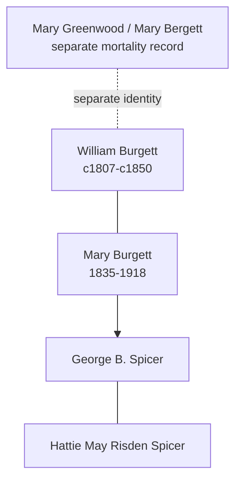

# Mary Burgett

## Biographical Profile

- **Name:** Mary Burgett
- **Role in this project:** Burgett-to-Spicer line ancestor represented across Iowa census-summary entries.

## Source-Cited Facts

- A census-summary entry gives Mary Burgett as born 19 Sep 1835 and died 28 Jan 1918.
- The section includes 1850 Brush Run Township, Iowa County, Iowa household records for the Bergett family.
- The same source batch also contains a separate 1850 Iowa mortality schedule entry for `Mary BERGETT` that is tracked as [[People/Mary Greenwood|Mary Greenwood]]; it is a different person from this Mary Burgett because the mortality entry gives age 38 and a March 1850 death.
- Later entries in the same section include Mary Spicer in Linn County, Iowa households, including 1900 Clinton Township (`Mary SPICER`, relation mother) and 1910 Maine Township (`Mary SPICER`, relation mother-in-law in a Duffield household).
- The Burial Sites book lists Mary Burgett as page 11 and places her in the Spicer/Spooner Cemetery section (page 52), which also includes George B. Spicer and Hattie May Risden Spicer. Map: [Google Maps](https://www.google.com/maps/search/?api=1&query=Spicer+Spooner+Cemetery+Homestead+Iowa).

## Family Diagram

This is a compact relationship sketch. The dashed link to Mary Greenwood is only a reminder that the mortality record is separate, not a genealogical merge.

## Research Gaps

1. Confirm continuity between Bergett/Burgett forms and later Spicer household entries.
2. Validate all listed relationships from image-level census pages.
3. Reconcile age/birth-year drift across listed decades.

## Sources

1. [[References/Shared Intake 2026-04-22 Census Summary Individuals p21-p30|Shared Intake 2026-04-22 Census Summary Individuals p21-p30]]
2. [[References/Shared Intake 2026-04-22 Burial Sites Summary|Shared Intake 2026-04-22 Burial Sites Summary]]
3. `References/raw/inbox/2026-04-22-intake/BurialSites/BurialSites.txt`
4. `References/raw/inbox/2026-04-22-intake/Census/CensusSummaryIndividual.pdf`

1. `References/raw/inbox/2026-04-24-census-indesign/CensusSummary-BurgettMary.txt`

2. [[References/Shared Intake 2026-04-22 Pedigree Timeline Spicer|Shared Intake 2026-04-22 Pedigree Timeline Spicer]]