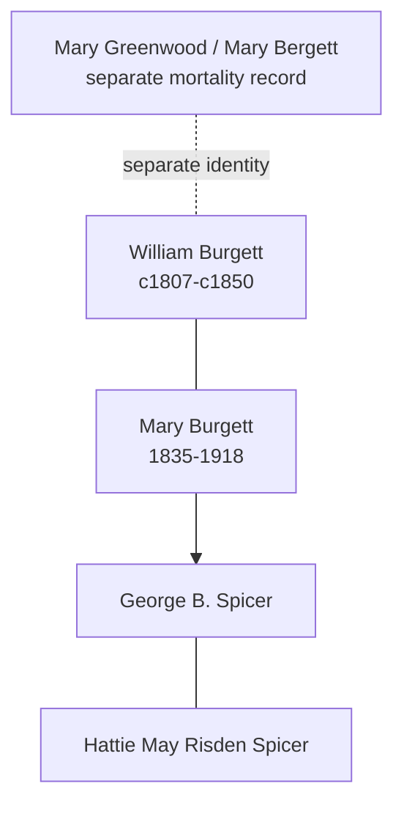

![[assets/snippets/Mary Burgett.svg]]

# Mary Burgett

## Biographical Profile

- **Dates:** 19 Sep 1835 - 28 Jan 1918

- **Name:** Mary Burgett
- **Role in this project:** Burgett-to-Spicer line ancestor represented across Iowa census-summary entries.

## Source-Cited Facts

- A census-summary entry gives Mary Burgett as born 19 Sep 1835 and died 28 Jan 1918.
- The section includes 1850 Brush Run Township, Iowa County, Iowa household records for the Bergett family.
- The same source batch also contains a separate 1850 Iowa mortality schedule entry for `Mary BERGETT` that is tracked as [[People/Mary Greenwood|Mary Greenwood]]; it is a different person from this Mary Burgett because the mortality entry gives age 38 and a March 1850 death.
- Later entries in the same section include Mary Spicer in Linn County, Iowa households, including 1900 Clinton Township (`Mary SPICER`, relation mother) and 1910 Maine Township (`Mary SPICER`, relation mother-in-law in a Duffield household).
- The Burial Sites book lists Mary Burgett as page 11 and places her in the Spicer/Spooner Cemetery section (page 52), which also includes George B. Spicer and Hattie May Risden Spicer. Map: [Google Maps](https://www.google.com/maps/search/?api=1&query=Spicer+Spooner+Cemetery+Homestead+Iowa).
- The processed Spicer timeline review confirms Mary Burgett as the spouse line paired with Charles Russell Spicer and keeps Mary Greenwood separate as an older Burgett-side figure.

## Family Diagram



This is a compact relationship sketch. The dashed link to Mary Greenwood is only a reminder that the mortality record is separate, not a genealogical merge.

## Research Gaps

1. Confirm continuity between Bergett/Burgett forms and later Spicer household entries.
2. Validate all listed relationships from image-level census pages.
3. Reconcile age/birth-year drift across listed decades.
4. Keep Mary Greenwood separate from Mary Burgett in all later branch summaries and diagrams.


## Census Records

> [!info] Extract from References/raw/extracted/CensusSummaryIndividual.txt

```text
BURGETT, Mary (19 Sep 1835 - 28 Jan 1918)
1850 Iowa, Iowa County, Brush Run Township
R/F
14/14

Name
William BERGETT
Mary BERGETT
John BERGETT
Adam BERGETT
Maria BERGETT
Series: M432, Roll: 184, Page: 279

Sex
M
F
M
M
F

Age
43
14
16
12
6

Occupation
Farmer

Born
Comments
Pennsylvania
Ohio
daughter of the deceased Mary
Ohio
Bergett
Ohio
Iowa

Farmer

1860 Iowa, Iowa County, Iowa Township, Page 629
D/F
968/1009

Name
C R SPICER
Mary SPICER
Charles SPICER
Silvester SPICER
Amana SPICER
Mariah SPICER
Rebeka SPICER
Peter BURGETT
Series: M653, Roll: 325, Page: 629

Age Sex
39
M
24
F
12
M
6
M
5
F
2
F
26
F
56
M

Color

Occupation
Chair Maker

Property
100

Nativity
New York
Ohio
Iowa
Iowa
Iowa
Iowa
Ohio
Penn

Real
800

Nativity Comments
New York
Iowa

Distiller

Comments

1870 Iowa, Linn County, Clinton Township
D/F
43/43

Name
Chas R SPICER
Mary SPICER
Sylvester N SPICER
Amanda SPICER
Mary SPICER
Wm SPICER
Perry SPICER
George SPICER
Ella SPICER
Zerna SPICER
Series: M593, Roll: 405, Page: 67

Age Sex
59? M
35
F
15
M
13
F
11
F
9
F
8
M
5
M
3
F
1
F

Color
W
W
W
W
W
W
W
W
W
W

Occupation
Farm Labr
Keeps House
Farm Labr

Pers
300

1880 Iowa, Linn County, Clinton Township, Page 153 C & 153 D
D/F
65/66

Name
Russel SPICER
Mary SPICER
George SPICER
William SPICER
Ellen SPICER
Dellie M. SPICER
Elizabeth SPICER
Fam Hist Lib Film
1254351

Rel
Self
Wife
Son
Son
Dau
Dau
Dau

Married Gender Race Age
BP
Married
Male
White 59
NY
Married
Female White 45
OH
Single
Male
White 15
IA
Single
Male
White 19
IA
Single
Female White 12
IA
Single
Female White 8
IA
Single
Female White 7
IA
NA Film No. T9-0351
Page 153C

Occupation
Farmer
Keeping House

FBP
NY
ENG
NY
NY
NY
NY
NY

At School

MBP
NY
PA
OH
OH
OH
OH
OH

1900 Iowa, Linn County, Clinton Township
Add
242

Name
George SPICER
Hattie SPICER
Mary SPICER
Clara SPICER
Roy Forney
Series: T623, Roll: 443, Page 62B

Rel
Head
Wife
Mother
Sister
Boarder

Race
W
W
W
W
W

Sex
M
F
F
F
M

Birthdate
Sept 1865
Mar 1877
? 1835
Sept 1881
Nov 1878

Age
35
23
65
18
21

MS ?
M 3
M 3

? ?
2 0
12 10

S
S

BP
Iowa
Iowa
Ohio
Iowa
Iowa

FBP
Ohio
Ohio
Penn
Ohio
NY

MBP Occ.
Ohio Farmer
Ind
Eng
Ohio
NY
Farm Labr

1910 Iowa, Linn County, Maine Township
D/F
86

Name
George W DUFFIELD
Clara E. DUFFIELD
Hope N. DUFFIELD
Mary SPICER
Series: T624, Roll: 410, Page 201

Rel
Head
Wife
Dau
M-I-L

CENSUS SUMMARY - INDIVIDUALS

Sex Race Age
M
W
25
F
w
21
F
W
3
F
W
74

MS
M1
M1
wD

?
5

?

?

1

1

12

10

Robert Archer John Thorpe

BP
Ill
Iowa
Iowa
Ohio

FBP
Penn
Ohio
Ill
Penn

MBP
Ill
Ohio
Iowa
Eng

Occupation
Farmer General Farm

None

23
```


## Name Variations

> [!info] Known aliases or census misspellings from Butch Thorpe's cross-reference table.
>
> - **BERGETT, Mary**
> - **SPICER, Mary**
## Source Indicators

> [!info] Indicators from Pedigree Timeline Diagrams
>
> - **Official Records**: Ref #213, 214, 215, 216
> - **Burial**: Verified (RIP marker)
> - **Obituary**: Available (Obit marker)

## Sources

1. [[References/Shared Intake 2026-04-22 Census Summary Individuals p21-p30|Shared Intake 2026-04-22 Census Summary Individuals p21-p30]]
2. [[References/Shared Intake 2026-04-22 Burial Sites Summary|Shared Intake 2026-04-22 Burial Sites Summary]]
3. `References/raw/inbox/2026-04-22-intake/BurialSites/BurialSites.txt`
4. `References/raw/inbox/2026-04-22-intake/Census/CensusSummaryIndividual.pdf`

1. `References/raw/inbox/2026-04-24-census-indesign/CensusSummary-BurgettMary.txt`

2. [[References/Shared Intake 2026-04-22 Pedigree Timeline Spicer|Shared Intake 2026-04-22 Pedigree Timeline Spicer]]
3. [[spicer-pedigree-timeline-index|Spicer Pedigree Timeline Extraction Index]]
