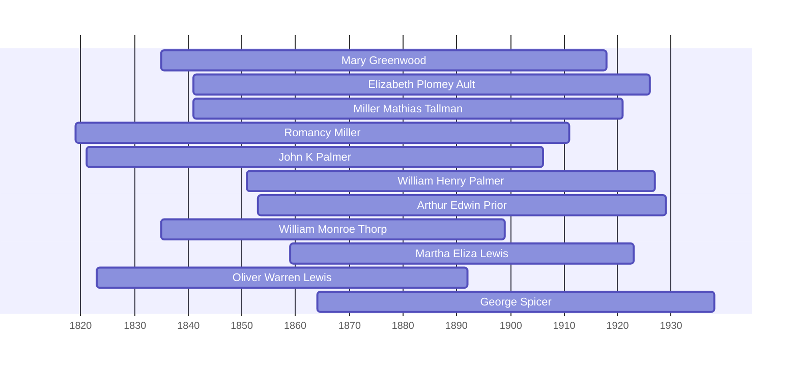

# Mary Greenwood

## Biographical Profile

- **Name:** Mary Greenwood
- **Role in this project:** Burgett-linked individual represented in 1850 Iowa mortality schedule summary entry.

## Source-Cited Facts

- The extracted census summary page 30 labels this profile `GREENWOOD, Mary (c. 1812 - Mar 1850)`.
- The same extract records an 1850 Iowa mortality schedule entry naming `Mary BERGETT`, female, age 38, born England.
- The entry notes death in March with cause recorded as fever and illness duration of 3 days.
- The extract cites `Series: A1156, Roll: 54, Page: 337, Line #6`.
- The same source page flags this as a Burgett-linked individual, but the age and death timing make it a separate Mary Bergett identity from [[People/Mary Burgett|Mary Burgett]] (1835-1918).
- The `GREENWOOD, Mary` heading appears to be compiler metadata for the mortality-schedule row, not the best canonical surname for the person.

## Research Gaps

1. Validate mortality-schedule line details from image-level records.
2. Determine whether the `GREENWOOD` heading should be preserved only as an index label or replaced by a more neutral mortality-record title.
3. Clarify the relationship of this Mary Bergett entry to the William Burgett household.


## Census Records

> [!info] Extract from References/raw/extracted/CensusSummaryIndividual.txt

```text
GREENWOOD, Mary (c. 1812 - Mar 1850)
1850 Iowa, County, District No 9, Mortality Schedule
R/F

Name
Sex
Mary BERGETT
F
Series: A1156, Roll: 54, Page: 337, Line #6

CENSUS SUMMARY - INDIVIDUALS

Age
38

Occupation

Born
England

Robert Archer John Thorpe

Comments
died March, Fever - Ill 3 days

30
```


## Name Variations

> [!info] Known aliases or census misspellings from Butch Thorpe's cross-reference table.
>
> - **BERGETT, Mary (GREENWOOD)**

## Overlapping Lifespans

> [!info] Visualizing contemporaries in the vault during the life of Mary Greenwood (1835-1918).



## Sources

1. [[References/Shared Intake 2026-04-22 Census Summary Individuals p21-p30|Shared Intake 2026-04-22 Census Summary Individuals p21-p30]]
2. `References/raw/inbox/2026-04-22-intake/Census/CensusSummaryIndividual.pdf`

1. `References/raw/inbox/2026-04-24-census-indesign/CensusSummary-GreenwoodMary.txt`

2. [[References/Shared Intake 2026-04-22 Pedigree Timeline Spicer|Shared Intake 2026-04-22 Pedigree Timeline Spicer]]