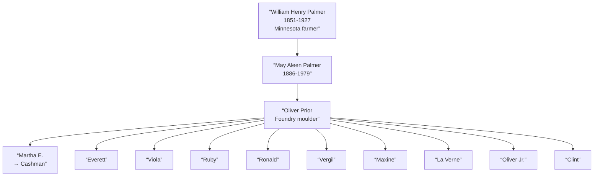
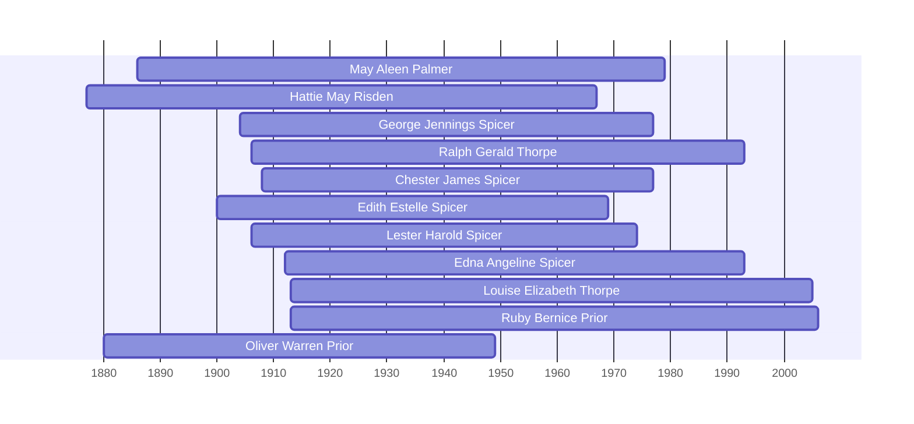

![[assets/snippets/May Aleen Palmer.svg]]

# May Aleen Palmer

## Biographical Profile

- **Name:** May Aleen Palmer (later May Aleen Prior)
- **Role in this project:** Palmer-to-Prior branch matriarch spanning Minnesota (1900), Iowa (1910-1930) with documented multi-child household progression.

## Source-Cited Facts

- **Dates:** 1 May 1886 - 21 May 1979
- **Maiden surname:** Palmer; married name: Prior (married [[People/Oliver Warren Prior|Oliver Prior]] c. 1910)
- **Burial:** Cedar Memorial Cemetery, Cedar Rapids, Iowa; 110 Lakeview, Space 5; GPS 42°1’25.1”N 91°37’47.2”W; inscription `OUR MOM / MAY A. PRIOR / MAY 1, 1886 / MAY 21, 1979`
- The processed Prior timeline review confirms May Aleen Palmer as the direct spouse line attached to [[People/Oliver Warren Prior|Oliver Warren Prior]] and preserves her chart ID as a search lead only.

## Census Records and Life Progression

### 1900 Minnesota Census — Mower County, Frankford Township (as daughter)
- **Head:** `William PALMER`, male, farmer, age 49
- **Elizabeth PALMER** (mother), age 42
- **May PALMER** (daughter), female, birthdate May 1887, age 13, born Wisconsin
- **Siblings in household:** Vern, Louis, Dott, Ivas, Voila, Vivian
- **Note:** Listed as age 13, born Wisconsin (variance from 1886 birth year); suggests May 1887 birth in census vs. May 1886 reported in summary index
- **Source:** Series T623, Roll 777, Page 3A; GSU microfilm available

### 1910 Iowa Census — Blackhawk County, East Waterloo Township, Waterloo
- **Head:** `Oliver PRIOR`, male, race White, age 30, occupation moulder foundry
- **Wife:** `May PRIOR`, female, race White, age 24
- **Child:**
  - `Martha PRIOR`, female, race White, age 5, occupation none
- **Source:** Series T624, Roll 392, Page 226; GSU microfilm available

### 1920 Iowa Census — Linn County, Cedar Rapids, 275 12th Ave E
- **Head:** `Oliver PRIOR`, male, race White, age 39, occupation moulder
- **Wife:** `May PRIOR`, female, race White, age 33, no occupation
- **Children:**
  - `Martha PRIOR`, female, age 15, no occupation
  - `Everett PRIOR`, male, age 12, no occupation
  - `Viola PRIOR`, female, age 9, no occupation
  - `Viola PRIOR`, female, age 9, no occupation (duplicate entry or OCR error?)
  - `Ruby PRIOR`, female, age 6, no occupation
  - `Ronald PRIOR`, male, age 4+, no occupation
  - `Vergil PRIOR`, male, age 1+, no occupation
  - `Maxine PRIOR`, female, age 11 months, no occupation
- **Source:** Series T625, Roll 500, Pages 3B, ED 131; GSU microfilm available

### 1930 Iowa Census — Linn County, Cedar Rapids, 14th Precinct, RFD #4 Memorial Drive
- **Head:** `Oliver PRIOR`, male, race White, age 50, occupation moulder foundry
- **Wife:** `May A PRIOR`, female, race White, age 43, no occupation
- **Children and Grandchildren:**
  - `Martha E CASHMAN`, female, age 25, married, operator telephone
  - `Warren A CASHMAN`, male, age 3+, no occupation
  - `Beverly M CASHMAN`, female, age 2+, no occupation
  - `Bruce F CASHMAN`, male, age 8 months, no occupation
  - `Everett ? PRIOR`, male, age 22, no occupation, core maker foundry
  - `Viola D PRIOR`, female, age 19, no occupation, mangle operator laundry
  - `Ruby B PRIOR`, female, age 16, no occupation, mangle operator laundry
  - `Ronald W PRIOR`, male, age 14, no occupation, none
  - `Vergil V PRIOR`, male, age 12, no occupation, none
  - `Maxine M PRIOR`, female, age 10, no occupation, none
  - `La Verne O PRIOR`, male, age 8, no occupation, none
  - `Oliver W PRIOR Jr`, male, age 3+, no occupation, none
  - `Clint R PRIOR`, male, age 2, no occupation, none
- **Note:** Large household with oldest child Martha married with children; occupational diversity (foundry work, telephone operator, laundry workers)
- **Source:** Series T626, Roll 665, Page 26B, ED 57; GSU microfilm available

## Family Connections

- **Father:** [[People/William Henry Palmer|William Henry Palmer]] (1851-1927), Minnesota farmer
- **Grandfather:** [[People/John K Palmer|John K Palmer]] (1821-1906), Wisconsin farmer
- **Husband:** [[People/Oliver Warren Prior|Oliver Prior]] (married c. 1910), foundry moulder
- **Children identified:** Martha E., Everett, Viola, Ruby, Ronald, Vergil, Maxine, La Verne, Oliver Jr., Clint (10+ children/stepchildren across three decades)
- **Pedigree significance:** Represents Palmer-Prior marriage alliance and family expansion into Iowa industrial economy; bridge between Wisconsin farming (grandfather/father) and Iowa foundry/industrial labor (husband and children)

## Family Diagram



May Aleen Palmer’s life arc spans Minnesota farm childhood (1900) through Iowa industrial marriage (1910+) to large multigenerational family (1920-1930), representing occupational transition from agriculture to urban foundry work.

## Research Gaps

1. Clarify birth year discrepancy: 1886 (burial inscription/summary) vs. 1887 (1900 census).
2. Validate all children names and birth years from original 1920/1930 census images (duplicate Viola entries suggest OCR errors).
3. Identify Martha’s husband surname (Cashman) and trace his line.
4. Trace remaining children’s adult lives in later records.
5. Confirm Oliver Prior’s occupational and family details.
6. Keep the chart's alphanumeric ID as a lead only rather than a verified external-profile match.


## Census Records

> [!info] Extract from References/raw/extracted/CensusSummaryIndividual.txt

```text
PALMER, May Aleen (1 May 1886 - 21 May 1979)
1900 Minnesota, Mower, Frankford Township
Add
38

Name
William PALMER
Elizabeth PALMER
Vern PALMER
Loulu PALMER
May PALMER
Dott PALMER
Ivas PALMER
VoilaPALMER
Vivian PALMER
Series: T623, Roll: 777, Page: 3A

Rel
Head
Wife
Son
Dau
Dau
Dau
Dau
Dau
Dau

Race
W
W
W
W
W
W
W
W
W

Sex
M
F
M
F
F
F
F
F
F

Birthdate
Jan 1851
Sep 1857
Oct 1882
Oct 1884
May 1887
Aug 1889
Sep 1891
May 1896
MAY 1898

Age
49
42
18
16
13
11
8
4
2

MS ? ? ?
M 26
M 26 10 10
S
S
S
S
S
S
S

BP
Penn
Wisc
Wisc
Wisc
Wisc
Wisc
Wisc
Minn
Minn

FBP
Penn
NY
Penn
Penn
Penn
Penn
Penn
Penn
Penn

MBP
NY
NY
NY
NY
NY
NY
NY
NY
NY

Occ.
Farmer
Farm Labr

1910 Iowa, Blackhawk County, East Waterloo Township, Waterloo
D/F
371

Name
Rel
Oliver PRIOR
Head
May PRIOR
Wife
Martha PRIOR
Dau
Everett PRIOR
Son
Series: T624, Roll:392 , Page 228

Sex Race Age
M
W
30
F
W
24
F
W
6
M
W
3

MS
M1
M1
S
S

?
7
7

?

?

2

2

BP
Minn
Wisc
Iowa
Iowa

FBP
Mich
Penn
Minn
Minn

MBP
Mich
Wisc
Mich
Mich

Occupation
Moulder Foundary
None
None
None

1920 Iowa, Linn County, Cedar Rapids, 275 12th Ave E
D/F
62

Name
Rel
Sex Race Age
Oliver PRIOR
Head
M
W
39
May PRIOR
Wife
F
W
33
Martha PRIOR
Dau
F
W
15
Everett PRIOR
Son
F
W
12
Viola PRIOR
Dau
F
W
9
Voila PRIOR
Dau
F
W
9
Ruby PRIOR
Dau
F
W
6
Ronald PRIOR
Son
M
W
4+
Vergil PRIOR
Son
F
W
1+
Maxine PRIOR
Dau
F
W 11mo
Series: T625, Roll: 500, Page: 3B, ED 131

MS
M
M
S
S
S
S
S
S
S
S

?

?

?

BP
Minn
Wisc
Iowa
Iowa
Iowa
Iowa
Iowa
Iowa
Iowa
Iowa

FBP
Mich
Penn
Minn
Minn
Minn
Minn
Minn
Minn
Minn
Minn

MBP
Mich
Wisc
Wisc
Wisc
Wisc
Wisc
Wisc
Wisc
Wisc
Wisc

Occupation
Moulder
None
None
None
None
None
None
None
None
None

1930 Iowa, Linn County, Cedar Rapids, 14th Precinct, RFD #4 Memorial Drive
D/F
627

Name
Rel
Oliver W PRIOR
Head
May A PRIOR
Wife
Martha E CASHMAN
Dau
Warren A CASHMAN
GSon
Beverly M CASHMAN
GDau
Bruce F CASHMAN
GSon
Everett ? PRIOR
Son
Voila D PRIOR
Dau
Viola D PRIOR
Dau
Ruby B PRIOR
Dau
Ronald WPRIOR
Son
Vergil V PRIOR
Son
Maxine M PRIOR
Son
La Verne O PRIOR
Son
Oliver W PRIOR Jr
Son
Clint R PRIOR
Son
Series: T626, Roll: 665, Page: 26B, ED 57

CENSUS SUMMARY - INDIVIDUALS

Sex Race Age
M
W
50
F
W
43
F
W
25
M
W 3+
F
W
2
M
W 8mo
M
W
22
F
W
19
F
W
19
F
W
16
M
W
14
M
W
12
M
W
10
M
W
6
M
W 3+
M
W
2

MS
M
M
M
S
S
S
S
S
S
S
S
S
S
S
S
S

BP
Minn
Wisc
Iowa
Iowa
Iowa
Iowa
Iowa
Iowa
Iowa
Iowa
Iowa
Iowa
Iowa
Iowa
Iowa
Iowa

FBP
Mich
Penn
Minn
NY
NY
NY
Minn
Minn
Minn
Minn
Minn
Minn
Minn
Minn
Minn
Minn

Robert Archer John Thorpe

MBP
Mich
Wisc
Wisc
Iowa
Iowa
Iowa
Wisc
Wisc
Wisc
Wisc
Wisc
Wisc
Wisc
Wisc
Wisc
Wisc

Occupation
Moulder, foundary
None
Operator, telephone
None
None
None
Core Maker, foundary
Mangle Operator, laundry
Mangle Operator, laundry
Mangle Operator, laundry
None
None
None
None
None
None

50
```


## Name Variations

> [!info] Known aliases or census misspellings from Butch Thorpe's cross-reference table.
>
> - **PRIOR, May**

## Overlapping Lifespans

> [!info] Visualizing contemporaries in the vault during the life of May Aleen Palmer (1886-1979).



## Source Indicators

> [!info] Indicators from Pedigree Timeline Diagrams
>
> - **Burial**: Verified (RIP marker)
> - **Obituary**: Available (Obit marker)

## Sources

1. [[References/Shared Intake 2026-04-22 Census Summary Individuals p41-p50|Shared Intake 2026-04-22 Census Summary Individuals p41-p50]]
2. [[References/Shared Intake 2026-04-22 Pedigree Timeline Prior|Shared Intake 2026-04-22 Pedigree Timeline Prior]]
3. [[prior-pedigree-timeline-index|Prior Pedigree Timeline Extraction Index]]
4. [[References/Shared Intake 2026-04-22 Burial Sites Summary|Shared Intake 2026-04-22 Burial Sites Summary]]
5. `References/raw/extracted/PedigreeTimeline2025Prior.txt`
6. `References/raw/inbox/2026-04-22-intake/BurialSites/BurialSites.txt`
7. `References/raw/inbox/2026-04-22-intake/Census/CensusSummaryIndividual.pdf`
