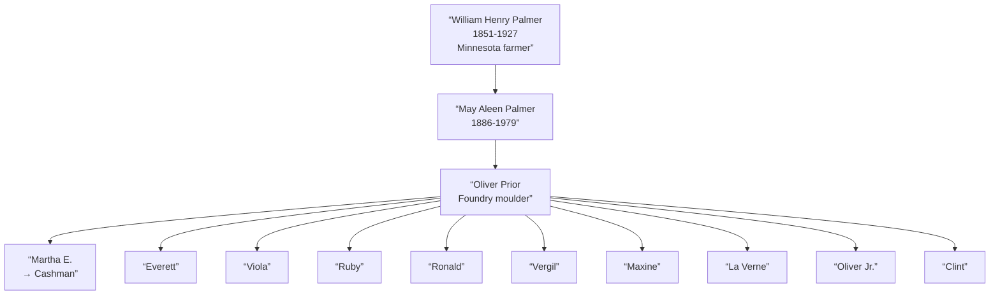

# May Aleen Palmer

## Biographical Profile

- **Name:** May Aleen Palmer (later May Aleen Prior)
- **Role in this project:** Palmer-to-Prior branch matriarch spanning Minnesota (1900), Iowa (1910-1930) with documented multi-child household progression.

## Source-Cited Facts

- **Birth/Death:** Born 1 May 1886; died 21 May 1979 (age 93 years, 20 days).
- **Maiden surname:** Palmer; married name: Prior (married [[People/Oliver Prior|Oliver Prior]] c. 1910)
- **Burial:** Cedar Memorial Cemetery, Cedar Rapids, Iowa; 110 Lakeview, Space 5; GPS 42°1’25.1”N 91°37’47.2”W; inscription `OUR MOM / MAY A. PRIOR / MAY 1, 1886 / MAY 21, 1979`

## Census Records and Life Progression

### 1900 Minnesota Census — Mower County, Frankford Township (as daughter)
- **Head:** `William PALMER`, male, farmer, age 49
- **Elizabeth PALMER** (mother), age 42
- **May PALMER** (daughter), female, birthdate May 1887, age 13, born Wisconsin
- **Siblings in household:** Vern, Louis, Dott, Ivas, Voila, Vivian
- **Note:** Listed as age 13, born Wisconsin (variance from 1886 birth year); suggests May 1887 birth in census vs. May 1886 reported in summary index
- **Source:** Series T623, Roll 777, Page 3A; GSU microfilm available

### 1910 Iowa Census — Blackhawk County, East Waterloo Township, Waterloo
- **Head:** `Oliver PRIOR`, male, race White, age 30, occupation moulder foundry
- **Wife:** `May PRIOR`, female, race White, age 24
- **Child:**
  - `Martha PRIOR`, female, race White, age 5, occupation none
- **Source:** Series T624, Roll 392, Page 226; GSU microfilm available

### 1920 Iowa Census — Linn County, Cedar Rapids, 275 12th Ave E
- **Head:** `Oliver PRIOR`, male, race White, age 39, occupation moulder
- **Wife:** `May PRIOR`, female, race White, age 33, no occupation
- **Children:**
  - `Martha PRIOR`, female, age 15, no occupation
  - `Everett PRIOR`, male, age 12, no occupation
  - `Viola PRIOR`, female, age 9, no occupation
  - `Viola PRIOR`, female, age 9, no occupation (duplicate entry or OCR error?)
  - `Ruby PRIOR`, female, age 6, no occupation
  - `Ronald PRIOR`, male, age 4+, no occupation
  - `Vergil PRIOR`, male, age 1+, no occupation
  - `Maxine PRIOR`, female, age 11 months, no occupation
- **Source:** Series T625, Roll 500, Pages 3B, ED 131; GSU microfilm available

### 1930 Iowa Census — Linn County, Cedar Rapids, 14th Precinct, RFD #4 Memorial Drive
- **Head:** `Oliver PRIOR`, male, race White, age 50, occupation moulder foundry
- **Wife:** `May A PRIOR`, female, race White, age 43, no occupation
- **Children and Grandchildren:**
  - `Martha E CASHMAN`, female, age 25, married, operator telephone
  - `Warren A CASHMAN`, male, age 3+, no occupation
  - `Beverly M CASHMAN`, female, age 2+, no occupation
  - `Bruce F CASHMAN`, male, age 8 months, no occupation
  - `Everett ? PRIOR`, male, age 22, no occupation, core maker foundry
  - `Viola D PRIOR`, female, age 19, no occupation, mangle operator laundry
  - `Ruby B PRIOR`, female, age 16, no occupation, mangle operator laundry
  - `Ronald W PRIOR`, male, age 14, no occupation, none
  - `Vergil V PRIOR`, male, age 12, no occupation, none
  - `Maxine M PRIOR`, female, age 10, no occupation, none
  - `La Verne O PRIOR`, male, age 8, no occupation, none
  - `Oliver W PRIOR Jr`, male, age 3+, no occupation, none
  - `Clint R PRIOR`, male, age 2, no occupation, none
- **Note:** Large household with oldest child Martha married with children; occupational diversity (foundry work, telephone operator, laundry workers)
- **Source:** Series T626, Roll 665, Page 26B, ED 57; GSU microfilm available

## Family Connections

- **Father:** [[People/William Henry Palmer|William Henry Palmer]] (1851-1927), Minnesota farmer
- **Grandfather:** [[People/John K Palmer|John K Palmer]] (1821-1906), Wisconsin farmer
- **Husband:** [[People/Oliver Prior|Oliver Prior]] (married c. 1910), foundry moulder
- **Children identified:** Martha E., Everett, Viola, Ruby, Ronald, Vergil, Maxine, La Verne, Oliver Jr., Clint (10+ children/stepchildren across three decades)
- **Pedigree significance:** Represents Palmer-Prior marriage alliance and family expansion into Iowa industrial economy; bridge between Wisconsin farming (grandfather/father) and Iowa foundry/industrial labor (husband and children)

## Family Diagram

May Aleen Palmer’s life arc spans Minnesota farm childhood (1900) through Iowa industrial marriage (1910+) to large multigenerational family (1920-1930), representing occupational transition from agriculture to urban foundry work.

## Research Gaps

1. Clarify birth year discrepancy: 1886 (burial inscription/summary) vs. 1887 (1900 census).
2. Validate all children names and birth years from original 1920/1930 census images (duplicate Viola entries suggest OCR errors).
3. Identify Martha’s husband surname (Cashman) and trace his line.
4. Trace remaining children’s adult lives in later records.
5. Confirm Oliver Prior’s occupational and family details.

## Sources

1. [[References/Shared Intake 2026-04-22 Census Summary Individuals p41-p50|Shared Intake 2026-04-22 Census Summary Individuals p41-p50]]
2. [[References/Shared Intake 2026-04-22 Pedigree Timeline Prior|Shared Intake 2026-04-22 Pedigree Timeline Prior]]
3. [[References/Shared Intake 2026-04-22 Burial Sites Summary|Shared Intake 2026-04-22 Burial Sites Summary]]
4. `References/raw/extracted/PedigreeTimeline2025Prior.txt`
5. `References/raw/inbox/2026-04-22-intake/BurialSites/BurialSites.txt`
6. `References/raw/inbox/2026-04-22-intake/Census/CensusSummaryIndividual.pdf`
