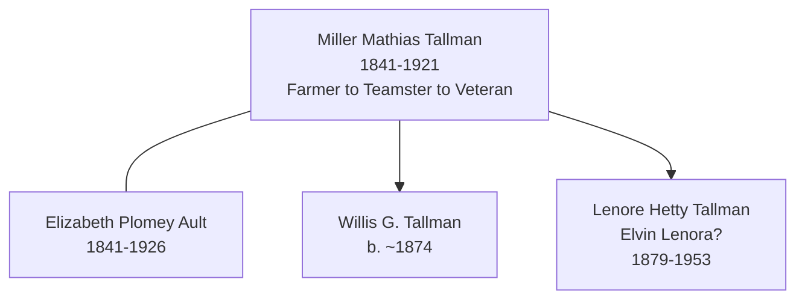
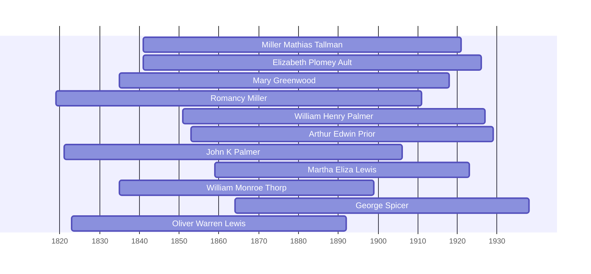

![[assets/snippets/Miller Mathias Tallman.svg]]

# Miller Mathias Tallman

## Biographical Profile

- **Name:** Miller Mathias Tallman
- **Role in this project:** Tallman-line ancestor connected to Ault-line census households.

## Source-Cited Facts

- **Birth/Death:** Born 14 Apr 1841; died 8 Apr 1921 (age 79 years, 11 months, 25 days).
- **Birthplace:** Ohio
- **Occupations:** Farmer (1880), teamster (1900)
- **Military Service:** Iowa Soldiers’ Home resident (1910-1920), suggesting Union veteran status
- **Burial:** Iowa Veterans’ Home Cemetery, Marshalltown, Iowa; South Section, Row 12, Grave 4
- The *Genealogy and History of Samuel Miller* page image for page 241 identifies Miller Mathias Tallman as a child of [[People/Romancy Miller|Romancy Miller]] and Benjamin Tallman and gives his birth date as 14 Apr 1841.

## Census Records and Life Progression

### 1880 Iowa Census — Cherokee County, Afton Township (as farmer)
- **Head:** `Miller M. TALLMAN`, male, married, age 39, occupation farmer, born Ohio
- **Wife:** `Elizabeth TALLMAN` (née Ault), married, age 30, born Ohio, occupation keeping house
- **Children:**
  - `Willis G. TALLMAN`, male, single, age 6, born Iowa
  - `Lena TALLMAN`, female, single, age 1, born Iowa
- **Household also includes:**
  - `Elbert WINN`, male, single, age 17, born Iowa
  - `Mary AULT` (Elizabeth’s mother), female, widow, age 73, born Maine, occupation aged
  - `Andrew RICHEY`, male, single, age 24, born Illinois, occupation farm laborer
- **Source:** Fam Hist Lib Film 1254332, Page 52D; GSU microfilm available

### 1900 Iowa Census — Woodbury County, Sioux City, p. 231R, Filmore Avenue (as teamster)
- **Head:** `Miller M. TALLMAN`, male, race White, birthdate Apr 1841, age 58, occupation teamster
- **Wife:** `Elizabeth P. TALLMAN` (née Ault), race White, birthdate Oct 1841, age 58
- **Child:**
  - `Lena P. TALLMAN`, female, race White, birthdate Feb 1879, age 21
- **Note:** Household in Sioux City; occupation changed from farmer to teamster (urban/transport labor)
- **Source:** Series T623, Roll 467, Page 231B; GSU microfilm available

### 1910 Iowa Census — Marshall County, Linn Township, Iowa Soldiers’ Home
- **Head:** `Miller M. TALLMAN`, male, race White, age 69, occupation none
- **Wife:** `Elizabeth P. TALLMAN`, female, race White, age 68
- **Note:** Residing at Iowa Soldiers’ Home; both listed as members
- **Source:** Series T624, Roll 441, Page 72; GSU microfilm available

### 1920 Iowa Census — Marshall County, Iowa Soldiers’ Home
- **Head:** `Miller M. TALLMAN`, male, race White, age 78, occupation none, member of Soldiers’ Home
- **Wife:** `Elizabeth TALLMAN`, female, race White, age 78, member of Soldiers’ Home
- **Note:** Continued residence at Iowa Soldiers’ Home; married couple both identified as members
- **Source:** Series T625, Roll 502, Pages 5B, ED 155; GSU microfilm available

## Family Connections

- **Wife:** [[People/Elizabeth Plomey Ault|Elizabeth Plomey Ault]] (1841-1926), married c. 1880
- **Children identified:** Willis G. Tallman (b. ~1874), Lena/Lena P. Tallman (b. 1879)
- **Mother-in-law:** Mary Ault (b. ~1802), living with household in 1880
- **Pedigree connection:** Married into [[People/Frederick Ault|Frederick Ault]]’s family; likely Union veteran based on Iowa Soldiers’ Home residence
- **Compiled-book reconciliation issue:** The Miller genealogy page 242 says Mathias M. Tallman married Lizzie Wimmer on 24 Aug 1872 and lists children William Gilmore Tallman and Elvin Lenora Tallman. The same page also summarizes the children as Willis G. Tallman and Lenore Tallman; page 250 identifies Elvin Lenora Tallman as wife of [[People/Uriah Blake Thorpe|U. B. Thorpe]]. These details likely correspond to the census-linked Elizabeth/Willis/Lena family group, but marriage and vital records are still needed before treating Lizzie Wimmer as resolved to [[People/Elizabeth Plomey Ault|Elizabeth Plomey Ault]].

## Family Diagram



Miller Mathias demonstrates the trajectory of a Civil War veteran: farming in rural Iowa (1880), transitioning to urban teamster work in Sioux City (1900), and finally entering the Iowa Soldiers’ Home for long-term care (1910-1920) until his death in 1921.

## Research Gaps

1. Confirm Union military service record and identify regiment/unit.
2. Locate Willis G. Tallman in later records (1880 shows age 6, implying birth ~1874).
3. Trace Lena P. Tallman after 1900; identify marriage and descendants.
4. Clarify relationship of Elbert Winn and Andrew Richey to the household in 1880.
5. Determine exact reason for Iowa Soldiers’ Home admission (age, health, pension status).
6. Resolve the wife-name conflict between Elizabeth Plomey Ault in census-linked sources and Lizzie Wimmer in the Miller genealogy.
7. Determine whether William Gilmore Tallman and Willis G. Tallman are the same person.
8. Determine whether Elvin Lenora Tallman and [[People/Lenore Hetty Tallman|Lenore Hetty Tallman]] are the same person.


## Census Records

> [!info] Extract from References/raw/extracted/CensusSummaryIndividual.txt

```text
TALLMAN, Miller Mathias (14 Apr 1841 - 8 Apr 1921)
1850 Iowa, Jones County, Rome Township
R/F
781/781

Name
Benjamin TOLLMAN
Romancy TOLLMAN
Miller TOLLMAN
Emma E TOLLMAN
Sarah J TOLLMAN
Eliza E TOLLMAN
Nathaniel H TOLLMAN
Series: M432, Roll: 185, Page: 192

Sex
M
F
M
F
F
F
M

Age
39
32
9
5
14
3
2

Occupation
Farmer

Born
Ohio
Ohio
Ohio
Ohio
Ohio
Ohio
Iowa

Comments

1860 Iowa, Linn County, College Township, Western
D/F
393/380

Name
Benjamin TALMON
Romcy TALMON
Miller TALMON
Ama TALMON
Eliza E TALMON
Nathaniel TALMON
Ama E TALMON
Griffin C TALMON
William L TALMON
John VANOISDSELL?
Elizabeth McMETE?
Mathew BOWER
Series: 653, Roll: 332, Page: 387

Age Sex
47
M
40
F
19
M
16
F
13
F
11
M
6
F
7
M
2
M
20
M
33
F
60
M

Color

Occupation
Farmer

Property
Nativity
5500 1800 Ohio
Ohio
Ohio
Ohio
Ohio
Iowa
Iowa
Iowa
Iowa
Iowa
Iowa
Iowa

Farm Hand

Comments

1870 Iowa, Linn county, College Township, Page 180
D/F
164/170

Name
Benj TALLMAN
Romancee TALLMAN
Matt H TALLMAN
Nathan H TALLMAN
Griffin C TALLMAN
Romancee TALLMAN
Wm L? TALLMAN
Jacob M TALLMAN
Series: M593, Roll: 405, Page: 180

Age Sex
59
M
56
F
28
M
21
M
18
M
14
F
8
M
5
M

Color
W
W
W
W
W
W
W
W

Occupation
Farmer
Keeps House
Farmer
Farm Labr
Farm Labr

Real

Pers

Nativity
Ohio
Ohio
Ohio
Iowa
Iowa
Iowa
Iowa
Iowa

Comments

Miller Mathias

1880 Iowa, Cherokee County, Afton Township
D/F
34/34

Name
Miller M. TALLMAN
Elizabeth TALLMAN
Willis G. TALLMAN
Lena TALLMAN
Elbert WINN
Mary AULT
Andrew RICHEY
Fam Hist Lib Film
1254332

Rel
Self
Wife
Son
Dau
SSon
Moth
Other

Married Gender Race Age
BP
Married
Male
White 39
OH
Married
Female White 30
OH
Single
Male
White 6
IA
Single
Female White 1
IA
Single
Male
White 17
IA
Widow
Female White 73
ME
Single
Male
White 24
IL
NA Film No. T9-0332
Page 52D

Occupation
Farmer
Keeping House

Aged
Farm Laborer

FBP
VA
PA
OH
OH
OH
CAN
IL

MBP
OH
ME
OH
OH
OH
CAN
IL

1900 Iowa, Woodbury County, Sioux City, p. 231R, Filmore Avenue
Add Name
4515 Miller M TALLMAN
Elizabeth P TALLMAN
Lena H TALLMAN
Series: T623, Roll: 467, Page 231B

CENSUS SUMMARY - INDIVIDUALS

Rel
Head
Wife
Dau

Race
W
W
W

Sex
M
F
F

Birthdate
Apr 1841
Oct 1841
Feb 1879

Age
58
58
21

MS
M
M
S

Robert Archer John Thorpe

?
#
#
-

? ?
- 3 3
- -

BP
Ohio
Ohio
Ohio

FBP
Ohio
Penn
Ohio

MBP Occ
Ohio Teamster
Canada
Ohio

73
```


## Name Variations

> [!info] Known aliases or census misspellings from Butch Thorpe's cross-reference table.
>
> - **TALMON, Miller**
> - **TOLLMAN, Miller**

## Overlapping Lifespans

> [!info] Visualizing contemporaries in the vault during the life of Miller Mathias Tallman (1841-1921).



## Source Indicators

> [!info] Indicators from Pedigree Timeline Diagrams
>
> - **Census Records**: Found in 1870, 1880, 1890, 1900, 1910
> - **Official Records**: Ref #021, 029, 040
> - **Burial**: Verified (RIP marker)
> - **Obituary**: Available (Obit marker)

## Sources

1. [[References/Shared Intake 2026-04-22 Census Summary Individuals p1-p10|Shared Intake 2026-04-22 Census Summary Individuals p1-p10]]
2. [[References/Shared Intake 2026-04-22 Burial Sites Summary|Shared Intake 2026-04-22 Burial Sites Summary]]
3. `References/raw/inbox/2026-04-22-intake/BurialSites/BurialSites.txt`
4. `References/raw/inbox/2026-04-22-intake/Census/CensusSummaryIndividual.pdf`
5. [[References/Shared Intake 2026-04-22 Pedigree Timeline Thorpe|Shared Intake 2026-04-22 Pedigree Timeline Thorpe]]
6. [[References/Book Outprints — Genealogy and History of Samuel Miller|Book Outprints — Genealogy and History of Samuel Miller]]
