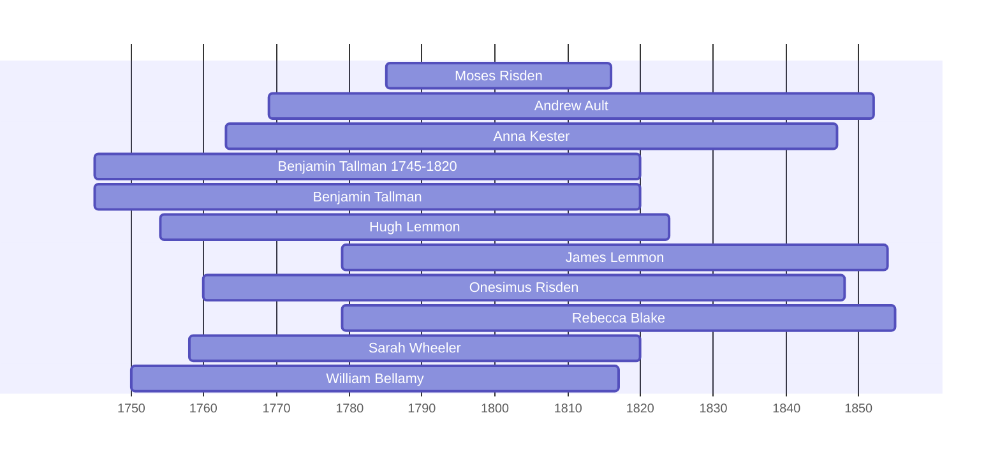

![[assets/snippets/Moses Risden.svg]]

# Moses Risden

## Biographical Profile

- **Name:** Moses Risden
- **Dates:** 1785-1816

## Source-Cited Facts

- Identified in pedigree timeline source.

## Research Notes

- Initial stub created from pedigree timeline extraction.

## Overlapping Lifespans

> [!info] Visualizing contemporaries in the vault during the life of Moses Risden (1785-1816).

## Source Indicators

> [!info] Indicators from Pedigree Timeline Diagrams
>
> - **Official Records**: Ref #108, 111
> - **Burial**: Verified (RIP marker)
> - **Obituary**: Available (Obit marker)

## Sources

1. [[References/raw/extracted/PedigreeTimelines2025Spicer.txt|PedigreeTimelines2025Spicer.txt]]
