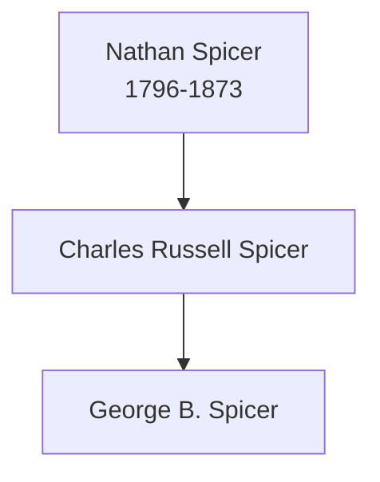

# Nathan Spicer

## Biographical Profile

- **Name:** Nathan Spicer
- **Role in this project:** Spicer-line ancestor listed in the census-summary index and lineage notes.

## Source-Cited Facts

- A census-summary entry gives Nathan Spicer as born 3 Apr 1796 and died 16 May 1873.
- The Spicer lineage note positions Nathan Spicer between Nathan Spicer (senior) and Charles Russell Spicer.
- The Burial Sites book places Nathan Spicer at Spicer/Spooner Cemetery near Homestead, Iowa (page 34), Grave No. 13 on Highway 6, 1 1/2 miles east of Homestead, with date of death 16 May 1873 and inscription `NATHAN SPICER / DIED / May 16, 1873 / AGED / 77yrs. 1mo. 13ds`. Map: [Google Maps](https://www.google.com/maps/search/?api=1&query=Spicer+Spooner+Cemetery+Homestead+Iowa).

## Family Diagram

This diagram shows the lineage direction stated in the Spicer lineage note.

## Research Gaps

1. Confirm the identity of the spouse(s) linked to this generation.
2. Verify dates and residence locations against primary census and vital records.

## Sources

1. [[References/Shared Intake 2026-04-22 Spicer Lineage Note|Shared Intake 2026-04-22 Spicer Lineage Note]]
2. [[References/Shared Intake 2026-04-22 Burial Sites Summary|Shared Intake 2026-04-22 Burial Sites Summary]]
3. `References/raw/inbox/2026-04-22-intake/Census/Ancestors in the Census.txt`
4. `References/raw/inbox/2026-04-22-intake/BurialSites/BurialSites.txt`
5. `References/raw/inbox/2026-04-22-intake/Pedigree Timeline/SPICLINE.txt`
